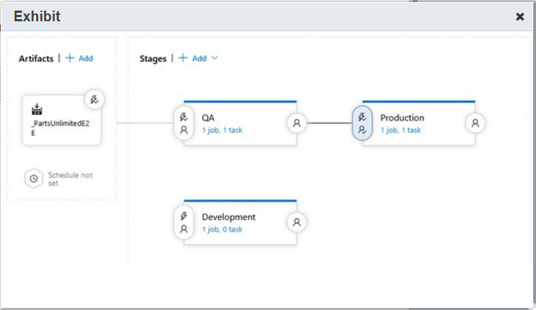

# PT00-Q10 to Q??: 

### Question 10:

You are a developer at a softare development company.
Your company uses Azure Boards to manage the development backlog and it uses Azure Repos to 
store the codebase. Every code change in the main branch must be auditable, requiring a user 
story associated with the commits.

You need to implement a branch policy in the main branch for the audit policy.

Which policy should you implement?

- Check for comment resolution
- Limit merge types
- Require a minimum number of reviewers
- Check for linked work items

---

### Answer:
 - Check for linked work items

---

### Explanation:

You should implement the **Check for linked work items policy**.

This policy adds a warning in the PR status overview when it is not associated with any
work items from the project board. If this policy is set, developers are unable to merge
the PR when it is not associated with a WI.

This complies with the **company audit policy**.

You **should not** implement:

ThESE policies do not satisfy the **company audit policy** in realation to the linked WI to every PR. 

- Require a minimum number of reviewers:
This policy specifies the min number of reviewers on a PR under certain conditions.

- Check for comment resolution:
This policy ensures that comment on a PR are addressed before merging.

- Limit merge types:
This policy enables specific merge strategies for a branch i.e. fast forward, rebase, etc.


---

### References:

[Branch policies and settings](https://learn.microsoft.com/en-us/azure/devops/repos/git/branch-policies?view=azure-devops&tabs=browser)   

---

### Question 11:

Your company uses Azure Boards to support as part of an Azure DevOps Service project:

 - tracking features
 - user stories
 - tasks

As part of the **continuos flow process (CFP)**, you need to monitor how long it takes to 
complete a request to add a proposed user story.

Which **out-of-the-box (OOB) widget** should you add to the dashboard?

- Velocity
- Cycle Time
- Lead Time
- Burndown

---

### Answer:
 - Lead Time

---

### Explanation:

You should add the **Laed Time widget** to teh Azure Board.

This widget displays work items that have been closed in a specific timeframe for a single team.
The **lead time of a WI** is the time taken to close the WI after it was created.

- For a **CFP**, the **Laed Time** meausures how long a request takes from **creation** to **closure**.

- For a  **Sprint/Fixed period process** teh **LT** measures how long the work on a request takes from
  when it **begins** to when it is **completed**, that is from **active** to **closed**.

You **should not** use the widgets below.

- Cycle Time:
**This is not quite clear!**
it measure how long it takes to complete WIs from when the team begings to actively work on them.
The time is calculated from the start of one process to the start of the next process.

- Burndown:
The **Burndown chart** focusses on the remaining work within a specific period of time.

- Velocity:
The **velocity chart** helps to determine how much work a team can do **sprint-over-sprint**.

---

### References:

[Add widgets to a dashboard](https://learn.microsoft.com/en-us/azure/devops/report/dashboards/add-widget-to-dashboard?view=azure-devops)  

[Out Of Box widget catalog](https://learn.microsoft.com/en-us/azure/devops/report/dashboards/widget-catalog?view=azure-devops)   

[Lead Time and Cycle Time widgets](https://learn.microsoft.com/en-us/azure/devops/report/dashboards/cycle-time-and-lead-time?view=azure-devops)

[View and configure team velocity](https://learn.microsoft.com/en-us/azure/devops/report/dashboards/team-velocity?view=azure-devops&tabs=in-context)  

[Configure a burndown or burnup widget](https://learn.microsoft.com/en-us/azure/devops/report/dashboards/configure-burndown-burnup-widgets?view=azure-devops)  

---

### Question12:

Your organization uses the **Cumulative Flow Diagram (CFD)** widget to monitor 
the flow of work through a system as part of an Azure DevOps Services Project.

There is a large amount of **Work in Progress (WIP)**, which shows up as a 
bulge on the **CFD** in the exhibit. 

The project has four members.

You need to **decrese the WIP metric** following the best practices guidelines.

How many items should be in progress per each team member at any given time?

- four items
- five items
- one item
- no more than two items

---

### Answer:
- no more than two items

---

### Explanation:

The **WIP metric** meausres the amount fo work or the number of WI that are
actively being worked on. A large WIP exhibits usualkly as a vertical bulge 
on the CFD.

The best practices guidelines recommend **no more than two items in progress per team memeber**.
In this case: `4 * 2 = 8` is the revommended max number of WI.

However, **each member should not have only one item at any given time** 
as there is a possibility that the owrk on a WI may have to be stopped
and restarted intermittently. 

More than two WI per developer is not recommented as it would be more
sifficult to keep focus on any of them.

---

### References:

[Cumulative flow, lead time, and cycle time guidance](https://learn.microsoft.com/en-us/azure/devops/report/dashboards/cumulative-flow-cycle-lead-time-guidance?view=azure-devops)  

---

### Question 13:

Your use Azure Boars as part of Azure DevOps Services to track work.

You use **Agile process** to create multiple WI including 

- user stories
- tasks
- bugs

You need to connect your Azure Board work items with **GitHub.com** so 
that you can **link GitHub commits and PRs** wit the WI on the Azure Board.

Which **two** authentication methods should you recommend to meet the 
requirements above?

- FIDO2 security key
- GitHub.com user account credentials
- Personal Access Token (PAT)
- OAuth
- user name and password

---

### Answer:

- GitHub.com user account credentials
- Personal Access Token (PAT)

---

### Explanation:

Different authentication methods are used depending on the type of GitHub.com
platform you want to connect to. In this scenario, you need to connect 
**to** the **GitHub.com platform which support two authetnication methods**. 
This means that the **Azure Boards App** must be authenticated to the 
**GitHub platofrm** in order for the **Azure Boards App** to have access to
the commit history of the corresponding repos!

- Personal Access Token (PAT):
You need to use the URL for your GitHub.com and the **PAT credentials from Azure Boards**
**which are recognized by GitHub.com**. This means that you create the PAT credentials
from the Azure DevOps Azure Boards portal with the URL to the repos on **GitHub.com**.
Then **GitHub.com** will trust the PAT provided by it to Azure Boards when the latter
tries to perform operations on GitHub.com such as, for example, reading the commit history
on a branch.

- GitHub.com user account credentials:
This authentication method may be used when yo want to connet to GitHub.com.
This is also **the preferred method to connect Azure Boards to GitHub.com!**

You **should not** use the following authentication methods.

- OAuth:
This method **would be the preferred authentication method of you wanted to connect**.
Azure Boards to **GitHub Enterprise Server**. 

How does this work? Not sure..
In this case you **register** the application **Azure Boards** on **GtiHub.com** as a **OAuth app**. 
Then your Azure Boards would have to provide the **ClientID** and **ServerSecret** for your registered 
OAuth app when it wants to perform oeration on your **GitHub Enterprise Server**. 

- FIDO2 security key:
The **Fast IDentity Online (FIDO) Alliance** helps to promote authentication standards
and reduce the use pf passwords as a form of authentication. **FIDO2** is the latest
standard that incorporates the web authentication **(WebAutthn)** standard. 
However, it is not an option in this scenario in order 
**to Authenticate Azure Boards with the GitHub platforms, either GitHub.com or GitHub Enterprise Server**.

- user name and password: 
do not use this method to authenticate applications

---

### Question 14:

Your organization uses Azure DevOps services to build and release 
modern, cloud-native applications.

You implement **Requirement Traceability Matrix (RTM)** in order to provide
end-to-end traceability by linking various objects, such as WI, branchen, builds
and releases.

You need to anlyse the code changes to identify the potentioan root cause of a 
test failure.

Which **requirement traceability type** should you use to meet the requirement?

- Bug traceability
- Source traceability
- Quality traceability
- Test failures

---

### Answer:
- Source traceability

---

### Explanation:

You should use **Source traceability** to analyze code changes in order to identify the 
potential root cause of a test failure. 

Based on the build or release pipeline, you can choose either of the following
views to see which code changes were committed.

- the timeline view
- the pipeline view

When you are trouble shooting test failures that occur consistently over a period of time,
it is important to trace it back to the original set of changes where the failure originated.
**Source traceability provide this information effetively**.

A **Requirement Traceability Matrix (RTM)** is a **document** which captures the technical 
details of the requirements for a given test scenario and its current state. It helps the
**testing team** to understand the level of testing that is performed for a given product.
It provides the tema with insight into **indicators** such as **the quality requirements**
or **readiness to ship** requirement.

You **should not** use:

- Bug traceability: 
[ it is not very clear what the following means..]
This provides **a way to track test failures and drive accountability within the team** so that 
**you can take remedial actions**. If you want to **associate bugs with test results**, you 
should visit the test report in a build or a release.

- Quality traceability:
This is to **ensure that user requirements meet the quality goals in the project**.
**Quality traceability** capures **requirements query** and **quality data**.
**Requirements query** captures the requirements, for example user stories in a current
iteration. **Qauality data** specifies the stage of the pipeline for which the requirement
is being traced.

- Test failures:
**Test analytics** provides test analytics for the following areas. 
 - builds 
 - releases 
 - test failures.
The **test failures report** provides a granula view of the top failing tests in the pipeline
along with the failure details.

---

### References:

[End-to-end traceability](https://learn.microsoft.com/en-us/azure/devops/cross-service/end-to-end-traceability?view=azure-devops)  

[Requirements traceability](https://learn.microsoft.com/en-us/azure/devops/pipelines/test/requirements-traceability?view=azure-devops)  

[What Is a Requirements Traceability Matrix (RTM)?](https://www.wrike.com/blog/what-is-requirements-traceability-matrix/)  


---

### Question 15:

You use Azure Boards app for GitHub to integrate Azure Boards to your GitHub repos.
You use `#AB` mention to link from GitHub to Azure Board work items so that `#AB129`
should link to WI iwth ID=129.

After completing the proccess, you observe that the `#AB129` mention links to the 
correct work item. However, a few `#AB` mentions produce unexpected or insonsistent
results.

- The following do not link to the ocrrect WI: `#AB130`, `#AB131`, `#AB132`
- The following link to the ocrrect WI: `#AB133`, `#AB134`

You need to troubleshoot this issue.
What is the cause of the issue?

- GitHub might be unavailable owning to a infrastructure/network outage.
- Connectivity between GitHub and Azure Boards has been revoked or it has failed.
- Hosted XML definitions for the WI tyeps are old and need updating. 
- The GitHub Repo is connected to 2 or more projects in more than one Azure DevOps Organization.

---

### Answer:
The GitHub Repo is connected to 2 or more projects in mode than one Azure DevOps Organization.

---

### Explanation:

The GitHub Repo is connected to 2 or more projects in more than one Azure DevOps Organization.
When this happens there may be inconsistencies in the `#AB` **mentions** that **link from GitHub**
**to Azure Boards WIs**.

Assume that **the same GitHub Repo** is connected to the following Azure DevOp Organization/Boards:

- `dev.azure.com\OrgA`
- `dev.azure.com\OrgB`

Each project within its corresponding organization maintain their WIs and the teams 
of each organization can link their WI IDs to commits of the same GitHub Repo.
In this case it is possible that teams working in the two organizations may see liniked WIs that 
were created by the other team and therefore do not match the expected WI IDs in their own
Azure Board.

**There is not known workaround for this problem** and the **recommended solution** is to
connect a single GitHub Repo to a single Azure DevOps Organization/Board.

**The following cannot be causes for this particular issue.**

- GitHub might be unavailable owning to a infrastructure/network outage.
This may be the case only when you get the following message:
`Yor credentials are invalid, please remove the connection and create` 
`a new one with OAth to establish the connection`. 
To resolve this issue you should follow the instructions given in the message.

- Hosted XML definitions for the WI tyeps are old and need updating.  
If an Azure DevOps organization uses **Hosted XML process model** 
**to customize the work tracking experience** and you want to link to and view the 
GitHub link types from the Development section in the work item forms, then you 
will need to update the XML definitions for the Work Item Types.

- Connectivity between GitHub and Azure Boards has been revoked or it has failed.
If a connection that uses OAuth or PAT is broken the reources that should be exposed
through it will not be available. In order to resolve connection issues it may be 
required to recreate the connection.

---

### References:

[Install the Azure Boards app for GitHub](https://learn.microsoft.com/en-us/azure/devops/boards/github/install-github-app?view=azure-devops)  

[Connect Azure Boards to GitHub - Resolve connection issues](https://learn.microsoft.com/en-us/azure/devops/boards/github/connect-to-github?view=azure-devops#resolve-connection-issues)  

[Link GitHub commits, pull requests, and issues to work items in Azure Boards](https://learn.microsoft.com/en-us/azure/devops/boards/github/link-to-from-github?view=azure-devops)  

---

### Question 16:

Your company uses Azure DevOps Services. 
You are using GitHub Actions to trigger a run in Azure Pipelines.

You need to check out multiple repos in Azure Pipelines.
The YAML exhibit below has three checkout steps.

```
resources:
  repositories:
  - repository: MyRepo
    type: github
    endpoint: MyServiceConnection
    name: MyOrgOrUser/MyGitHubRepo
``- repository: MyBitbucketRepo
    type: bitbucket
    endpoint: MyBitbucketServiceConnection
    name: MyBitbucketOrgOrUser/MyBitbucketRepo

trigger:
- main

pool:
vmImage: 'ubuntu-latest'

steps:
- checkout: self
- checkout: MyRepo
- checkout: MyBitbucketRepo

-scirpt: dir $(Build.SourcesDirectory)

```

For each of the following statements.

| Yes | No  | Statement |
| --- | --- | ------------------------------------------------- |
| Yes | No  | type: github represents teh GitHub Enterprise Server repository type |
| Yes | No  | checkout: self represents the repository that contains the pipeline YAML |
| Yes | No  | The source code will be checked out into a directory called s located in a subfolder of (Agent.BuildDirrectory) |

---

### Answer:

| Answer | Statement |
| ------ | ------------------------------------------------- |
| No     | type: github represents teh GitHub Enterprise Server repository type |
| Yes    | checkout: self represents the repository that contains the pipeline YAML |
| No     | The source code will be checked out into a directory called s located in a subfolder of (Agent.BuildDirrectory) |

---

### Explanation:

In Git terminology the term **checkout** refers to the act of **switching** betwenn different 
versions of a target entity. 

The **git checkout** command operates on three distinct entities:
- files
- commits 
- branches

**type: github**

represents the **GitHub.com** repository type and **not** the GitHub Enterprise Server repository type.
There are four possible types of repos in Azure DevOps Services:
 - Azure Repo Git ?
 - GitHub (type: github)
 - GitHub Enterprise (type: githubeinterprise)
 - Bitbucket Cloud ?

**checkout: self**
represents the repository that contains the pipeline YAML and this step causes the repo to be checked out.
If no other steps are specified, this is the default step of a YAM pipeline.
However, with **multiple steps** as it is in this scenario the `checkout: self` must be specified
in order to check out the repo where the YAML file is contained.

**The source code will be checked out into a directory called s located in a subfolder of (Agent.BuildDirrectory)**
Given that in this case multiple repositories are going to be checked out within the same YAML pipeline,
these will each be ckecked out into subfolders named after each repo in the `(Agent.BuildDirrectory)/s`
directory.

The source code is checked out in `(Agent.BuildDirrectory)/s` only when no **cheout** steps are specified
in the YAML Pipeline.

---

### References:

[Check out multiple repositories in your pipeline](https://learn.microsoft.com/en-us/azure/devops/pipelines/repos/multi-repo-checkout?view=azure-devops)   

[Use GitHub Actions to trigger a run in Azure Pipelines - Sprint 161 Update](https://learn.microsoft.com/en-us/azure/devops/release-notes/2019/sprint-161-update)  

[Git Checkout](https://www.javatpoint.com/git-checkout)  

---

### Question 17:

You r company uses Azure DevOps. 
You are using GitHub Actions with Azure Pipeliens.
You are trying to execute a workflow every time a Git commit gets pushed to main or
when a pull request is initiated.

You need to implement a solution.

How should you complete the given YAML code?
To answer selct the appropriate values from the drop down menus.

```
name: CI

# Run this workflow every time a commit gest pushed to main or a PR is opened on main.
on:
  push:
    branches:    
      OPTION-1 >> main <<
      OPTION-2 >> feature/* <<
    pull_request:
      OPTION-3 >> main <<
      OPTION-4 >> feature/* <<

jobs:
  build:
    name: Call Azure Pipeline
    runs-on: OPTION-5 >>Azurepipelines@v1<< | OPTION-6 >>ubuntu-latest<<
    steps:
    - name: Azure Pipeline Action
      uses: OPTION-7 >>Azurepipelines@v1<< | OPTION-8 >>ubuntu-latest<<
      with:
        azure-devops-project-url: https://dev.azure.com/organization/project-name
        azure-pipeline-name: 'First Pipeline'
        OPTION-9A >>azureSubscriptionEndpoint<< : OPTION-10A >>'$(System.DefaultWorkingDirectory)\TFC\$(ProjectName)'<<
        OPTION-9B >>azure-devops-token<< : OPTION-10B >>'${{secrets.AZURE_DEVOPS_TOKEN}}<<

```

---

### Answer:

```
name: CI

# Run this workflow every time a commit gest pushed to main or a PR is opened on main.
on:
  push:
    branches:    
      main
      
    pull_request:
      main 

jobs:
  build:
    name: Call Azure Pipeline
    runs-on: ubuntu-latest
    steps:
    - name: Azure Pipeline Action
      uses: Azurepipelines@v1
      with:
        azure-devops-project-url: https://dev.azure.com/organization/project-name
        azure-pipeline-name: 'First Pipeline'
        azure-devops-token : ${{secrets.AZURE_DEVOPS_TOKEN}}

```

---

### Explanation:

1. Use the **main** branch for both triggers `push` and `pull_request`. 
   This satisy the requirement that this pipeline should run when commits are pushed on the emain branch
   or when a PR is opened against the main branch.

2. `runs-on: ubuntu-latest` specifies that this pipeline should execute on the latest available 
    Ubuntu based VM on Azure DevOps infrastructure. This is one of the options available when 
    a pipeline is run from GitHub Actions.
    The other option `runs-on: Azurepipelines@v1` does not make any sense!

3. in the steps of the build job for this pipeline use the pipeline task **Azure/pipelines@v1** by specifying 
   `uses: Azure/pipelines@v1`. The deatis of **Azure/pipelines@v1** are found in the references to this 
   question.

  ```
  steps:
      - name: Azure Pipeline Action
        uses: Azurepipelines@v1
  ```

4. Use `azure-devops-token : ${{secrets.AZURE_DEVOPS_TOKEN}}` to provide a PAT token to the pipeline
   action **Azure/pipelines@v1** so that it can operate on Azure DevOps on the project and pipeline 
   specified as follows:
   
   ```
   azure-devops-project-url: https://dev.azure.com/organization/project-name
        azure-pipeline-name: 'First Pipeline'
   ``` 

   You will need to create the PAT value on Azure DevOps for GitHub Actions and store it as a secret
   on GitHub. Create the token on Azure DevOps so that it specifies the permnissions that the 
   GitHub Action  **Azure/pipelines@v1** in this pipeline needs.
   Then you take the token that has been crafted on Azure DevOps for your organizsation/project/pipeline
   and store it as a secret on GitHub.
   When the GitHub Action Workflow execute the pipeline on Azure DevOps the value  
   ` ${{secrets.AZURE_DEVOPS_TOKEN}}` is provided by GitHub to Azure DevOps so that the 
   GitHub Action Workflow is authenticated to Azure DevOps for the purpuse of running this
   action worflow.

The remaining wrong options.

5. The value `feature/*` would set the wrong branches. The requirement says that the pipeline 
   must trigger for pushes or PR on the main branch and not feature branches.

```
branches:    
      feature/*
    pull_request:      
      feature/* 
```

6. `azureSubscriptionEndpoint` is not an option of **Azure/pipelines@v1**. 
    Instead `$(azureSubscriptionEndpoint)` is the value of a custom pipeline variable named `azureSubscriptionEndpoint`.
    However, it is not required to create or use the value of such a variabnle in this scenario.

7. `$(System.DefaultWorkingDirectory)\TFC\$(ProjectName)` is also a value built in the pipeline
  from the values of `System.DefaultWorkingDirectory` and `ProjectName`. This is not required in
  this scenario.

```
with:
  azure-devops-project-url: https://dev.azure.com/organization/project-name
  azure-pipeline-name: 'First Pipeline'
  azureSubscriptionEndpoint : '$(System.DefaultWorkingDirectory)\TFC\$(ProjectName)'
```


---

[GitHub Action for Azure Pipelines](https://github.com/Azure/pipelines/releases)  
[Azure/pipelines@v1](https://github.com/marketplace/actions/azure-pipelines-action)  
This action enables you to trigger an Azure pipeline run right from inside an Action workflow.

[Use personal access tokens](https://learn.microsoft.com/en-us/azure/devops/organizations/accounts/use-personal-access-tokens-to-authenticate?view=azure-devops&tabs=Windows)
A personal access token contains your security credentials for Azure DevOps. 
A PAT identifies you, your accessible organizations, and scopes of access. 
As such, they're as critical as passwords, so you should treat them the same way.
if you're working with third-party tools that don't support Microsoft or Microsoft Entra accounts
or you don't want to provide your primary credentials to the tool – use PATs to limit your risk.

[Azure and GitHub integration](https://learn.microsoft.com/en-us/azure/developer/github/?view=azure-devops)  
[Use GitHub Actions to trigger a run in Azure Pipelines - Sprint 161 Update](https://learn.microsoft.com/en-us/azure/devops/release-notes/2019/sprint-161-update)

---

### Question 18:

You have a GitHub private Repo for a library used by your organization.
This Repo is integrated with an Azure Boards project which is used to mage the project backlog.
You adopt a pull request and commit guidelines to automatically generate release notes.
Every two weeks you create a new git tag for this library followuing semantic versioning.

You need to define the best place to communicate with the library users to communicate the
changes in any specific version of teh library.

Where should you store the releas notes?

- GitHub releases
- Pull request description
- Work Item description
- Work Item acceptance criteria

---

### Explanation:

You should store the release notes in **GitHub releases**.
This makes it easy for the library users to see the changes in any specific version that is published 
under the related git tag. You can include also links to the library binary files and source code.

The remaining options do not apply.

The **Work Item acceptance criteria** specifies the requirements to fulfill in order to consider the 
WI **completed**.

The **Pull request description** or the **Work Item description** are for the details related to each
and not for the release notes as they would lack the required visibility to the target audience that 
si the consumers of the library. Istead you **could and should** include in the release notes 
**links to the WIs &/OR PRs** that contrubute to each release.

---

### References:

[About Releases - GitHub Docs](https://docs.github.com/en/repositories/releasing-projects-on-github/about-releases)  

[About PRs - GitHub Docs](https://docs.github.com/en/pull-requests/collaborating-with-pull-requests/proposing-changes-to-your-work-with-pull-requests/about-pull-requests)  

[Field descriptions for default and work item fields used in process templates](https://learn.microsoft.com/en-us/azure/devops/boards/work-items/guidance/work-item-field?view=azure-devops)  

---

### Question 19:

You work as a product owner for a project in Azure DevOps.
The project follows the Scrum process and Azure Repos, Azure Boards 
and Azure Puipelines are used for the project lifecycle.
The stakeholders want to receive reports about the project's progress.

You need to create a custom dashboard in Azure DevOps for the stakeholders.

Which chart widgets should you use for each requirement?
To answer drag the appropriate widget ot each requirement.
A widget may be used once, more than once or not at all.

- Lead Time widget
- Sprint Capacity widget
- Deplyment status widget
- Cycle Time widget
- Releae Pipeline Overview widget

| Widget  |  Statement |
| ------- | ------------------------------------------------- |
|  ?      |  Determine how long a WI takes from creation to completion |
|  ?      |  Estimate the team capacity in a given sprint |
|  ?      |  Show a consolidated view of the success rate of a deployment pipeline |


---

### Answer:

| Widget  |  Statement |
| ------- | ------------------------------------------------- |
|  Lead Time widget |  Determine how long a WI takes from creation to completion |
|  Sprint Capacity widget |  Estimate the team capacity in a given sprint |
|  Deplyment status widget |  Show a consolidated view of the success rate of a deployment pipeline |

---

### Explanation:

- Lead Time widget
This gives the stakeholders an estimation of how long it may take for a 
recently requested feature to be completed.
This means from **created** to **completed**.

- Sprint Capacity widget
This alloes the stakeholders to determine whether the team is currently caopable 
of working on all the user stories in the sprint.


- Deplyment status widget
It shows the status of the deployment and the test pass rate accross multuiple 
environments for a recent set of builds on a deployment pipeline.

The following two widget are not applicable to this question.

- Cycle Time widget
It shows how long a WI takes from **active** to **completed**.

- Releae Pipeline Overview widget
It shows the statuis of a release pipeline and its environment when the pipeline was executed.
It does not show teh success rate but only the current status.

---

### References:

[About dashboards, charts, reports, & widgets](https://learn.microsoft.com/en-us/azure/devops/report/dashboards/overview?view=azure-devops)  

---

### Question 20:

Your organization wants to create a custom dashboard widget.
The proposed widget will use a combination of HTML, JavaScript and CSS.
You create a **extension's manifets vss-extension.json** in the home directory as shown below.

```
{
"manifestVersion": 1,
    "id": "tools",
    "version": "0.1.0",
    "name": "Fabrikam Tools",
    "publisher": "fabrikam",
    "description": "Awesome tools to help you and your team do great things everyday.",
    "targets": [
        {
            "id": "Microsoft.VisualStudio.Services"
        }
    ],

    ...
}
```

You need to add the follwoing information to the manifest.

- The extension uses version 3.0 APIs
- The extension does not support older versions

Which property should you add to the file **vss-extension.json**?

- dadges
- scopes
- baseUri
- demands

---

### Answer:
- demands

---

### Explanation:

The **optional Runtime property: demands**:

An array of demands (strings) listing the capabilities required by your extension.

For example, **api-version/3.0** indicates that your extension uses version 3.0 APIs,
and so can't run in older products that don't support this version. 

For more information, see the full list of demands.

[Extension manifest reference > Demands](https://learn.microsoft.com/en-us/azure/devops/extend/develop/manifest?view=azure-devops#demands)  

Demands let you specify capabilities and other features required by your extension. 
You can use these demands to limit where your extension can be published or installed.
Demands get used by the Visual Studio Marketplace to list the products and environments 
your extension is compatible with.
This helps customers understand whether your extension works with their version of Azure DevOps.

The following options are nopt applicable to this question.

**Runtime properties**

- scopes
An array of authorization scopes (strings) listing permissions required by your extension.

For example, **vso.work** and **vs.code_write** indicates your extension needs read-only access
to work items and read/write access to source code (and related resource). 
Scopes are presented to the user when installing your extension. 
For more information, see the full list of [scopes](https://learn.microsoft.com/en-us/azure/devops/extend/develop/manifest?view=azure-devops#scopes)  

Your extension can specify one or more scopes. 
Scopes control what resources can be accessed by your extension and what operations 
your extension is allowed to do with those resources.
The scopes you specify in your extension manifest are the scopes set on access tokens issued to your extension. 
If no scopes are specified, extensions are only provided access to user profile and extension data.

- baseUri
(Optional) base URL for all relative URLs specified by the extension's contributions.
For example: https://myapp.com/{{account.name}}/. 
This property should be left empty if your extension's contents are packaged with your extension.


[**Discovery attributes**](https://learn.microsoft.com/en-us/azure/devops/extend/develop/manifest?view=azure-devops#discovery-attributes)

- dadges
Array of links to external metadata badges like TravisCI, Appveyor, and so on, from the approved badges sites.
[Supported Badge Services](https://learn.microsoft.com/en-us/azure/devops/extend/develop/manifest?view=azure-devops#approvedbadges)  

Valid keys: 
`href`: Link the user navigates to when selecting the badge. 
`uri`: The absolute URL of the badge image to be displayed. 
`description`: Description of the badge, to be displayed on hover.


---

### References:

[Extension manifest reference](https://learn.microsoft.com/en-us/azure/devops/extend/develop/manifest?view=azure-devops)
Every extension has a JSON manifest file that defines basic information about the extension.
The file also defines how it can extend and enhance the experience.

[Add a dashboard widget](https://learn.microsoft.com/en-us/azure/devops/extend/develop/add-dashboard-widget?view=azure-devops)  

[Adventures with Azure DevOps: Create a Custom Dashboard Widget](https://mattruma.com/adventures-with-azure-devops-create-a-custom-dashboard-widget/)    

---

### Question 21:

Your organization uses Azure DevOps Services team projec tWikis to enhance developer communication.
You need to assign default permissions to a user named UserA so that they can edit the team project 
page.

Which security groups should you add UserA to as a team member?

- Project administrator
- Team administrator
- Readers
- Contributors

---

### Answer:
- Project administrator

---

### Explanation:
In Azure DevOps assign users to Security Groups in order to assgn to those
users the permissions of the Security Groups.

>The security group **Project administrator**: 
 provides the permissions to edit the Project Wikis **among others permissions**.
 For example, it provides the permission to **set the project-level notifications and alerts**
 and **creation of pages on the project Wikis**.

The following are not applicable in this case.

>The security group **Team administrator**: 
 Members of this SG **cannot edit the project Wiki pages**.
 They can perform action such as 
 **setting personal notifications / alerts**,
 **setting teams notifications / alerts**, 
 **viewing project Wikis**, 
 **viewing code wikis**, 
 **publishing code as wiki**, 
 **viewing the project page**,
 **navigating using the project pages**, 
 **request / provide feedback**, 
 **perform code search and work tracking**.

>The security group **Contributors**:
 **View project Wikis / Wikis code**, 
 **publish code wikis**, 
 **view project page**,
 **navigate from project page**,
 **request / provide feedback**, 
 **perform code search and work tracking**.

>The security group **Readers**:
**View project Wikis / Wikis code**, 
 **view project page**,
 **navigate from project page**,
 **request / provide feedback**, 
 **perform code search and work tracking**.

---

### References:

[About wikis, READMEs, and Markdown](https://learn.microsoft.com/en-us/azure/devops/project/wiki/about-readme-wiki?view=azure-devops)  

[Default permissions and access set for collaboration tools](https://learn.microsoft.com/en-us/azure/devops/project/wiki/wiki-readme-permissions?view=azure-devops)    

---

### Question 22:

Your company uses Azure DevOps services to manage development projects internally.

The company has drawn up an internal policy for creation of new projects 
in Azure DevOps services and it has established the following requirements.

1. Formal project methods which require a framework for process improvement should be used.
2. All records of decisions for change management should be audited anuualy by the company.

You need to choose a process model that allows you to plan and track Work Item Types (WITs)

Which process model should you use?

- Agile
- Scrum
- CMMI
- Basic

---

### Answer:
- CMMI

---

### Explanation:

**Capability Maturity Model Integration (CMMI) process model** is one of the 4 prpcess models
supported by **Azure DevOps services** or **Azure DevOps Server**.

**Azure DevOps services** refers to the online platform where organizations can manage multiple 
projects while **Azure DevOps Server** - more on this distinction si found below in the **References**.

The **Work Item Types (WITs)** to be used for **tracking** and **planning** work determine which
model process should be used within the organization as a default. In this scenario, given that 
the company has **strick guidelines in regard to compliance policies**, it is recommended that 
the *Capability Maturity Model Integration (CMMI) process model** is used.

The **Capability Maturity Model Integration (CMMI) process model** the following WITs are used to track work:

 - tests
 - feedback
 - code reviews
  - requirements
 - chage requests
 - tasks
 - bugs
 - risks

 The **purpose of the CMMI process model** is :
 
 1. to **assess the maturity** of a company's processes. 
 2. **provide guidance** on ways in which the company can improve processes and products. 
 3. **measure and manage risks**.


The remaining options do not apply to this question.

- Basic:
This process model is **suitable for a team to get started with**. 

It employes the following artifacts in order **to track work**:  
  - issues
  - tasks
  - epics


In the Bsic model: 
  - there are **not formal project methods** 
  - **it does not provide auditing** for records and decisions.

- Agile:
With the **Agile** and also with **Scrum** process model for projects 
**development and test activities are tracked separately**.

It employes the following WITs in order **to track work**:  
  - user stories 
  - bug (optionally)
  - tasks
  - a Kanban board
  - a Taskboard (optional)

In the Agile model:
  - **does not demand formal project methods**
  -  **it does not provide auditing** for records and decisions.

- Scrum:
The **Scrum process model** should be employed in the following two scenarios:
  - Your company is already using Scrum to manage projects.
  - Produck Backlog Items **(PBIs) and Bugs** are required to be tracked on a **Kanban board**.
  - PBIs may also be broken down into **tasks** on a **Taskboard**.

In the Scrum model:
  - **does not demand formal project methods**
  -  **it does not provide auditing** for records and decisions.

---

### References:

[Compare Azure DevOps Services with Azure DevOps Server](https://learn.microsoft.com/en-us/azure/devops/user-guide/about-azure-devops-services-tfs?view=azure-devops)  

 > **Azure DevOps services**
   The cloud offering, Azure DevOps Services, provides a scalable, reliable, and globally available hosted service. 
   It's backed by a 99.9% SLA, monitored by our 24/7 operations team, and available in local data centers around 
   the world.

> **Azure DevOps Server**
  The on-premises offering, Azure DevOps Server, is built on a **SQL Server back end**. 
  Customers usually choose the on-premises version when they need their data to stay 
  within their network. Or, when they want **access to SQL Server reporting services** 
  that integrate with Azure DevOps Server data and tools.

  Both offerings provide the same essential features and services, but Azure DevOps Services 
  offers the following added benefits:

  - Simplified server management
  - Immediate access to the latest and greatest features
  - Improved connectivity with remote sites
  - A transition from capital expenditures (servers and the like) to operational expenditures (subscriptions)

[About default processes and process templates](https://learn.microsoft.com/en-us/azure/devops/boards/work-items/guidance/choose-process?view=azure-devops&tabs=agile-process)    

[Understand CMMI process template artifacts](https://learn.microsoft.com/en-us/azure/devops/boards/work-items/guidance/cmmi-process?view=azure-devops)  

[Background to Capability Maturity Model Integration (CMMI)](https://learn.microsoft.com/en-us/azure/devops/boards/work-items/guidance/cmmi/guidance-background-to-cmmi?view=azure-devops)  

[Agile Essentials](https://www.agilealliance.org/agile-essentials/)  

---

### Question 23:

Your company uses Azure DevOps Services tp build and release cloud-native modern applications on Azure.

You wamt to use **Azure DevOps Release Notes Generator** to create Release Notes for Azure DevOps.
**Release Notes Generator** is **deployed as a Functiion App in App Service** and requires 
authentication to access the endpoint.

You need to set up a Webhook function to send the event to Azure DevOopa Release Notes Generator
function endpoint.

Which action setting should you configure to invoke the endpoint securely?

- HTTP header
- URL with HTTPS endpoint
- URL with HTTP endpoint
- Basic Authentication

---

### Answer:
- URL with HTTPS endpoint

---

### Explanation:

A **Webhook** provides a way to send the data that describes an event in the form of a JSON representation
to any service. In this case the service that needs to receive the event data is the 
**Azure DevOps Release Notes Generator** and it is required that this data is sent to this endpoint securely.

The  **endpoint** in this case uses **authentication** that is it is an authenticated endpoint. 
The **URL with HTTPS endpoint** employs **encryption** of the payload **to protect the authentication details**.

The remaining options do not apply in this question.

- URL with HTTP endpoint:
If the Webhook used this option the data would be sent **unecrypted** to the **service endpoint**.

- Basic Authentication:
With **Basic Authentication** it is required to provide authentication details in order to access 
a **service endpoint**. 
However, **Basic Authentication** by itself requires **no encryption** in transit of the 
authentication details. With Webhooks it is possible to use **Basic Authentication** with which the 
**payload contains the data related to the event and the authetication credentials** to authenticate
to the endpoint. 
When a **Webhook with Basic Authentication** is setup **HTTPS is required!** as it is discussed in the 
reference. The reason is to make sure that even if the **service endpoint requires BA** then the 
authetication details will always be **encrypted in transit** and never as plain text.

- HTTP header:
These are used in a HTTP requests to send to the endpoint additional data that should not be in the payload.
There are **authentication headers** which may be used to supply authetication credentials sucuh as, for example,
**Bearer Tokens**.

---

### References:

[Azure DevOps Release Notes Generator](https://github.com/azure-samples/azure-devops-release-notes/tree/master/)  

The generator is a function app containing a HTTP triggered function that creates a Markdown file whenever a new release is created in Azure DevOps, using Azure Blob Storage.

[Webhooks](https://learn.microsoft.com/en-us/azure/devops/service-hooks/services/webhooks?view=azure-devops)  
Webhooks provide a way to send a JSON representation of an event to any service. 
All that is required is a public endpoint (HTTP or HTTPS).
Only organization Owners or Project Collection Administrators can manage webhooks for an organization.
In **Azure DevOps Services** webhooks are managed in the tab **Project Settings > Service hooks**.

[Q: Can I send webhooks to non HTTPS endpoints?](https://learn.microsoft.com/en-us/azure/devops/service-hooks/services/webhooks?view=azure-devops#q-can-i-send-webhooks-to-non-https-endpoints)   

A: Yes. However, it's recommended that you only use HTTPS endpoints for your webhooks. Using HTTP means there is a the potential for private data being sent unencrypted. **This includes any authentication headers in your webhook**.

[Q: Can I use basic authentication when setting up a webhook that isn't HTTPS?](https://learn.microsoft.com/en-us/azure/devops/service-hooks/services/webhooks?view=azure-devops#q-can-i-use-basic-authentication-when-setting-up-a-webhook-that-isnt-https) 
A: No. You must use HTTPS when utilizing basic authentication on a webhook.

---

### Question 24:

Your company used Azure DevOps projects to build and release commercial cloud-native 
software applications. The team uses GitHub for software development and it uses 
Azure Boards to plan and track the work.

You want to use **automatically generated Release Notes** for your GitHub releases
instead of having to write them manually.

On **GitHub.com** you have created the **/release.yml** file in the **.github**
directory as shown below:

```
# .github/release.yml

changelog:
  exclude:
    labels:
      - ignore-for-release
    authors:
      - sarah
  categories:
    - title: Breaking Changes, v2
      labels:
        - Major-changes
        - breaking-change
    - title: New Features
      labels:
        - Minor-changes
        - enhancement
    - title: Other Changes
      labels:
        - "*"
```

You need to diagnose the output.
For each of the following statements, select Yes or No according to whether the 
statement is true or false.

| Yes | No  | Statement |
| --- | --- | ------------------------------------------------- |
| Yes | No  | The **ignore-for-release label** excludes a PR from appearing in the automatically generated Release Notes |
| Yes | No  | The yml file specifies that PRs from all authors except Sarah are to be excluded from automatically generated release notes. |
| Yes | No  |  The **enhancement labels** will be considered for a PR and will be included in the automatically generated release notes.|


---

### Answer:

| Yes | No  | Statement |
| --- | --- | ------------------------------------------------- |
| Yes | The **ignore-for-release label** excludes a PR from appearing in the automatically generated Release Notes. |
| No  | The yml file specifies that PRs from all authors except Sarah are to be excluded from automatically generated release notes. |
| Yes |  The **enhancement labels** will be considered for a PR and will be included in the automatically generated release notes.|

---

### Explanation:

```
changelog:
  exclude:
    labels:
      - ignore-for-release
    authors:
      - sarah

```

The excerpt of **.github/release.yml** above specifies that 

**exclide:/labels:/ ignore-for-release label1, lable2, label3**:
Excludes a PR that has the specified lable value from appearing in the auomatically generated RNs.

**exclide:/authors:/ sarah, otherAuthor1, otherAuthor2**:
Excludes a PR that has the specified author value from appearing in the auomatically generated RNs.
The second statement is false becase the given YAML causes only the PRs with author Sarah to be excluded
which is the opposite of what is specified in the second statement.

The label `- enhancement` causes PRs that are labeled with `enhancement` to be included 
in the automatically generated RNs.

You can also customize your automated release notes, using labels to create custom 
categories to organize pull requests you want to include, and exclude certain labels
and users from appearing in the output. You can also **create new categories** and list
the the PR lables that must be included in the automatically generated RNs.

---

### References:

[GitHub - Automatically generated release notes](https://docs.github.com/en/repositories/releasing-projects-on-github/automatically-generated-release-notes)   

[How to automate your release notes](https://cloudblogs.microsoft.com/opensource/2018/09/06/how-to-automate-software-release-notes/)  

---

### Question 25:

You are using the **Azure DevOps Service REST API 6.0 Service Hooks Services** to create 
a notification.

The code exhibit is the following:

```
 POST https://dev.azure.com/{organization}/_apis/hooks/testnotifications?useRealData={useRealData}&api-version=6.0
```

You check the status of the above request after some time.
It shows that the notification has been **dequeued**.

What is the current status of the notification?

- completed
- processing
- queued
- requestInProgress

---

### Answer:
- processing

---

### Explanation:

If the notification has been **dequeued**, it means that its **status** is **processing**.
The **consumer action** has not yet finished processing the notification.

The other options do not apply:

[NotificationStatus](https://learn.microsoft.com/en-us/rest/api/azure/devops/hooks/notifications/create?view=azure-devops-rest-6.0&viewFallbackFrom=azure-devops-rest-6.0s#notificationstatus)   

### Note:


---

### References:

[Service hooks](https://learn.microsoft.com/en-us/rest/api/azure/devops/hooks/?view=azure-devops-rest-6.0)  
The service hook publishers define a set of events. 
You create **subscriptions** based on an event and select the **service hook consumer and action to take** 
in response to that event from the publisher.

[Subscriptions - Create](https://learn.microsoft.com/en-us/rest/api/azure/devops/hooks/subscriptions/create?view=azure-devops-rest-6.0&tabs=HTTP)  
`POST https://dev.azure.com/{organization}/_apis/hooks/subscriptions?api-version=6.0`

> [Notifications - Create](https://learn.microsoft.com/en-us/rest/api/azure/devops/hooks/notifications/create?view=azure-devops-rest-6.0)
  Sends a test notification. 
  **This is useful for verifying the configuration of an updated or new service hooks subscription.**
  This means that this API can be use to generate artificial notifications in order to check 
  whether the subscriptions that have been set with any number of consumer work properly and
  process the event as planned.

  ```
  POST https://dev.azure.com/{organization}/_apis/hooks/testnotifications?api-version=6.0
  POST https://dev.azure.com/{organization}/_apis/hooks/testnotifications?useRealData={useRealData}&api-version=6.0
  ```

[NotificationStatus](https://learn.microsoft.com/en-us/rest/api/azure/devops/hooks/notifications/create?view=azure-devops-rest-6.0&viewFallbackFrom=azure-devops-rest-6.0s#notificationstatus)   

**NotificationStatus**:

completed	        string  The request completed
processing	      string  The notification has been **dequeued** and has begun processing.
queued	          string  The notification has been queued
requestInProgress	string  The consumer action has processed the notification. The request is in progress.

**NotificationResult**:

filtered	        string The notification was filtered by the Delivery Job
pending	          string The notification has not yet completed

---

### Question 26:

An organization plans to integrate Azure DevOps with a wide variety of applications.

A developer uses **Service Hooks** for a specific consumer service on successful 
completion of a build process. The developer wants to track the diagnostics settings 
for troubleshooting event matching using the  **Azure DevOps Service REST API 6.0**
**Diagnostics API version 6.0**.

You need to implement a solution to meet the requirement.

Which **SubscriptionDiagnostics** diagnostic settings should you use?

- deliveryTracing
- evaluationTracing
- deliveryResults

---

### Answer:
- evaluationTracing

---

### Explanation:

The **Azure DevOps Service REST API 6.0** **Diagnostics API version 6.0** has two operations.

[Service Hooks > Diagnostics](https://learn.microsoft.com/en-us/rest/api/azure/devops/hooks/diagnostics?view=azure-devops-rest-6.0)

- [Get](https://learn.microsoft.com/en-us/rest/api/azure/devops/hooks/diagnostics/get?view=azure-devops-rest-6.0&tabs=HTTP)  
- [Update](https://learn.microsoft.com/en-us/rest/api/azure/devops/hooks/diagnostics/update?view=azure-devops-rest-6.0&tabs=HTTP)  


SubscriptionDiagnostics


Name	                  Type	                Description

deliveryResults	        SubscriptionTracing   Diagnostics settings for retaining delivery results. Used for Service Hooks subscriptions.
deliveryTracing   	    SubscriptionTracing   Diagnostics settings for troubleshooting notification delivery.
**evaluationTracing**	  SubscriptionTracing   **Diagnostics settings for troubleshooting event matching.**


---

### References:

[Service hooks events](https://learn.microsoft.com/en-us/azure/devops/service-hooks/events?view=azure-devops)

[Exercise - set up service hooks to monitor the pipeline](https://learn.microsoft.com/en-us/training/modules/automate-inspection-health/5-exercise-set-up-service-hooks-to-monitor-pipeline)  

In this exercise, you'll investigate Service Hooks.
This exercise is about how a release pipeline can communicate with other services by using **service hooks**.
By using service hooks, we can notify other applications that an event has occurred within Azure DevOps. 
We could also send a message to a team in Microsoft Teams or Slack.
We could also trigger an action in Bamboo or Jenkins.

Suppose the application that you want to communicate with isn't in the list of available **application hooks.**
In that case, you can almost always use the **Web Hooks** option as a generic way to communicate. 
**It allows you to make an HTTP POST when an event occurs.**
**So, if, for example, you wanted to call an Azure Function or an Azure Logic App, you could use this option.**


---

### Question 27:

Your company decides to integrate the **GitHub Enterprise Server** into their Azure DevOps Server CI/CD
pipeline.

You need to make sure that the connection bewteen **GitHub Enterprise Server** and the 
**Azure DevOps Server** is protected.

What should you choose?

- OAuth
- Windows Authentication
- A secured username & password
- Personal Access Tokens (PATs)

---

### Answer:
- OAuth

---

### Explanation:

**OAuth** is the **preferred authentication method between GitHub Enterprise Server and Azure DevOps**.
**OAuth** allows **unrelated servers and services** to safely allow authenticated access to their 
resources.

The other options cannot be applied to this question.

- Personal Access Tokens (PATs):

PATs are a better alternative to passwords that may be used to authenticate to Azure DevOps.
Hiowever, in this specific case this is not the preferred method.
With PATs the admin of teh Azure DevOps organization / project create a PAT from the 
Azure DevOps portal. In the process of creation of the PAT the admin provides the details
of the service/server that will make use of the PAT to call into Azure DevOps.
This process ivolves a manual authetication to this service / server and the specification
of the permission to associate with the PAT.
Finally, the Azure DevOps portal produces the PAT code that **should be treated as a secure code**
**to be stored safely on the server / service that calls into Azure DevOps**.
PAT usually have also a **expiration date**.

- Windows Authentication:
This is specific to **user authentication on the same AD Domain**.
It is **not appropriate to server to server authentication over the internet**.

- A secured username & password:
This kind of credential is only meant for human interaction and it is not particualrly secure.
It is **not appropriate to server to server authentication**.


---

### References:

[Connect Azure Boards to GitHub (cloud)](https://learn.microsoft.com/en-us/azure/devops/boards/github/connect-to-github?view=azure-devops)  

[About Azure Boards-GitHub integration](https://learn.microsoft.com/en-us/azure/devops/boards/github/?view=azure-devops)  

---

### Question 28:

Your Team uses a GitHub Repo to build a project. As part of the development process
UX designers need to **manage and version** screen mockups and Photoshops Documents 
(PSD) files in the same repository.

You need to recomment a solution to store the PSD files.
The solution must not have an impact on the rpository fetch and cloning performance or
change the current Git Workflow.

Whcih solution should you recommend?

- Azure Artifacts
- Git Large File Storage (LFS)
- Azure Blob sTORAGE
- OneDrive

---

### Answer:
- Git Large File Storage (LFS)

---

### Explanation:

**Git Large File Storage (LFS)** can be used to store large files such as PSDs, audio and video,
large datasets, large images and graphics into a Git Repo. The Git Repo actually stores only 
**references to teh files and not the files themselves**. The large files are stored on a
service that is more suitable to store large files while the Git Repo provides the functinality
to version them.

The other options are not suitable in this scenario.

- Azure Blob Storage
- OneDrive
These can bes used as **Storage** for teh large files. However, these are not directly integrated
with the git workflow or versioning.

- Azure Artifacts
This is used **to manage code packages repositories** such as private feeds from Npm, NuGet or Python 
packages.

---

### References:

[Git Large File Storage](https://git-lfs.com/)  


[Introduction to Azure Blob Storage](https://learn.microsoft.com/en-us/azure/storage/blobs/storage-blobs-introduction)  

[Azure Artifacts overview](https://learn.microsoft.com/en-us/azure/devops/artifacts/start-using-azure-artifacts?view=azure-devops&tabs=nugettfs%2Cnuget%2Corgstorage)  

Azure Artifacts enables developers to share their code efficiently and manage all their packages from one place. With Azure Artifacts, developers can publish packages to their feeds and share it within the same team, across organizations, and even publicly. Developers can also consume packages from different feeds and public registries such as NuGet.org or npmjs.com. Azure Artifacts supports multiple package types such as NuGet, npm, Python, Maven, Cargo, and Universal Packages.

[Plan for SharePoint and OneDrive in Microsoft 365](https://learn.microsoft.com/en-us/sharepoint/plan-for-sharepoint-onedrive)  

---

### Question 29:

You are a DevOps consultant and you are helping a software development company to
migrate their codebase to Azure DevOps Repos. The company has remote development 
teams that work on different projects and with different features at the same time.
Some developer have limited internet connectivity, which requires them to work
offiline occasionally.

Which source control system should you recommend?

- Team Foundation Vesrion Control (TFVC)
- Git
- Subversion (SVN)
- Mercurial

---

### Answer:
- Git

---

### Explanation:

**Git allows developers to keep a local copy of the source code repo** and work on different 
features uisng branches. Being the repo local to their machines this would laso work well
in all cases with limited connectivity to the cenral Git Repo as it is the case in this scenario.
**Developers can work on their branches completely offline and need to be online only when they**
**need to synch their changes with thiose on the remote repos**.

The other options are not suitable in this scenario.

- Team Foundation Vesrion Control (TFVC):
This is a **cenralized version control system**. Its use case is for Repos that are 
**very large!**. In this cases it might be an alternative for Giot Repos as it allows 
the developer to only check out to their development machines the files they need to work 
on and not the whole repository as it is the case with Git Repos.
**This is not suitable in all cases whth limited connectivity to the TFVS server**.

- Subversion (SVN)
- Mercurial
These source control systems **are not supported by Azure Repos**.
In these case the source control system ought ot be changed to Git / TFVC before it 
is possible to migrate it to Azure Repos.


---

### References:

[Choosing the right version control for your project](https://learn.microsoft.com/en-us/azure/devops/repos/tfvc/comparison-git-tfvc?view=azure-devops)  

[Azure Repos Git Documentation](https://learn.microsoft.com/en-us/azure/devops/repos/git/?view=azure-devops)  

[What is Team Foundation Version Control?](https://learn.microsoft.com/en-us/azure/devops/repos/tfvc/what-is-tfvc?view=azure-devops)  

---

### Question 30:

You use **GitHub Desktop** to manage your GitHub puill request workflow effectively.
You are trying to authenticate your account from GitHub Desktop so that you can 
access your already existing resources on **GitHub.com**.

However, you receive the following error message:

```
info: [ui] [AppStore.withAuthenticatingUser] account found for repository: node - USERNAME (empty token)
```

What is causing the problem?

- You do not have a valid SSH key setup.
- You do not have adequate permissions to access the source code repository.
- You want to clone a source code repository which has existing submodules that you do not have access to.
- You cannot find the access token that GitHub.com created in the system keychain.

---

### Answer:
- You cannot find the access token that GitHub.com created in the system keychain.

---

### Explanation:

- You cannot find the access token that GitHub.com created in the system keychain.
`info: [ui] [AppStore.withAuthenticatingUser] account found for repository: node - USERNAME (empty token)`

In this scenario there is an **empty token** `USERNAME (empty token)`. This means that **GitHub Desktop**
**cannot find the relevant access token that it previously created in the system keychain**.
In order to correct this error you must **sign out of your GitHub Desktop, clear the cache and then**
**sign in again**.

The other options do not apply in this case.

- You do not have adequate permissions to access the source code repository.

[GitHub Desktop - Repository Not Found](https://docs.github.com/en/desktop/installing-and-authenticating-to-github-desktop/authenticating-to-github-in-github-desktop#repository-not-found)  

This would be the cause of the problem if the error message was the following:
```
fatal: repository 'https://github.com/<user>/<repo>.git' not found
(The error was parsed as 8: The repository does not seem to exist anymore. 
You may not have access, or it may have been deleted or renamed.)
```
To troubleshoot, contact the person in your organization who administers permissions.

- You do not have a valid SSH key setup.
[GitHub Desktop - Could not read from remote repository](https://docs.github.com/en/desktop/installing-and-authenticating-to-github-desktop/authenticating-to-github-in-github-desktop#could-not-read-from-remote-repository)
```
git@github.com: Permission denied (publickey).
fatal: Could not read from remote repository.
Please make sure you have the correct access rights and the repository exists.
```
This error means that you do not have a valid SSH key set up.
To troubleshoot, see:
[Generating a new SSH key and adding it to the ssh-agent](https://docs.github.com/en/authentication/connecting-to-github-with-ssh/generating-a-new-ssh-key-and-adding-it-to-the-ssh-agent)  

- You want to clone a source code repository which has existing submodules that you do not have access to.
[GitHub Desktop - Failed to clone](https://docs.github.com/en/desktop/installing-and-authenticating-to-github-desktop/authenticating-to-github-in-github-desktop#failed-to-clone)  
```
fatal: clone of 'git@github.com:<user>/<repo>' into submodule path '<path>' failed
Failed to clone 'src/github.com/<user>/<repo>'. Retry scheduled
Cloning into '<path>'...
git@github.com: Permission denied (publickey).
fatal: Could not read from remote repository.
Please make sure you have the correct access rights
and the repository exists.
```
This error means that either the repository that you are trying to clone has submodules 
that you do not have access to or you do not have a valid SSH key set up.
If you do not have access to the submodules, troubleshoot by contacting the person who
administers permissions for the repository.

---

### References:

[Authenticating to GitHub in GitHub Desktop](https://docs.github.com/en/desktop/installing-and-authenticating-to-github-desktop/authenticating-to-github-in-github-desktop)   

You can securely access your account's resources on GitHub Desktop by authenticating to GitHub.

---

### Question 31:

**This is the same as Q30 but the error message in one of the other options**.

You want to use **GitHGub Desktop 3.0 to manage GitHub Pull Request workflow effectively**.
You are trying to authenticate your account from GitHub Desktop in order to be able to access 
the existing resources on GitHub.com.

You receive the following error message:

```
git@github.com: Permission denied (publickey).
fatal: Could not read from remote repository.
Please make sure you have the correct access rights and the repository exists.
```

---

### Answer:

- You do not have a valid SSH key setup.
[GitHub Desktop - Could not read from remote repository](https://docs.github.com/en/desktop/installing-and-authenticating-to-github-desktop/authenticating-to-github-in-github-desktop#could-not-read-from-remote-repository)
```
git@github.com: Permission denied (publickey).
fatal: Could not read from remote repository.
Please make sure you have the correct access rights and the repository exists.
```
This error means that you do not have a valid SSH key set up.
To troubleshoot, see:
[Generating a new SSH key and adding it to the ssh-agent](https://docs.github.com/en/authentication/connecting-to-github-with-ssh/generating-a-new-ssh-key-and-adding-it-to-the-ssh-agent)  

---

### Explanation: 
refer to the **Explanation for Q30**.

---

### Question 32:

**Refer to Q28.**

Your company uses **Git Large File Storage (LFS) extension** for versioning large files.

Your team is working with large assest such as videos.
Concurrent edits of different files in Git repositories lead often to merge conflicts.

You need to solve this issue.
What should you do?

- Use the `git lfs unlock --force` command
- Use the `git lfs track --lockable` command
- Use the `git lfs fetch --include` command
- Use the `git lfs fetch --exclude` command

---

### Answer:
- Use the `git lfs track --lockable` command

---

### Explanation:

- Use the `git lfs track --lockable` command

In particular the argument: `--lockable` `-l`
Makes the paths 'lockable' meaning **they should be locked to edit them** 
and will be made read-only **in the working copy when not locked**.

This command allows developers to **lock their files when they are updating them** and as 
long as one develioper holds the lock other developers will not be able to edit those large
files.

**This solves the problem of concurrent edits and therefore the merge conflich that may arise.**

The other options do not apply in this case.

- Use the `git lfs unlock --force` command
With this command a developer can force out the lock on a file held by another developer.
This  might  be necessary when someone has forgotten to release their lock on a file.

- Use the `git lfs fetch --exclude` command (also -X)
**This command is typically used when you are configuring the CI/ build or tio run unit tests**
**and you want to exclude large files which are not necessary to the build or the test run**.
You can exclude a directory or a path pattern.

- Use the `git lfs fetch --include` command (also -I)
This allows to explicetely include a specifies path pattern.

---

### References:

[Manage and store large files in Git](https://learn.microsoft.com/en-us/azure/devops/repos/git/manage-large-files?view=azure-devops)   

[Git LFS Documentation](https://github.com/git-lfs/git-lfs/blob/main/docs/README.md)

#### Git LFS Unlock:
[docs/man/git-lfs-unlock.adoc](https://github.com/git-lfs/git-lfs/blob/main/docs/man/git-lfs-unlock.adoc)  
Removes the given file path as "locked" on the Git LFS server. 
Files must exist and have a clean git status before they can be unlocked. 
The `--force` flag will skip these checks.

`r <name>` `--remote=<name>`
Specify the Git LFS server to use. Ignored if the lfs.url config key is set.

`-f` `--force`
Tells the server to remove the lock, even if it’s owned by another user.

`-i <id>` `--id=<id>`
Specifies a lock by its ID instead of path.

`--json` 
Writes lock info as JSON to STDOUT if the command exits successfully. 
Intended for interoperation with external tools. 
If the command returns with a non-zero exit code, plain text messages will be sent to STDERR.

#### Git LFS Track:
[docs/man/git-lfs-track.adoc](https://github.com/git-lfs/git-lfs/blob/main/docs/man/git-lfs-track.adoc)  
Start tracking the given **patterns(s)** through Git LFS. 
The argument is **written to .gitattributes**. 
If no paths are provided, simply list the currently-tracked paths.

The gitattributes documentation states that patterns **use the gitignore pattern rules to match paths**. 
This means that patterns which contain asterisk (*), question mark (?), and the bracket characters 
([ and ]) are treated specially. 
To disable this behavior and treat them literally instead, use `--filename` or 
**escape the character with a backslash**.

`--lockable` `-l`
Make the paths 'lockable', meaning they should be locked to edit them, and will be made read-only
**in the working copy when not locked**.

`--not-lockable`
Remove the lockable flag from the paths so they are no longer read-only unless locked.

`--verbose` `-v`
If enabled, have git lfs track log files which it will touch. Disabled by default.

`--dry-run` `-d` **Disabled by default.**
If enabled, have git lfs track log all actions it would normally take 
(adding entries to .gitattributes, touching files on disk, etc) without performing any mutative
operations to the disk.

`git lfs track --dry-run [files]` 
also implicitly mocks the behavior of passing the `--verbose`, and will log in greater detail
what it is doing.

`--filename`
Treat the arguments as literal filenames, not as patterns. 
Any special glob characters in the filename will be escaped when writing the .gitattributes file.

#### Git LFS Fetch:
[docs/man/git-lfs-fetch.adoc](https://github.com/git-lfs/git-lfs/blob/main/docs/man/git-lfs-fetch.adoc)  

Download Git LFS objects at the given refs from the specified remote. 
See [_default_remote] and [_default_refs] for what happens if you don’t specify.

`--all:`
Download all objects that are referenced by any commit reachable from the refs provided as arguments. 
If no refs are provided, then all refs are fetched. This is primarily for backup and migration purposes.
Cannot be combined with --recent or --include/--exclude. 
Ignores any globally configured include and exclude paths to ensure that all objects are downloaded.

`--prune:`
Prune old and unreferenced objects after fetching, equivalent to running git lfs prune afterwards.

`--recent:`
Download objects referenced by recent branches & commits in addition to those that would otherwise be downloaded. 

`--include=<paths>` & `--exclude=<paths>`
[Include and Exclede](https://github.com/git-lfs/git-lfs/blob/main/docs/man/git-lfs-fetch.adoc#include-and-exclude)  

You can configure Git LFS to only fetch objects to satisfy references in certain paths of the repo
and/or to exclude certain paths of the repo, to reduce the time you spend downloading things you 
do not use.

In your Git configuration or in a .lfsconfig file, you may set either or both of 
lfs.fetchinclude and lfs.fetchexclude to comma-separated lists of paths. 
If lfs.fetchinclude is defined, Git LFS objects will only be fetched if their path matches one in that list.
if lfs.fetchexclude is defined, Git LFS objects will only be fetched if their path does not match one in that list. Paths are matched using wildcard matching as per gitignore(5).

Note that using the command-line options -I and -X override the respective configuration settings. 
Setting either option to an empty string clears the value.

---

### Question 33:

Your company uses Git source code versioning as part fo an Azure DevOps services project
to build and release mobile applications. Ypu have noticed that during teh execution of 
simple commands, such as `git commit`, `git fetch` the commands remain stuck for several 
minutes.

You decide to use **Scalar**.

Which four actionsa should you perform?
Each correct answer presents part of the solution.

- Enable `status.aheadBehind=true` to calculate how far ahead or behind
  your branch is compared to the remote-tracking branch

- Disable `status.aheadBehind=false` to remove the calculation of 
  how far ahead or behind your branch is compared to the remote-tracking branch

- Use the `git-repack` command

- Use the `core.fsmonitor` command hook to Watchman

- Use the `git gc --aggressive` command

- Disable autio-GC by setting `gc.auto=0`

- Disable writing the commit-graph during fetch vby setting `fetch.writeCommitGraph=false`

---

### Answer:

- Disable `status.aheadBehind=false` to remove the calculation of 
  how far ahead or behind your branch is compared to the remote-tracking branch
- Use the `core.fsmonitor` command hook to Watchman
- Disable autio-GC by setting `gc.auto=0`
- Disable writing the commit-graph during fetch vby setting `fetch.writeCommitGraph=false`

---

### Explanation:

With **Scalar** it is possible to **accelerate the Git Workflow** 
**irrespective of the size and shape of your Git Repo**.
It allows Git Config Settings to be modified in order to overcome performance issues
and bottlenecks.

- Disable autio-GC by setting `gc.auto=0`
This prevents Git commands from being blocked by **maintenance**, that is
the **Garbage Collection** that is built into Git.
he background maintenance keeps your Git object database clean.

- Disable writing the commit-graph during fetch vby setting `fetch.writeCommitGraph=false`
**Scalar ensures that the fetch step is run once about every 1h, which saves precious time**
**and makes sure that new objects are not downloaded while your git commands are executed**.

**Fetch in the background**
The fetch step runs git fetch about once an hour. This allows your local repository to keep
its object database close to that of your remotes. This means that the time-consuming part
of git fetch that downloads the new objects happens when you are not waiting for your command
to complete.

We intentionally do not change your local branches, including the ones in refs/remotes.
You still need to run git fetch in the foreground when you want ref updates from your remotes.
We run git fetch with a custom refspec to put all remote refs into a new 
ref namespace: refs/scalar/hidden/<remote>/<branch>. 
This allows us to have starting points when writing the commit-graph

- Disable `status.aheadBehind=false` to remove the calculation of 
  how far ahead or behind your branch is compared to the remote-tracking branch
This removes the calculation of how far ahead or behind your branch is compared to the 
remote-tracking branch. This message is frequently ignored, but can cost precious 
seconds when you just want to see your unstaged changes.

- Use the `core.fsmonitor` command hook to **Watchman**
If you are using the [GitHub Watchman](https://github.com/facebook/watchman)  
The **Watchman** watches files and records for changes and can also trigger actions such
as the rebuild of assets when matching files have changed.
The **hooks folder** in **.git** that is **.git/hooks** holds a few **Git Hooks** scripts.
These are executed **before of after Git Events**. 

In other words, by installong **Watchman** in your repo and by using `core.fsmonitor`
within Scalar: 

[Improve Git Repo performance with File System NMonitor](https://github.blog/2022-06-29-improve-git-monorepo-performance-with-a-file-system-monitor/)  
The Git file system monitor (FSMonitor) feature can speed up these commands by 
**reducing the size of the search**, and this can greatly reduce the pain of working
in large worktrees. 
For example, this chart shows status times dropping to under a second on three 
different large worktrees when FSMonitor is enabled!

---

The following options do not apply in this case.

- Enable `status.aheadBehind=true` to calculate how far ahead or behind
  your branch is compared to the remote-tracking branch
This would add additional time to the overall process and slow down your Git Workflow!

- Use the `git gc --aggressive` command
Cause the **Git Garbage Collector** to run more often and therefore it will 
slow down your Git Workflow!

- Use the `git-repack` command
[git gc --aggressive vs git repack](https://stackoverflow.com/questions/28720151/git-gc-aggressive-vs-git-repack)  
[git-repack](https://git-scm.com/docs/git-repack/2.8.6)
This command is used to combine all objects that do not currently reside in a "pack", into a pack. 
It can also be used to re-organize existing packs into a single, more efficient pack.
A pack is a collection of objects, individually compressed, with delta compression applied, stored
in a single file, with an associated index file.

***Packs are used to reduce the load on mirror systems, backup engines, disk storage, etc.** 
In this case it would not help with the issue of a developer who waits for minutes following the commands:
`git commit`, `git fetch`

---

### References:

[Introducing Scalar: Git at scale for everyone](https://devblogs.microsoft.com/devops/introducing-scalar/)  

[Git at Scale: Scalar! | Derrick Stolee's virtual talk at the Git London user group, July 2021.](https://www.youtube.com/watch?v=8iZqagosc5w)  

[Scalar Documentation](https://github.com/microsoft/git/blob/HEAD/contrib/scalar/docs/index.md)  

[Scalar](https://github.com/microsoft/scalar)  
Scalar is a tool that helps Git scale to some of the largest Git repositories. 
It achieves this by **enabling some advanced Git features**, such as:

- Partial clone: 
reduces time to get a working repository by not downloading all Git objects right away.

- Background prefetch: 
downloads Git object data from all remotes every hour, reducing the amount of time
for foreground git fetch calls.

- Sparse-checkout: 
limits the size of your working directory.

- File system monitor: 
tracks the recently modified files and eliminates the need for Git to scan the entire worktree.

- Commit-graph: 
accelerates commit walks and reachability calculations, speeding up commands like git log.

- Multi-pack-index: 
enables fast object lookups across many pack-files.

- Incremental repack: 
Repacks the packed Git data into fewer pack-file without disrupting concurrent 
commands by using the multi-pack-index. 

---

### Question 34:

You manage project in Azure DevOps Repos. The Developemnt team requires that at least
three team members (including the pull requester) review pull requests. 
All team members must approve the code changes on pull requests before it is merged
with teh master.

Which three actions should you perform?

- Set the minimum number of reviewer to three
- Set the minimum number of reviewer to two
- Enable the Reset all code reviwer votes option when new changes are pushed
- Enable the Allow requestors to approve their own changes options
- Enable Require a minimum nuner of reviewers options

---

### Answer:
### Explanation:

- Enable Require a minimum nuner of reviewers options
- Set the minimum number of reviewer to three
- Enable the Allow requestors to approve their own changes options

The reasons are pretty obvous just by looking at the requirements in the 
question.

The following options do not applyu in this case.

- Set the minimum number of reviewer to two
This is the dfault number when the `nable Require a minimum nuner of reviewers`
option is enabled.

- Enable the Reset all code reviwer votes option when new changes are pushed
This options enusre that new changes ot a PR are reviwed by already approved
reviewers.

---

### Question 35:

Your company is working with an **external team** to develp a checkout module
for your e-commenrce platform.

Your company uses **Azure Boards** to manage the platform backlog and 
**the external team** uses **Trello**.

You need to add new cards to the external team board when 
**your product team** creates new backlog items in Azure Boards.

This process should be as automatic as possible.

Which two actions should you perform?

- Grant access to Azure Devops in the Trello account
- Import CSV cards into Trello with Import2 Widzard
- Configure a Service Hook Subscription in Azure DevOps
- Install Trello integration from Visual Studio Marketplace
- Create a quey in Azure Board and export the work items as a CSV file.

---

### Answer:
- Grant access to Azure Devops in the Trello account
- Configure a Service Hook Subscription in Azure DevOps

---

### Explanation:

- Grant access to Azure Devops in the Trello account
This allows the Trello Account to subscribe to Azure Boards events that is to 
listen to/receive them from Azure Boards and Azure Boards to perform some 
actions on the Trello Board.
Then Azure Board will be able to create new Cards and lists on the Trello Board 
used by the external team.

- Configure a Service Hook Subscription in Azure DevOps
The service hook should be set up such that when the event of the creation 
of a new Backlog Item occurs in Azure Boards then a task is run such that 
it creates a new Card on the Trello Board.
In order to do so Azure Boards needs some kind of token to be used by this 
service hook. This token is created in Trello at the step above and will be
used by Azure Boards when the hook runs.

The remaining options do not apply in this case.

- Install Trello integration from Visual Studio Marketplace
This page conatains only a link to Micorsoft Docs that describe stet by step
how to configure Trello integration with Azure Boards.
There is no extension for Trello that can be installed into Azure Boards!

- Create a quey in Azure Board and export the work items as a CSV file.
This would work only for one-off jobs and would not be automatic!

- Import CSV cards into Trello with Import2 Widzard
This **Import2 Widzard** ios a 3rd-oparty tool that performs the import of 
CSV cards into Trello. It is a manual process therefore not suitable to this 
scenario.

---

### References:
 
[Create a service hook for Azure DevOps Services and TFS with Trello](https://learn.microsoft.com/en-us/azure/devops/service-hooks/services/trello?view=azure-devops)   

[Trello Integration](https://marketplace.visualstudio.com/items?itemName=ms-vsts.services-trello)  

[Send an email with work items](https://learn.microsoft.com/en-us/azure/devops/boards/work-items/email-work-items?view=azure-devops&tabs=browser)    

[Integrate with service hooks](https://learn.microsoft.com/en-us/azure/devops/service-hooks/overview?view=azure-devops)  

---

### Question 36:

A company decides to use a Git Repo as part of their DevOps solution.
You need to adopt a branching model for the main branch policy.

Which two options should you choose?

- Require automatic merging of the feature branches when a pull request is made
- Require automatic reviews when a pull request is created
- Require a stakeholder feedback to complete a pull request 
- Require a pull requerst to merge code

---

### Answer:

- Require a pull requerst to merge code
- Require automatic reviews when a pull request is created

---

### Explanation:

- Require a pull requerst to merge code
This prevents code from being merged into **main** by direct git push.
In order to merge code a PR is reaquired which promotes code review and discussion.

- Require automatic reviews when a pull request is created
This option makes usre that **reviews are performed in a timely fashion**.

The following options are not suitable in this scenario.

- Require automatic merging of the feature branches when a pull request is made

- Require a stakeholder feedback to complete a pull request 
Gathering feedback from a stakeholder is more appropriate **after building and testing**.

---

### References:

[Adopt a Git branching strategy](https://learn.microsoft.com/en-us/azure/devops/repos/git/git-branching-guidance?view=azure-devops)  

---

### Question 37:

A development team decides to replace their centralized version control system with Git.

As the concept of branching is new to teh team, you need to develop
a branching strategy that is easy to adopt and causes minimal disruption.

Which action should you perform to define a branching strategy?

- Keep long-running feature branches
- Commit changes to the main branch
- Use feature branches for features and bug fixes
- Keeps all features and bug fixes local until they are ready to merge in the main branch

---

### Answer:
- Use feature branches for features and bug fixes

---

### Explanation:

Use feature branches for features and bug fixes **to isolate work that is in progress**
**from a potentially releasable code**.

The other options do not apply in this case.

- Keeps all features and bug fixes local until they are ready to merge in the main branch
This defeats the purpose of moving to a decentralized version control system and will cause
problems on merging.

- Commit changes to the main branch
Commits are performed on **local repositories and not on the main branch**.
New code flows into teh main branch through the process of merging. 

- Keep long-running feature branches
This has always negative effects and normally results in many merge conflicts.
It is a bad branching strategy.

---

### References:

[Adopt a Git branching strategy](https://learn.microsoft.com/en-us/azure/devops/repos/git/git-branching-guidance?view=azure-devops)  

---

### Question 38:

A company decides to use Azure DevOps together with a Git repository.
The copany wants to use Git with a **trunk-based branching strategy**.

You need to ensure that code is delivered ot production safely.

Which four action should you perform and in which order?

- merge changes to the main branch
- create a build agent
- create a feature branch
- generate a pull request
- commit changes to the main branch
- commit and push the changes to the feature branch

---

### Answer:

1. create a feature branch
2. commit and push the changes to the feature branch
3. generate a pull request
4. merge changes to the main branch

---
 
### Explanation:

The essence of a **trunk-based branching strategy** is summarized in the \
sequence of these four actions.

1. create a feature branch
2. commit and push the changes to the feature branch
3. generate a pull request
4. merge changes to the main branch

The remaining options do not apply.

- commit changes to the main branch
Commits are performed on **local repositories and not on the main branch**.
New code flows into teh main branch through the process of merging. 

- create a build agent
Build agents are created as part of a CI pipeline and have nothing ot do with 
the definition of a **branching strategy**.

---

### References:

[Trunk Based Development](https://trunkbaseddevelopment.com/)   

[https://learn.microsoft.com/en-us/devops/plan/how-microsoft-plans-devops](https://learn.microsoft.com/en-us/devops/plan/how-microsoft-plans-devops)  

[Adopt a Git branching strategy](https://learn.microsoft.com/en-us/azure/devops/repos/git/git-branching-guidance?view=azure-devops)  

---

### Question 39:

You are creating a **pull request policy** as part of Azure DevOps services in which a 
specified number of reviewers are required to approve tyhe code in your project with no 
rejections.

The following additional contitions must be met:

- PRs can complete successfully even if some of the code reviewers do not approve 
  as long as the minimum number of upvotes required is met
- Push request to the source branch will not reset votes.

How should you complete the **Azure CLI** command?

Select the appropriate options.

```
az policy approver-count create >> OPTION-1A | 2A | 3A << true \
--blocking true \
--branch main \
--creator-vote-counts true \
--repository-id SOME-GUID
>> OPTION-2A | 2B | 2C << false \
--output table
--

OPTION-1A: --allow-downvotes
OPTION-1B: --creator-vote-counts
OPTION-1C: --reset-on-source-push

OPTION-2A: --creator-vote-counts
OPTION-2B: --allow-downvotes
OPTION-2C: --reset-on-source-push

```

---

### Answer:

OPTION-1A: --allow-downvotes
OPTION-2C: --reset-on-source-push

```
az policy approver-count create --allow-downvotes true \
--blocking true \
--branch main \
--creator-vote-counts true \
--repository-id SOME-GUID
--reset-on-source-push false \
--output table
```


---

### Explanation:

`--allow-downvotes`:
 This policy allows downvotes. PRs can complete successfully even if some of the code reviewers 
 do not approve as long as the minimum number of upvotes required is met.

`--reset-on-source-push`:
Push request to the source branch will not reset votes.

---

### References:

[Branch policies and settings](https://learn.microsoft.com/en-us/azure/devops/repos/git/branch-policies?view=azure-devops&tabs=browser)  

[az repos policy approver-count](https://learn.microsoft.com/en-us/cli/azure/repos/policy/approver-count?view=azure-cli-latest) 

```
az repos policy approver-count create --allow-downvotes {false, true}
                                      --blocking {false, true}
                                      --branch
                                      --creator-vote-counts {false, true}
                                      --enabled {false, true}
                                      --minimum-approver-count
                                      --repository-id
                                      --reset-on-source-push {false, true}
                                      [--branch-match-type {exact, prefix}]
                                      [--detect {false, true}]
                                      [--org]
                                      [--project]
```

---

### Question 40:

You are creating **Azure DevOps CLI** to **create a merge strategy policy** for PRs.

You need to create a **semi-linear history** by replacing the source branch commits
onto the target branch and then create a merge commit.

How should you complete the code?
Select the appropriate option.

```
az repos policy merge-strategy create --blocking true \
--branch main \ 
--enabled >> OPTION-1A | 1B << \
--repository-id SOME-GUID \
--output table \
-->> OPTION-2A | 2B | 2C << true
```

OPTION-1A/1B: true / false

OPTION-2A: --allow-rebase
OPTION-2B: --allow-rebase-merge
OPTION-2C: --allow-no-fast-forward

---

### Answer:

OPTION-1A: true 
OPTION-2B: --allow-rebase-merge

```
az repos policy merge-strategy create --blocking true \
--branch main --enabled true \
--repository-id SOME-GUID \
--output table \
--allow-rebase-merge true
```

---

### Explanation:

`--branch main --enabled true`:
This applies the policy to the branch **main** and  **enables it**.

`--allow-rebase-merge true`:
This makes it possible to rebase the merge commits on top of the target branch 
and add a merge commit afterwards which creates a **semi-linear history**.

The remaining options do not apply to this case.

OPTION-2A: `--allow-rebase`
This allows **rebase and fast-forward** and **creates a linear history** on the target branch.
There will be no merge commits and the commits from a merged branch are replayed on top of the
target branch.

OPTION-2C: `--allow-no-fast-forward`
This allows for **basic merge without fast-forward**. 
It allows **to preserve the whole history from the feature and bug branches** onto the main branch.
It creates a **non linear history** but it is faithfull to the work that was done on the feature or
bug branches.

---

### References:

[Branch policies and settings](https://learn.microsoft.com/en-us/azure/devops/repos/git/branch-policies?view=azure-devops&tabs=browser)  

[az repos policy merge-strategy](https://learn.microsoft.com/en-us/cli/azure/repos/policy/merge-strategy?view=azure-cli-latest)  

```
az repos policy merge-strategy create --blocking {false, true}
                                      --branch
                                      --enabled {false, true}
                                      --repository-id
                                      [--allow-no-fast-forward {false, true}]
                                      [--allow-rebase {false, true}]
                                      [--allow-rebase-merge {false, true}]
                                      [--allow-squash {false, true}]
                                      [--branch-match-type {exact, prefix}]
                                      [--detect {false, true}]
                                      [--org]
                                      [--project]
```

---

### Question 41:

You manage a Azure Subscription which has appplications that were specifically
developed for different teams in youur company.

You made to be sure that every resource in this subscription contains a tag
that identifies the team that is responsible for each resource.

Which tool should you use to meet this **compliancerequirement**?

- a Chef server
- a resource group
- Azure Policy
- Role-Based Access Control (RBAC)

---

### Answer:
- Azure Policy

---

### Explanation:

**Azure Policy is a set of rules that rea used to ensure that the resources in a**
**subscription comply with these rules** and adhere to a specified configuration.
It is possible to create an Azure Policy that has a rule by which all resources
in the subscription or a specific resource group have a specific tag from a chosen
set.

The other options do not apply in this case.

- a Chef server
Chef is an **infrastructure automation tool** that can guarantee that 
reosurces are **in a desired state**. This may include the presence of a tag.

- a resource group
This is only a logical grouping and **tags** are not hinhereted down from the RG
to the resources in it.

- Role-Based Access Control (RBAC)
**RBAC** is only an access control strategy to access Azure Resources based on
the roles assigned to the agent that needs to access them.

---

### References:

[What is Azure Policy?](https://learn.microsoft.com/en-us/azure/governance/policy/overview)  
[Azure Policy Samples](https://learn.microsoft.com/en-us/azure/governance/policy/samples/)  

[Azure Marketplace - Chef](https://docs.chef.io/azure_marketplace/) 
[RBAC](https://learn.microsoft.com/en-us/azure/role-based-access-control/overview)  
[What is Azure Resource Manager?](https://learn.microsoft.com/en-us/azure/azure-resource-manager/management/overview)  

---

### Question 42:

Your team has decided to make all projects private due to security concerns.
You were involved in developing sa project which now you must make private.

Which actions should you perform in Azure DevOps to make your project private?

- change the external guest access setting under security policies
- change the SSH authentication setting under application policies
- change the project visibility under the project overview tab
- change the allow public project settings under security policies

---

### Answer:
- change the project visibility under the project overview tab

---

### Explanation:

By **changing the project visibility under the project overview tab** to private the project 
will no longer publicly available.

The other options do not apply tio this case.

- change the allow public project settings under security policies

[Enable anonymous access to projects](https://learn.microsoft.com/en-us/azure/devops/organizations/projects/make-project-public?view=azure-devops#1-enable-anonymous-access-to-projects)

Before you can change a private project to a public project, 
you must enable anonymous access for your organization.

[Set the project visibility](https://learn.microsoft.com/en-us/azure/devops/organizations/projects/make-project-public?view=azure-devops#2-set-project-visibility)  

---

- change the external guest access setting under security policies
This setting is for **external users** who **do not have Azure AD indentities**.

[Add external users to your organization](https://learn.microsoft.com/en-us/azure/devops/organizations/accounts/add-external-user?view=azure-devops)  

Invite external users to your organization. 
If you access Azure DevOps via Microsoft Entra ID, you must add the identities
of those users to your Microsoft Entra ID. Doing so also grants the users more
privileges. 

---

- change the SSH authentication setting under application policies

This setting is a **network protocol** that is used **to connect to your code repository**.

[Use SSH key authentication](https://learn.microsoft.com/en-us/azure/devops/repos/git/use-ssh-keys-to-authenticate?view=azure-devops)

You can connect to your Git repos through SSH on macOS, Linux, or Windows 
to securely connect with HTTPS authentication.
SSH public key authentication works with an asymmetric pair of generated encryption keys. 
The public key is shared with Azure DevOps and used to verify the initial ssh connection.
The private key is kept safe and secure on your system.

You must be a member of the either of the following two security groups: 
**Project Collection Administrators**  
**Project Administrators**  

for the organization that you want to invite external users to.

---

### References:

[Change project visibility to public or private](https://learn.microsoft.com/en-us/azure/devops/organizations/projects/make-project-public?view=azure-devops)  

---

### Question 43:

You use Git Repos to store source code and manage features as part of
an Azure DevOps services project in your company.

You need to set permissions for a user UserA so that they can perform
the following operations:

- create branches
- create tags
- mamange notes

Which **three security groups** cpould tou add UserA to?

- Contributors
- Project Administrators
- Release Administrators
- Build Administrators
- Readers

---

### Answer:

- Contributors
- Project Administrators
- Build Administrators

---

### Explanation:

You may add UserA to any of the following  security groups:
- Contributors
- Project Administrators
- Build Administrators

UserA would then be able to 
- create branches
- create tags
- mamange notes

The following do not apply.\

- Readers
This security group **lacks the permissions** to:
Contribute, Create branches, Create tags, and Manage notes.

[Default repository permissions](https://learn.microsoft.com/en-us/azure/devops/repos/git/set-git-repository-permissions?view=azure-devops#default-repository-permissions)

- Release Administrators
[](https://learn.microsoft.com/en-us/azure/devops/organizations/security/permissions?view=azure-devops&tabs=preview-page)  

[Security groups, service accounts, and permissions in Azure DevOps](https://learn.microsoft.com/en-us/azure/devops/organizations/security/permissions?view=azure-devops&tabs=preview-page)  
Release Administrators
Has permissions to manage all release operations.
Assign to users who define and manage release pipelines.

---

### References:

[Security groups, service accounts, and permissions in Azure DevOps](https://learn.microsoft.com/en-us/azure/devops/organizations/security/permissions?view=azure-devops&tabs=preview-page)  

[Set Git repository permissions](https://learn.microsoft.com/en-us/azure/devops/repos/git/set-git-repository-permissions?view=azure-devops)  

[Get started with permissions and access](https://learn.microsoft.com/en-us/azure/devops/organizations/security/about-permissions?view=azure-devops&tabs=preview-page)  

---

### Question Q44:

You use **Git repositories to store source code and manage features** as part of an 
Azure DevOps services project in your company.

You are a member of teh **Contributors** security group.

You need to **create git tags**.

Which**three name convenctions** should you consider?

- a name without ASCII control characters such as spaces and colons
- a name length which does not exceed 250 ACII characters
- a name length which does not exceed 40 hexadecimal characters
- a name without hyphens
- a name length which does not exceed 300 ACII characters

---

### Answer:
### Explanation:

- a name without ASCII control characters such as spaces and colons
- a name length which does not exceed 250 ACII characters
- a name length which does not exceed 40 hexadecimal characters

The convensions for Git tags are the following:
- a name without ASCII control characters such as spaces and colons, **tilde**
- a name length which does not exceed 250 ACII characters
- a name length which does not exceed 40 hexadecimal characters
However:
- lowercase chars and hyphens can be used

---

### References:

[Use Git Tags](https://learn.microsoft.com/en-us/azure/devops/repos/git/git-tags?view=azure-devops&tabs=browser)  

---

### Question 45:

You use Git for source code versioning for all yourprojects.

You need to **undo the changes made by a shared commit for one of the projects**
**and ensure that the original commit is not deleted**.

- git revert
- git reset
- git switch
- git checkout

---

### Answer:
### Explanation:

- git revert #commitID
This **undoes / reverses** the changes of `commitID` by **adding a new commit** and  
**without deleting teh original commit**.

The other options do not apply to this case.

---

- git checkout
You can use this command to **quickly discard the changes you have made on you local repo**.
This returns the source code to the last committed version.

--- 

- git switch
This **gets your commit out of Git into your working tree**.

[What's the difference between git switch and git checkout <branch>](https://stackoverflow.com/questions/57265785/whats-the-difference-between-git-switch-and-git-checkout-branch)  

the **switch** and **restore** commands were introduced to split the 
**checkout** command into two separate pieces:

1. "checking out a branch to work on advancing its history"
2. "checking out paths out of the index and/or a tree-ish to work on advancing the current history"

In other words, **checkout** does two different things and this release split each of those different
things into its own focused command.

```
git-checkout - Switch branches or restore working tree files
```

switch has some limitations: at the moment you can switch from any commit to <branch name>, 
however it's impossible to switch from <branch name> to a particular commit with a status 
of detached HEAD. 
So you need to use git **checkout 5efb** 
(where 5efb is an example of a hash reference to arbitrary commit)

--

- git reset

**Reverst a branch to its state in a previous commit**.
**It affetcs all files in the branch!**.
This command can be used with multiple flags.

`git reset #id --hard`:
This resets the branch to the commit #id **nd discards all changes made to the branch following this commit**.
That is these changes will no longer be in teh working tree and are lost!

`git reset #id --mixed`:
It does the same as with `--hard` **but it preserves the subsequent changes as unstaged**.
This is the **deafult** option!

`git reset #id --soft`:
It does the same as with `--mixed` **but it preserves the subsequent changes as staged & unstaged**.

---

### References:

[Azure Repos - Undo changes](https://learn.microsoft.com/en-us/azure/devops/repos/git/undo?view=azure-devops&tabs=visual-studio-2022)  

[What is the `git restore` command and what is the difference between `git restore` and `git reset`?](https://stackoverflow.com/questions/58003030/what-is-the-git-restore-command-and-what-is-the-difference-between-git-restor)  

---

### Question 46:

You use **Git Repos to store source code and mamage features** as part of a project
on Azure DevOps Services.

A user has added a **large binary file** into teh repository.
You need to remove the file in order to keep the rpository clean and lightweight.

Which **two commands** should you use?

- git push --force
- git revert
- git checkout
- git rebase

---

### Answer:
### Explanation:

- git rebase
- git push --force

To solve this problem:

1. ask your team to **stop pushing to the repo** that is freeze the history until the problem is solved.
2. **rebase** wirh `git rebase #SHA` where `#SHA` is the hash value of the commit you want to go back to.
   You can use `git log` to find the **SHA values** of recent commits.
3. Once you have been able to remove the offending file(s) use  `git push --force`.
   This forces your repository to **override the history on the origin**.

The offending commits and files will be permanenlty lost on the remote!


The following do not apply to this case.

- git revert
This does not remove commits and their contents from a repository.

- git checkout
This is only to restore the repo to a particular branch or files to a particolar versions.

---

### References:

[Learn how to remove a large binary from your Git history to manage the size of cloned repositories](https://learn.microsoft.com/en-us/azure/devops/repos/git/remove-binaries?view=azure-devops)  

[Git command reference](https://learn.microsoft.com/en-us/azure/devops/repos/git/command-prompt?view=azure-devops)   

---

### Question 47:

Company2 is a software company which has branch offices around teh world.

Each office can choose which source control system or service they use in their projects.
You have been hired to integrate these projects with Azure Pipelines.

You need to determine which source control services Company2 can use wirh Azure Pipelines.

Which **three source control services** can they use?


- CSV
- GitHub
- GitHub Enterprise
- Bitbucket
- Mercurial

---

### Answer:

- GitHub
- GitHub Enterprise
- Bitbucket

The following are the only source control systems supported by Azure DevOps Services Azure Pipelines:

- GitHub
- GitHub Enterprise
- Bitbucket **Cloud**
- **Azure DevOps Repos Git**

The following is only supported in **Azure Pipelines Classic**!

- **Azure DevOps Repos TFVC**
- Subversions (CSV)

The following options do nopt apply as are not supported by Azure DevOps Services.

- CSV
- Mercurial
- Bitbucket Server

---

### References:

[Supported source repositories](https://learn.microsoft.com/en-us/azure/devops/pipelines/repos/?view=azure-devops)  

[What is Azure Pipelines?](https://learn.microsoft.com/en-us/azure/devops/pipelines/get-started/what-is-azure-pipelines?view=azure-devops)  

---

### Question 48:

You are building an **automated test pipeline for a Java application** using **Azure Pipelines**.
Yoou create a task to run **code coverage** tests. 
However the results are not available in the test summary.

Which **two** actions should you perform?

- include a Publish code coverage task
- enable the code coverage tool in Visual Studio test task
- enable the code ocverage tool in a Maven task
- include a Shell script task to publish to **Coveralls**


---

### Answer:
### Explanation:

- include a Publish code coverage task
- enable the code ocverage tool in a Maven task

The **Publish code coverage task** publishes test a coverage summary generated in 
**Cobertura or JaCoCo** formats to Azure Pipelines. These are the code coverage 
summary formats supported by Azure Pipelines.

**Alternatively** by **enabling the code ocverage tool in a Maven task** you can achieve 
teh same result from within Maven, whcich can publish test cover results in the supported
formats.

The remaining options do not apply in this case.

- enable the code coverage tool in Visual Studio test task
This task can indeed publish code cover results to Azure Pipelines but only for **.Net**
not for Java applications as it is the case.

- include a Shell script task to publish to **Coveralls**
This is another service [COVERALLS](https://coveralls.io/)

---

### References:

[PublishCodeCoverageResults@1](https://learn.microsoft.com/en-us/azure/devops/pipelines/tasks/reference/publish-code-coverage-results-v1?view=azure-pipelines)   

[](https://learn.microsoft.com/en-us/azure/devops/pipelines/tasks/reference/maven-v3?view=azure-pipelines&viewFallbackFrom=azure-devops)  

[ShellScript@2](https://learn.microsoft.com/en-us/azure/devops/pipelines/tasks/reference/shell-script-v2?view=azure-pipelines&viewFallbackFrom=azure-devops)  

[MSBuild@1 - MSBuild v1 task](https://learn.microsoft.com/en-us/azure/devops/pipelines/tasks/reference/msbuild-v1?view=azure-pipelines&viewFallbackFrom=azure-devops)  

[COVERALLAS - API](https://docs.coveralls.io/api-introduction)  

---

### Question 49:

You use Azure DevOps services to build amd release software.
You need to **implement Dynamic Security Scanning** against a running web applicatiions
as part of the **CD pipeline**.

Which tool should you intergate with your CD pipeline?

- OSWAP ZAP
- SonarQube
- MendBold (formerly Whitesource)
- FindBugs

---

### Answer:
- OSWAP ZAP

---

### Explanation:

[Azure DevOps Pipelines: Leveraging OWASP ZAP in the Release Pipeline](https://devblogs.microsoft.com/premier-developer/azure-devops-pipelines-leveraging-owasp-zap-in-the-release-pipeline/)  

**OSWAP ZAP stands for Zed Attack Proxy by OSWAP**, **Open Worldwide Application Security Project**.
**ZAP** is an **extension** that allows to perform **Dynamic Security Scanning** against a running
application. It **requires a CD Pipeline** to be in place.
The extension **pretends** to be an attacker and it fiddles the web app with requests in  order to
identify possible vulerabilities.

The other options do not apply in this case.

- [MendBold (formerly Whitesource)](https://marketplace.visualstudio.com/items?itemName=whitesource.whiteSource-bolt-v2)  
This is a **Deopendency Scanner** and provides information on the dependencies that are consumed 
in your project. It provides details about their **vulerabilities and licencing issues**.
Azure DevOp Services integrates with MendBold, it **detects open source components used by your** 
**software without scannign your code**.
It **provides real-time allerts** on **vulnerabilities and licencing uissues** realted to 
**open source component**.

- SonarQube
[SonarQube extension for Azure DevOps](https://docs.sonarsource.com/sonarqube/latest/analyzing-source-code/scanners/sonarqube-extension-for-azure-devops/)  
[SonarQube Extension for Azure DevOps Pipelines](https://marketplace.visualstudio.com/items?itemName=SonarSource.sonarqube)
This is a **static code analysis** tool for applications written in any of the supported languages.
**Java, .Net C#, Kotlin, etc.**

- [FindBugs](https://findbugs.sourceforge.net/)  
This is a **static code analysis** tool for Java applications.

---

### Question 50:

Your company uses Azure DevOps Services to build and release **enterprise software**.
You use **Pull Requests code coverage** to measure the percentage of your code that 
si tested.

You create the following YAML file:

```
coverage:
  status:
    comments: on
    diff:
      target: 50%
```

You need to ensure that the YAML file will achieve the desired outcome.

For each of the following statements select Yeas or No.

| Yes | No  | Statement |
| --- | --- | ------------------------------------------------- |
| Yes | No  | The details about coverage for each changed file will be posted as a PR comment |
| Yes | No  | The file provides code coverage only for the lines changed in a PR|
| Yes | No  | 50% represents the threshold value for a sucessful full coverage status to be posted |


---

### Answer:

| Yes | Statement |
| --- | ------------------------------------------------- |
| Yes | The details about coverage for each changed file will be posted as a PR comment |
| Yes | The file provides code coverage only for the lines changed in a PR|
| No  | 50% represents the threshold value for a sucessful full coverage status to be posted |

---

### Explanation:

```
diff:
  target: 50%
```

`diff:`
There are **two types of code coverager**:

1. **Full coverage**: for the entire code base.
2. **Diff coverage**: in the context of a Pull Request.
  Measures the test coverage of the code **added or changed** by the PR.

`comments: on`: 
**details about coverage for each file** will be posted as **PR comments**. 

`target: 50%`
It rerpesents the target threshold value for **diff coverage and not dull coverage** 
in order for a success status for the PR to be posted.

---

### References:

[Code coverage for pull requests](https://learn.microsoft.com/en-us/azure/devops/pipelines/test/codecoverage-for-pullrequests?view=azure-devops)  

[codecoverage-yaml-samples](https://github.com/MicrosoftDocs/codecoverage-yaml-samples)  

---

### Question 51:

Your company uses Azure DevOps Services to build and release enterprise software.
You use **manual validation** to pause an Azure Pipelien Task and validate 
configuration settings before starting a computation-intensive task.

You have crerated the following YAML code:
You meed 5to ensure that the YAML file will achieve the desired outcome.

```
 pool:
   vmImage: 'ubuntu-latest'

jobs:
- job: WaitForValidation
  displayName: Wait For Validation
  pool: server
  timeoutInMinutes: 4320
  steps:
  - task: ManualValidation@0
    timeoutInMinutes: 2880
    inputs:
      notifyUsers: |
        jdoe@mycompany.com
      instructions: 'Please validate the build configuration and resume the build'
      onTimeout: 'resume' 
```

For each of the following statements select Yeas or No.

| Yes | No  | Statement |
| --- | --- | ------------------------------------------------- |
| Yes | No  | jdoe@mycompany.com will be able to approve or deny the pipeline run. |
| Yes | No  | Users with teh View builds, Queue builds and Stop builds permissions can act on a manual validation |
| Yes | No  | The job will time out in 48 hours |


---

### Answer:

| Yes | Statement |
| --- | ------------------------------------------------- |
| Yes | jdoe@mycompany.com will be able to approve or deny the pipeline run. |
| No  | Users with the View builds, Queue builds and Stop builds permissions can act on a manual validation |
| No  | The job will time out in 48 hours |

---

### Explanation:

`notifyUsers: jdoe@mycompany.com`
This user will be able to approve or deny the pipeline run.
The **optional parameter** `notifyUsers` denotes the list of email addresses of users that will be notified
when the task runs. They will be able to approve or deny the pipeline run.

However, only users with **Queue builds permission** can act on a manula validation.
Users with **Stop builds and View builds permissions** **cannot perform** manual validation.

` timeoutInMinutes: 2880`
The **job** times out in 72 h and not 48 h.
The **2880** is the timeout in minutes for the **task**. 

- 1 h = 60 min
- 24 h = 1440min
- 48h = 2880 min
- 72h = 4320 min

---

### References:

[Use gates and approvals to control your deployment](https://learn.microsoft.com/en-us/azure/devops/pipelines/release/deploy-using-approvals?view=azure-devops)  

[ManualValidation@0 Task](https://learn.microsoft.com/en-us/azure/devops/pipelines/tasks/reference/manual-validation-v0?view=azure-pipelines&viewFallbackFrom=azure-devops&tabs=yaml)  

[Security groups, service accounts, and permissions in Azure DevOps](https://learn.microsoft.com/en-us/azure/devops/organizations/security/permissions?view=azure-devops&tabs=preview-page)  

---

### Question 52:

Your company uses Azure DevOps Services to build and release software.
Your team uses **Azure Test Plans** to integrate automated test cases in its test plans
and run them as part of an Azure DevOps project.

UserA receices the error:
`You do not have sufficient permissio to trigger a release`.

You needd to troubleshoot this issue.

Which **four** permissions could you assign to UserA in the **Security menu**
of the release pipeline?

- create release
- edit release stage
- edit build quality
- queue builds
- manage deployments
- manage releases


---

### Answer:

- create release
- edit release stage
- manage deployments
- manage releases

---

### Explanation:

Pipeline permissions are permissions associated with pipelines in a Azure DevOps project. 
For a user to be able **to run automated tests fro Azure Test Plans**, the user can
either:

1. be assigned to teh security group **Project Contributor**
2. be assigned the **four permissions above**.

The remaining options do not apply.

- edit build quality
This permission enables users to add tags to a build.

- queue builds
This permission enables users to queue new builds.

---

### References:

[Run automated tests from test plans](https://learn.microsoft.com/en-us/azure/devops/test/run-automated-tests-from-test-hub?view=azure-devops)  

[Set pipeline permissions](https://learn.microsoft.com/en-us/azure/devops/pipelines/policies/permissions?view=azure-devops)  

---

### Question 53:

You are implementing **GitHub Actions** to **automate the development workflow** 
from withing GitHub. Your team si trying to use **Azure Command Line Interface**
**Azure CLI** in a GitHub Action Workflow.

You need to **establish an authentication method** that enables you to use the 
Azure CLI in a GitHub Action Workflow to be used.

Which **two** authetication methods could you use to 
**authenticate your login action** with Azure?

- Azure login action with OpenID conncet (OIDC)
- Azure login action with a srvice principal secret
- Azure login action with SAML 2.0
- Azure login action with Micorsoft Authentication Library (MSAL)

---

### Answer:
### Explanation:

- The 1st option: Azure login action with a srvice principal secret

In this case you **create a Service Pincipal in Azure AD** i.e. from the Azure Portal.
This **Service Pincipal** is an identity that is created to represent an application
in your Azure AD tenant. 

During the process of creation of this identity some tokens such as **Application ID**
and **application secret** are provided by Azure AD and are meant to be used by the 
application to authenticate to Azure AD as the Service Principal Identity above.

In this case the application that makes use of these credentials would be the Azure CLI
task used in the GitHub Action Workflow. The GitHub Action Workflow **provides means**
**to store the credentials** **Application ID** and **application secret** as secrets
and therefore to keep them safe from accidental leaks.

An user with permission to create secrets on the GitHub Workflow i.e. can store the 
**Application ID** and **application secret** in a one-off operation in that this user
will be the only one to actually know the values of these secrets. The other users such
as developers may make use of them in their Workflow referrenging to them through the 
labels givent to these secrects and therefore only indirectly. These users have therefore
no access to the values of this secrets and moreover these are never witten as such to 
any of teh Workflow logs.

- The 2nd option:  Azure login action with OpenID connect (OIDC)

**OpenID Connect (OIDC) with an Azure Service Principla using a Federated Identity Credential**.
 **OIDC** is an **authentication & authorization layer** build on top of **OAuth 2.0**.

 In this scenario, you require:
 
  1. a **Service Principal in Azure AD** withy the **Contributor role** on the Azure subscription.
  2. **this same Azure AD application** must be configured with **federated credentials** to trust
      tokens issued by GHitHub Actions to your GitHub Repo.
  3. a GitHub Action Workflow that requests GitHub to issue tokens to it and use them in its
     Login Action.  

In the GitHub Action of the Workflow the action with the **Azure Command Line Interface (Azure CLI)**
will then request an authetication token from GitHub and present this token together with the identity
of the Azure AD application of  **STEP-1** above to autheticate on Azure AD as this **Service Pricipal**.
**Azure AD** will trust the token issued by GitHub because of the **federation** to GitHub that was 
set up in **STEP-2**. At this point the login can succeed and the action will run under an identity that
has **Contributor role** on the Azure subscription.  

---

The remaining options do not apply.

- Azure login action with SAML 2.0 (Security Assertion Markup Language)
This authentication method is **not supported** by Azure.

- Azure login action with Micorsoft Authentication Library (MSAL)
 
 **MSAL** is **not a supported** as authentication method on Azure AD.
 It is not possible to use **MASL** in a GitHub Action with the **Azure Command Line Interface (Azure CLI)**
 in order to log in to an Azure AD tenant and thereofre gain access as a valid identity on a subscription
 under that tenant.

**MSAL** makes it posiible for code to interact with the **Micorsoft Identity Platform** and allows developers
to write simple code to: 

1. **authenticate users** 
2. **access secured Micorsoft Web APIs** such as **Micorsoft APIS** i.e. **Microsoft Graph** 
2. **access secured 3rd-party APIs** 

---

### Explanation:

[Azure and GitHub integration](https://learn.microsoft.com/en-us/azure/developer/github/?view=azure-devops)  

[What is GitHub Actions for Azure](https://learn.microsoft.com/en-us/azure/developer/github/github-actions)  

[Use GitHub Actions to connect to Azure](https://learn.microsoft.com/en-us/azure/developer/github/connect-from-azure?tabs=azure-portal%2Cwindows)  

---

### Question 54:

You use Azure DevOps to manage complex software development projects.

You want to **perform statistical analysis** and 
**visualize results into a chart to identify trends**.

You need to author **advanced queries with Kusto Query Language**.

What should you integrate with your DevOps pipelines?

- Azure Monitor Container Instances
- Azure Log Analytics
- Azure Data Explorer
- Azure Monitor Application Insignts

---

### Answer:
### Explanation:
- Azure Data Explorer

You can integrate **Azure Data Explorer** with Azure DevOps Pipelines!

[Azure Data Explorer - Pipeline Tools](https://marketplace.visualstudio.com/items?itemName=Azure-Kusto.PublishToADX)  

Azure Pipelines task facilitates an integration between Azure DevOps Pipeline 
(Build / Release) and Azure Data Explorer (ADX) databases. 

This extension includes 3 basic tasks:

1. Azure Data Explorer Command - Run Admin Commands against ADX cluster
2. Azure Data Explorer Query - Run Queries against ADX cluster and parse the results
3. Azure Data Explorer Query Server Gate - Agentless task to Gate releases depending on the query outcome

The content and functionality of the tasks can be taken from either:

- a git source control 
- build sources 
- build artifacts 
- inline the task. 

The tasks **authenticates with AAD App details (ID / Key)** 
either from variabes or an Azure DevOps Service endpoint.

---

The remaining options do not apply in this case.

- Azure Monitor Application Insignts

This step would be required if you wanted:
**to implement a mechanism that allows the continuous monitoring** 
**of your Azure DevOps release pipelines** throughout the complete
development lifecycle. 
The intergation of **Azure DevOps Release Pipelines** with 
**Azure Monitor Application Insights** allows you to create:

- alerts
- gates
- rollback deployments

--- 

- Azure Monitor Container Instances

[Container insights overview](https://learn.microsoft.com/en-us/azure/azure-monitor/containers/container-insights-overview)  
[Monitor container resources in Azure Container Instances](https://learn.microsoft.com/en-us/azure/container-instances/container-instances-monitor)  

**Container insights** is a **feature of Azure Monitor** that monitors 
the **performance and health** of container workloads deployed to Azure 
or that are **managed by Azure Arc-enabled Kubernetes**. 

It collects **memory and processor metrics** and **logs** from :
- controllers 
- nodes
- containers 
- gathers container logs

You can **analyze** the collected data for the different components in your cluster
with a collection of views and **pre-built workbooks**.

---

- Azure Log Analytics

With **Azure Log Analytics** you can edit and run log queries from data collected by
**Azure Monitor** as logs.

---

### References:

[Azure DevOps Task for Azure Data Explorer](https://learn.microsoft.com/en-us/azure/data-explorer/devops)  
[Azure Data Explorer - Pipeline Tools](https://marketplace.visualstudio.com/items?itemName=Azure-Kusto.PublishToADX)  


[Overview of Log Analytics in Azure Monitor](https://learn.microsoft.com/en-us/azure/azure-monitor/logs/log-analytics-overview)  
[Application Insights overview](https://learn.microsoft.com/en-us/azure/azure-monitor/app/app-insights-overview)  
[Azure Monitor overview](https://learn.microsoft.com/en-us/azure/azure-monitor/overview)  

---

### Question 55:

Your company uses Azure DevOps. 
You **integrate** a **cloud-hosted Jenkins Server** and a new Azure DevOps deployment.
The DevOps project is named Project1.

You need to perform **end-to-end load testing** under the following conditions:

1. Support multiple operating systems that run Java i.e. Windows, Linux, Mac, etc. 
2. Integration with Jenkins
3. No licencing costs

What should you use?

- PSScriptAnalyzer
- Pester
- JMeter
- WebLOAD

---

### Answer:
- JMeter

---

### Explanation:

Use **JMeter to run end-to-end load testing** for your Azure DevOps project.

**JMeter** satisfies the three conditions:

1. Support multiple operating systems that run Java i.e. Windows, Linux, Mac, etc. 
2. Integration with Jenkins
3. No licencing costs

It also support integration with several popular **Application Lifecycle Management Tools (ALM)**
such as:

- Visual Studio Team Foundation Services (VSTS)
- Jenkins

The remaining options do not apply in this case.
The details are inthe references.
However, in summary:

- PSScriptAnalyzer:
**PSScriptAnalyzer is a static code checker for PowerShell modules and scripts**. 
**It is not meant to run end-to-end load testing**.

- Pester
Pester is a testing and mocking framework for **PowerShell**.
**It integrates with Jenkins** but **it is not meant to run end-to-end load testing**.

- WebLOAD
**WebLoad is a full-featured enterprise-level load testing tool by RadView**. 
It is a licensed product therefore not free like JMeter!
---

### References:

[Customize a load test with Apache JMeter plugins and Azure Load Testing](https://learn.microsoft.com/en-us/azure/load-testing/how-to-use-jmeter-plugins?tabs=portal)  

[JMeter implementation for a load testing pipeline](https://learn.microsoft.com/en-us/azure/architecture/example-scenario/banking/jmeter-load-testing-pipeline-implementation-reference)  

[What are the best Performance Testing Tools?](https://techcommunity.microsoft.com/t5/testingspot-blog/what-are-the-best-performance-testing-tools/ba-p/367774)   

---

[Pester](https://gaunacode.com/pester-test-results-on-azure-devops)
[What is Pester?](https://pester.dev/docs/quick-start)   
Pester is a testing and mocking framework for **PowerShell**.
Pester provides a framework for writing and running tests. 
Pester is most commonly **used for writing unit and integration tests**, but
**it is not limited to just that**. 

**It is also a base for tools that validate whole**: 

- environments
- computer 
- deployments
- database configurations 
- and so on..

You can publish test results from common unit test frameworks to Azure DevOps so that they’re associated with a build.

[Azure DevIOps - Pester](https://pester.dev/docs/usage/test-results/#azure-devops)  
[Increase the success rate of Azure DevOps pipelines using Pester](https://www.logitblog.com/increase-the-success-rate-of-azure-devops-pipelines-using-pester/)  

---

[Cloud Load Testing - WebLOAD SaaS – Fully Managed Cloud Load Testing](https://www.radview.com/solution/cloud-load-testing/?gad_source=1&gclid=Cj0KCQiA4NWrBhD-ARIsAFCKwWtEn6HJU1B-CzRJXQq8ZeGeEL0UgCj3g0EGlCrEDX8qIxlAdXywH5waAowmEALw_wcB)  

[WebLOAD - Microsoft’s Visual Studio And Azure DevOps: Load Testing Replacement](https://www.softwaretestinghelp.com/webload-for-visual-studio-and-azure-devops-replacement/)  

Web Performance and Load Tests via Visual Studio Enterprise and Azure DevOps used to be a good option.
However, since Microsoft recently published that **Visual Studio 2019 will be the last version** 
**of Visual Studio with load testing functionality**.

**WebLoad is a full-featured enterprise-level load testing tool by RadView**. 
It has many similar features compared to LoadRunner or Visual Studio Load Tests while
it has a lower cost than LoadRunner. It is a pretty popular LoadRunner competitor and
has been gaining market in the last years.

---

[GitHub-PowerShell/PSScriptAnalyzer](https://github.com/PowerShell/PSScriptAnalyzer)  

[A Fundamental Tutorial of PSScriptAnalyzer](https://www.devopsschool.com/blog/a-fundamental-tutorial-of-psscriptanalyzer/)  

**PSScriptAnalyzer is a static code checker for PowerShell modules and scripts**. 
PSScriptAnalyzer checks the quality of PowerShell code by running a set of rules.
The **rules are based on PowerShell best practices** identified by the 
**PowerShell Team and the community**. 

It **generates DiagnosticResults (errors and warnings)** to inform users about
potential code defects and suggests possible solutions for improvements.

PSScriptAnalyzer ships with a collection of built-in rules that check various 
aspects of PowerShell code such as:

- The presence of uninitialized variables
- Use of PSCredential type
- Use of Invoke-Expression
- And many more


---

### Question 56:

Your company uses Azure DevOps.

You have a .Net Application written in C# an you use NUnit for unit testing.
The following are forur tests in your code:

```
namespace MyCompany.SomeNamespace
{
    
    public class TestClass
    {
        [Test]
        public void TestA()  {  ...   }

        [Test, Order(1)]
        public void TestB()  {  ...   }

        [Test, Order(2)]
        public void TestC()  {  ...   }
        
        [Test]
        public void TestD()  {  ...   }
    }
}
```

You need to make usre that the tests run in a specific order.
For each statement select Yes or No.

| Yes | No  | Statement |
| --- | --- | ------------------------------------------------- |
| Yes | No  | TestB & TectC execute before TestA & TestD |
| Yes | No  | TestC always executes before TestB |
| Yes | No  | TestA always executes before TestD  |

---

### Answer:

| Answer | Statement |
| ------ | ------------------------------------------------- |
| Yes | TestB & TectC execute before TestA & TestD |
| No  | TestC always executes before TestB |
| No  | TestA always executes before TestD  |

---

### Explanation:

**In NUnit** the **Order attribute** specifies the **exact execution order** of the tests.
**The tests with the Order attribute (TestB and TectC) are run first!**
Among those with the Order attribute tests are run in **ascending order** thetrefore 
**TestB always before TestC**.
The tests **that do not specify a Order attribute** are run after those that do so.
However, those that do not specify an order are run randomly.

---

### References:

[Unit testing C# with NUnit and .NET Core](https://learn.microsoft.com/en-us/dotnet/core/testing/unit-testing-with-nunit)  

[Order unit tests](https://learn.microsoft.com/en-us/dotnet/core/testing/order-unit-tests?pivots=nunit)  
- Nunit
- XUnit
- MSTest

[NUnit -Order](https://docs.nunit.org/articles/nunit/writing-tests/attributes/order.html)

---

### Question 57:

Your company uses Azure DevOps. You are **automating the UI testing process**
for  your company. You have chosen **Selenium** to do so.

You have decided to **deply a Microsoft Hostet Agent in Azure to run the**
**tests on Selenium** for a Web App.

You need to implement a soulition using **Headless** mode.

What should you do?

- Configure Windows Agents to run as interactive process with auto-logon enabled
- Configure Windows Agents to run as interactive process with auto-logon disabled
- Enable Selenium to use popular browser and matching web-driver version to run the tests
- Create a Batch File with `%windir%\System32\tscon.exe 1 /dest:console` on  the remote computer
  to disconnect from the Remote Desktop


---

### Answer:
- Enable Selenium to use popular browser and matching web-driver version to run the tests

---

### Explanation:

In this scenario you have decided to **deply a Microsoft Hostet Agent in Azure to run the**
**tests on Selenium** for a Web App on Azure DevOps pipelines.

There are **two ways you can deploy your Web App with Selenium** on an Agent in a Azure DevOps pipeline.

1. Microsoft Hostet Agent 
2. Self-Hosted (Windows) Hostet Agent 

1. Microsoft Hostet Agent: 
In this case you can enable Selenium to use popular browser and matching web-driver version to run the tests.
This is **referred as running headless mode** as teh browsers will run without their UI.
This is ideal when you want to run UI **unattenmded UI tests** in CI/CD pipelines.
This way of testing UI is much faster when compared with the interactive alternative where the UI of 
the browser is used.

**Important**:

The following browsers **can run in headless mode**:
- **Microsoft Internet Explorer**
- **Chrome**
- **Firefox**

The following browsers **cannot run in headless mode**:
- Micorsoft Edge

---

The other optios do nto apply in this case:

- Configure Windows Agents to run as interactive process with auto-logon disabled
This does not enable Selenium to run in headless mode, which is a requirement in this scenario.

- Configure Windows Agents to run as interactive process with auto-logon enabled
**The interactive process with auto-log on** is used when UI tests are run for:
- Desktop Apps
- test that do not use a headless browser

- Create a Batch File with `%windir%\System32\tscon.exe 1 /dest:console` on  the remote computer
  to disconnect from the Remote Desktop

**This is not very clear > refer to the docs & refs for more..**  
You should perform this action when Selenium runs with a visible UI on a self-hosted Windows agent.
This **batch file prevents any UI tests that run on a remote computer to access the computer on which the**
**agent is running with auto-logon** (when using Remote Desktop). 


---

### References:

[UI test with Selenium](https://learn.microsoft.com/en-us/azure/devops/pipelines/test/continuous-test-selenium?view=azure-devops)  

[Using Azure DevOps for UI Testing](https://learn.microsoft.com/en-us/appcenter/test-cloud/vsts-plugin)  

[UI testing considerations](https://learn.microsoft.com/en-us/azure/devops/pipelines/test/ui-testing-considerations?view=azure-devops&tabs=mstest)  

[Microsoft-hosted agents](https://learn.microsoft.com/en-us/azure/devops/pipelines/agents/hosted?view=azure-devops&tabs=yaml)  

[Self-hosted Windows agents](https://learn.microsoft.com/en-us/azure/devops/pipelines/agents/windows-agent?view=azure-devops)  

---

### Question 58:

Your company uses Azure DevOps. 
You are running automated tests in the CI/CD pipeline.
You have decided to **use Visual Studio test task** to run tests.

**This enables you to automatically capture teh video of teh tests!**
**This video is then available as an attachment to the test results**.

You need to isolate a problematic test that casuses the host to crash.

How should you complete the XML code in teh given `*.runnsettings` file?

Select the appropriate options.

https://github.com/microsoft/vstest/issues/2375
```
<RunSettings>
  <RunConfiguration>
    <MaxCpuCount>4</MaxCpuCount>
  </RunConfiguration>
  <DataCollectionRunSettings>
    <DataCollectors>
      <DataCollector friendlyName="blame" enabled="True">
        <Configuration>
          <ResultsDirectory>...\build</ResultsDirectory>
      	  <CollectDump DumpType="**?????**" />
            <CollectDumpOnTestSessionHang TestTimeout="120000" HangDumpType="**?????**"/>
      	  <CollectDump>
        </Configuration>
      </DataCollector>
    </DataCollectors>
  </DataCollectionRunSettings>    
</RunSettings>
```

**The options**:

**??** : "full | mini | none"

---

### Answer: 
### Explanation:
**full** should be used in both places.

```
<DataCollectors>
      <DataCollector friendlyName="blame" enabled="True">
        <Configuration>    
          <ResultsDirectory>...\build</ResultsDirectory>
                    <CollectDump DumpType="full" />
                      <CollectDumpOnTestSessionHang TestTimeout="120000" HangDumpType="full"/>
                    <CollectDump>          

```

In `.runnsettings` the element **DataCollector** speciies the **settings of the diagnostic data adapterr**.
Since you want to **isolate a problematic test that causes the host to crash** you need to use
the `blame` **data collector feature**.

```
<DataCollector friendlyName="blame" enabled="True">
```

Running **this collector creates a output file: Sequence.xml in TestResults** and in this file
the oorder of execution of teh  test is captured up to the crash.

**There are three differnt ways to execute the blame data collector:**

1. Simply enable the Sequence.xml file but do not collect the dump
2. enable the Crash Dump when the Host crashes
3. enable the Hang Dump when the Host hangs and does not finish running teh test before its timeout

Moreover

`<CollectDump DumpType="full" />`: with full | mini
**enables the Crash Dump** with either the Full or the Mini Dump type.
**Full** ensures that the files contain the containts of teh **Vitual Memory** for a proccess.
**Mini** do not do the same but are far smaller files.
The recommendation is to use **full**.

`<CollectDumpOnTestSessionHang TestTimeout="120000" HangDumpType="full"/>`
The value `TestTimeout="120000"` is millisencods but it could also be something like 
`TestTimeout="10min"` and it sets the threshold for a test to be considered hanging.
Then the meaning of the attribute `DumpType="full | mini"` is a s described above.

**You should not use Mini in this case for the follwoing reason:**
You might not be able ot extract the necessary information and therefore debug teh problem.

**Do not use the value none** as this does not capture anything and simply **kills the processes on  the host**!
This would prevent any debugging at all.

---

### References:

[docs/extensions/blame-datacollector.md](https://github.com/Microsoft/vstest-docs/blob/main/docs/extensions/blame-datacollector.md)  

Certain execution sequences can crash the testhost process spawned by the vstest runner. However there is no easy way to diagnose such an aborted test run since there is no way to know what specific test case was running at the time. The "blame" mode in vstest tracks the tests as they are executing and, in the case of the testhost process crashing, emits the tests names in their sequence of execution up to and including the specific test that was running at the time of the crash. This makes it easier to isolate the offending test and diagnose further.

[VSTest](https://github.com/microsoft/vstest)
The Visual Studio Test Platform is an open and extensible test platform that enables running tests, collect diagnostics data and report results. The Test Platform supports running tests written in various test frameworks, and using a pluggable adapter model. Based on user-choice, the desired test framework and its corresponding adapter can be acquired as a vsix or as NuGet package as the case may be. Adapters can be written in terms of a public API exposed by the Test Platform.

The Test Platform currently ships as part Visual Studio 2019, and in the .NET Core Tools Preview 3.

[VSTest - Configure a test run](https://github.com/Microsoft/vstest-docs/blob/main/docs/configure.md)  

[Visual Studio Testing - Configure unit tests by using a .runsettings file](https://learn.microsoft.com/en-us/visualstudio/test/configure-unit-tests-by-using-a-dot-runsettings-file?view=vs-2022)  

[UI testing considerations](https://learn.microsoft.com/en-us/azure/devops/pipelines/test/ui-testing-considerations?view=azure-devops&tabs=mstest)  

[GiotHub - vstests -CollectDumpOnTestSessionHang doesn't produce a dump file #2375](https://github.com/microsoft/vstest/issues/2375)  

---

### Question 59:

Your team intends to **release** a project following **semantic versioning**.  

The developer are not sure when to increment the **Major, Minor or Patch** versions.

You need to **help the developers to decide** which version they should increase
in any given situation.

Which version should a developer increase for each of the following?


| Major | Minor | Patch | Statement |
| ----- | ----- | ------| ------------------------------------------- |
| Major | Minor | Patch |  To introduce a new backward compatible feature |
| Major | Minor | Patch |  To deprecate a feature |
| Major | Minor | Patch |  To remove a deprecated feature |
| Major | Minor | Patch |  To release a bug fix |

---

### Answer:
### Explanation:

| XXXXX |  Statement |
| ----- | ------------------------------------------- |
| Minor |  To introduce a new backward compatible feature |
| Minor |  To deprecate a feature |
| Major |  To remove a deprecated feature |
| Patch |  To release a bug fix |

**Semantic Versioning (SemVer)**: read the references. 

The answer is self-explanatory.

To introduce a new backward compatible feature: no breaking change + new funtionality
To deprecate a feature: no breaking change bu the feature is still present
To remove a deprecated feature: breaking change
To release a bug fix: all safe

---

### References:

[Semantic Versioning 2.0.0](https://semver.org/)  
[npm SemVer Calculator](https://semver.npmjs.com/)  
[About semantic versioning](https://docs.npmjs.com/about-semantic-versioning)  

---

### Question 60:

Your team developed a **Python Library** and uses Azure DevOps Pilelines for its CI/CD.
The team uses a **Git Repo** and follows a **formalized commit message convention**.

You need to implement a solution that will **automatically generate** a **version number**
in the **realease pipeline** based on the commit history!
The version number **must follow the Semantic Versioning (SemVer)**.

Which **two** solutions would meet the requirements?

- GitVersion
- Release It
- GitKraken
- Semantic release
- Git version number bumper

---

### Answer:
### Explanation:
- GitVersion
- Semantic release

The **Semantic release** use the **AngularJS** commit message convenction as its default
but this can be changed through configuration. 

**Both tools can be set up so that they understandthe teams's message convention.**
Thy both intergate with Azure DevOps.

The remaining options do not apply in this case.

- Git version number bumper
- Release It
These do not satisfy teh requirement because are both **command line tools** that 
operate **interactively and not automatically** within a Azure DevOps Release pipeline.

- GitKraken
**This is a graphical Git client** with lost of features to make it easier for developer to 
interact with Git. It is not a tool that is meant to be integrated with Azure DevOps release
pipelines.

---

### References:

---

[GitTools/GitVersion](https://github.com/GitTools/GitVersion)
[GitTools](https://marketplace.visualstudio.com/items?itemName=gittools.gittools)  

Versioning when using Git, solved. GitVersion looks at your Git history and works
out the semantic version of the commit being built.

It works with most branching strategies but has been designed mainly around 
- GitFlow
- GitHubFlow (pull request workflow). 

The calculated version numbers can then be accessed through variables such as 
`$(GitVersion.NuGetVersion)` and `$(GitVersion.SemVer)`. 
It is also very configurable to allow it to work with most release workflows!

---

[git-version-bumper](https://github.com/AmmarCodes/git-version-bumper)

Do you go to check your git tags list, then search for the latest (larger) tag
before you create new bumped tag?
This cli tool will help you bumping the version by just selecting which part of
the version you want to increase.

---

[release-it](https://github.com/release-it/release-it)  

Use release-it for version management and publish to anywhere with 
its versatile configuration, a powerful plugin system, and hooks to execute 
any command you need to test, build, and/or publish your project.

Generic CLI tool to automate versioning and package publishing-related tasks:

- Bump version (in e.g. package.json)
- Git commit, tag, push
- Execute any (test or build) commands using hooks
- Create release at GitHub or GitLab
- Generate changelog
- Publish to npm
- Manage pre-releases
- Extend with plugins
- Release from any CI/CD environment

---

[semantic release](https://semantic-release.gitbook.io/semantic-release/)

semantic-release automates the whole package release workflow including: 
determining the next version number, generating the release notes, and 
publishing the package.

This removes the immediate connection between human emotions and version numbers,
strictly following the Semantic Versioning specification and communicating the
impact of changes to consumers.

---

[semantic-release-ado](https://github.com/lluchmk/semantic-release-ado)   

Semantic release plugin for automatic builds on Azure DevOps pipelines.

---

[GitKraken](https://help.gitkraken.com/)  

---

### Question 61:

Your company manages a Java library to integrate an e-commerce platform with
an **Enterprise Resource Planning (ERP)** solution.

The company wants to **improve the distribution of the library** 
**to allow their customers developers to download and update the library using Maven**.
The library **shoul not** be publicly accessible.

Which **three** solutions should you recommend?

- Azure Artifacts
- Nexus Repositories
- Maven Central Repository
- Packagist
- Artifactory

---

### Answer:

- Azure Artifacts
- Nexus Repositories
- Artifactory

- **Azure Artifacts**: 
It is a service to store and distributes software packages.
It supports all packages types and dependency management tools for all languages including Java and Maven.
You can create private feeds and grant access only to specific developers.
This is a requirement in this case.

- **Nexus Repositories**:
is a **self-hosted repository** solution for software packages.
It supports java and Maven packages formats.
It can manage tokens to grant access to private developers.

- **Artifactory**:
it is available as **self-hosted** and/or **as service** **universal repository manager for**:
- application apckages
- Linux Packages
- Docker images
It can manage tokens to grant access to private developers.

---

The remaining options do not apply to this case.

- Maven Central Repository: 
thisis the central repository for Maven packages and it is not private

- Packagist:
This is a Dependency Manager for PHP

---

### References:

[Get started with Maven packages and Azure Artifacts](https://learn.microsoft.com/en-us/azure/devops/artifacts/get-started-maven?view=azure-devops)  


This quickstart will guide you through setting up your Maven project to connect to
Azure Artifacts feeds and publish and download your Maven packages.

---

[JFrog - Artifactory - Maven Repo](https://jfrog.com/help/r/jfrog-artifactory-documentation/maven-repository)

As a Maven repository, Artifactory is both  

- **source for artifacts needed for a build** and 
- **a target to deploy artifacts generated in the build process**

Maven is configured using a **settings.xml** file located under your Maven home directory 
(typically, this will be /user.home/.m2/settings.xml). 

---

[sonatype nexus repository oss](https://www.sonatype.com/products/sonatype-nexus-oss?topnav=true)   

- Universal repository support
- Billions of components served to developers weekly

Build and Distribute Software Fast:
- Build quickly and reliably: Publish and cache components in a central repository that connects natively to all popular package managers.
- Manage storage space efficiently: Automatically clean up old or unused artifacts from your repositories

Secure Your Software Supply Chain:
...

---

[packagist](https://packagist.org/)  
A Dependency Manager for PHP
 
---

---

### Question 62:

You manage a NuGet feed with a C# library in Azure Artifacts.

Users report that NuGet restore takes too long to run.

You investigate and siscover that there are too many package versions
in Azure Artifacts.

You need to **choose a solution that will remove old package versions**
in order to improve NuGet client performance.
**Your solution should minimize administrative overhead**.

Which solution should you choose?

- Unlist old packages versions
- add a retention policy
- set up a `nuget.org` as an upstream source
- delete old package versions

---

### Answer:
### Explanation:
- add a retention policy

By adding a **retention policy** to Azure Artifacts you can choose the max number of versions
to retain and for how long a version should be retained from the time it was last downloaded.
**This improves performance**.

The remainign options do not apply in this case.

- Unlist old packages versions
**This would only modify how packages are displayed to clients** i.e. to prevent the installation 
of certain package versions. For example, in order to prevent braking changes to reach consumers.
This is a manual process.

- delete old package versions
This would work but it is a manual process.

- set up a `nuget.org` as an upstream source
This is done only to make available one or more upstream sources through a single private feed
on Azure Artifatcs. This also store a copy of each packages that is downloaded from any upstream
locally to Azure Artifacts therefore eliminating the dependency on the upstream sources.

---

### References:

[Delete packages automatically with retention policies](https://learn.microsoft.com/en-us/azure/devops/artifacts/how-to/delete-and-recover-packages?view=azure-devops&tabs=nuget#delete-packages-automatically-with-retention-policies)  

The number of versions for each package hosted in your feed can grow quickly. 
To free up storage space, you can set up retention policies to automatically delete old packages.
If you want to retain a package indefinitely, you can promote it to a view. 
Packages promoted to a view are exempt from retention policies and will not be subject to deletion.
 To configure retention policies for your feed, please follow the steps below:


[Delete and recover packages](https://learn.microsoft.com/en-us/azure/devops/artifacts/how-to/delete-and-recover-packages?view=azure-devops&tabs=nuget)  

[Azure Artifacts Upstream Sources](https://learn.microsoft.com/en-us/azure/devops/artifacts/concepts/upstream-sources?view=azure-devops)  

Using upstream sources, you can conveniently store packages from various sources in a single feed. 
This includes packages you publish and those you consume from external feeds and public registries
like NuGet.org, npmjs.com, Maven Central, and PyPI. 
Once you've enabled upstream sources, any package installed from these upstream sources, 
a copy will be automatically saved to your feed.

---

### Question Q63:

You have a **release pipeline for a Maven project** in Azure Pipelines.
You **use Maven to build and publish** the package.
The package source code is in a Git Repo hosted in Azure Repos.

You need to: 
**integrate the release pipeline with Azure Artifatcts feed managed by another team**.

The other team send you the feed repository configuration and **settings.xml** file
with the Maven credentials.

Which **four** action should you perform?
Arrange the actions in any orther.

- Upload the `settings.xml` file in Azure Pipelines library
- Copy the `settings.xml` file to the `~/.m2` directory in the pipeline
- include the feed repository configuration in the package `pom.xml` file
- commit the `settings.xml` in the package repository
- add a **download secure file task** in the pipeline
- add the credential in the package `pom.xml` file
- include the feed repository configuration in the pipeline build variables

---

### Answer:

- Upload the `settings.xml` file in Azure Pipelines library
- include the feed repository configuration in the package `pom.xml` file
- add a **download secure file task** in the pipeline
- Copy the `settings.xml` file to the `~/.m2` directory in the pipeline

The remaining options do not apply in this case.

- commit the `settings.xml` in the package repository
- add the credential in the package `pom.xml` file
- include the feed repository configuration in the pipeline build variables

---

### Explanation:

- Upload the `settings.xml` file in Azure Pipelines library

The **Azure DevOps Pipelines** allow you to securely store **secret files** that can be used in 
build or release pipelines.

- include the feed repository configuration in the package `pom.xml` file

This configure Maven to publish the package to the feed.

- add a **download secure file task** in the pipeline
This goes hand in hand with the first step and allows the release pipeline to consume the 
`settings.xml` with the secrets.

- Copy the `settings.xml` file to the `~/.m2` directory in the pipeline

In order to publish the package to the feed Maven needs to access the credentials that are
in the file `settings.xml` and this is possible when it is in the `~/.m2` directory.

---

The remaining options do not apply in this case.

- add the credential in the package `pom.xml` file
- commit the `settings.xml` in the package repository
Sensitive information should never be committed to a repository it is a security flaw.
Nor should be copied ot the file `pom.xml` for the package.

- include the feed repository configuration in the pipeline build variables
Maven uses the `pom.xml` file to **build and publish** a package you do not need to use the 
Azure Pipeline Variables for the build.  

---

### References:

[Get started with Maven packages and Azure Artifacts](https://learn.microsoft.com/en-us/azure/devops/artifacts/get-started-maven?view=azure-devops)  

[DownloadSecureFile@1 ](https://learn.microsoft.com/en-us/azure/devops/pipelines/tasks/reference/download-secure-file-v1?view=azure-pipelines&viewFallbackFrom=azure-devops)  

---

### Question 64:

You are the Tech Lead of a developemt team.
You plan to open-source modules of the .NET application as NuGet packages.

You need to **communicate ot the possible users of this package what is new**
**for each package release**. You **must diffentiate between releases that contain**
**breaking changes** and those that contain only security patches.

Which **two** actions should you perform?

- Use a Git Wprkflow based on feature branches
- Implement automated tests
- Generate a Changelog
- Follow Semantic Vesrioning (SemVer)


---

### Answer:
### Explanation:

- Generate a Changelog
- Follow Semantic Vesrioning (SemVer)

The remaining options do not apply to this case.

- Use a Git Wprkflow based on feature branches
- Implement automated tests

---

- Generate a Changelog:
This is a means to communicate changes to the consumers of a library.
This can be used in combination with a tool sucha as [release-changelog-builder-action](https://github.com/marketplace/actions/release-changelog-builder) to automate teh process of generating the changelog
entries from the commit messages.  

- Follow Semantic Vesrioning (SemVer)
This topic has already been discussed in depth by preceding questions and references.

---

The remaining options do not apply to this case.

- Implement automated tests
This is obviously off-topic in this question and would only guarantee some
quality to the library.

- Use a Git Wprkflow based on feature branches
This is only a common way library projects can try to promote the contribution
from the community by allowing them to create PRs and discuss the feature in 
a collaborative fashion which is suitable for open-source projects.
**A Git Workflow that implements this idea is indeed the GitHub flow**.

---

### References:

[.Net Architecture - Library guidance](https://learn.microsoft.com/en-us/dotnet/standard/library-guidance/)  
[NuGet - Package versioning](https://learn.microsoft.com/en-us/nuget/concepts/package-versioning)

[release-changelog-builder-action](https://github.com/marketplace/actions/release-changelog-builder)   

---

### Question 65:

**Your company maintains a Node.js SDK to integrate developers with its service**.
**Newer versions of this SDK are deployed manually to a File Transfer Protocol (FTP) Server**. 

The developers that use the SDK provided by the company **rarely update the SDK**
**because it is not integrated with npm or yarn**, which are the **dependency nanagement tools**
that they use.

You need to **publish the SDK in a Node.js package registry** to enable the developers
to install it from their dependency nanagement tools.
The SDK package **must be private and available only to these developers**.

Which **three** actions should you perform?

- configure a `.npmrc` file in the root of your Git repo
- run `npm ci` during the build pipeline
- create a new feed in **Azure Artifacts** to store the builds
- store the build packages in **Azure Storage**
- commit the `npm-shrinkmap.json` file in the root of your project
- run `npm publish` during the build pipeline

---

### Answer:

- configure a `.npmrc` file in the root of your Git repo
- create a new feed in **Azure Artifacts** to store the builds
- run `npm publish` during the build pipeline

---

### Explanation:

1. create a new feed in **Azure Artifacts** to store the builds
2. configure a `.npmrc` file in the root of your Git repo
3. run `npm publish` during the build pipeline

---

1. create a new feed in **Azure Artifacts** to store the builds
[Create a feed](https://learn.microsoft.com/en-us/azure/devops/artifacts/get-started-npm?view=azure-devops&tabs=Windows#create-a-feed)    

This feed must be **compatible with Node.js package registry** in the sense that 
instead of publishing the Node.js SDK used by the company developers to a public
Node.js registry you will publish to this Azure Artifact feed.
This must be a **private feed** as requested. 

---

2. configure a `.npmrc` file in the root of your Git repo

[Set up your .npmrc files](https://learn.microsoft.com/en-us/azure/devops/artifacts/get-started-npm?view=azure-devops&tabs=Windows#set-up-your-npmrc-files)  

We recommend using two .npmrc files. 
The first one should be located in the same directory as your package.json file. 
The second should be placed in the $home directory (Linux/macOS) or $env.HOME (Windows) to securely store your credentials. 
The npm client will then be able to look up this file and fetch your credentials for authentication. 
This enables you to share your config file while keeping your credentials secure.

[Setup credentials](https://learn.microsoft.com/en-us/azure/devops/artifacts/get-started-npm?view=azure-devops&tabs=Windows#setup-credentials)

npm supports a single registry in your .npmrc file. Multiple registries are possible with scopes and upstream sources.

(**This was not well explained in the question**)
The file `.npmrc` is used to **store feed URLs and credentials fo registries**.
This file will contain the registry configuration to the feed.

---

3. run `npm publish` during the build pipeline

[Publish packages](https://learn.microsoft.com/en-us/azure/devops/artifacts/get-started-npm?view=azure-devops&tabs=Windows#publish-packages)  

To publish your npm package, run the following command in your project directory: `npm publish`

When the command `npm publish` ececutes **it will read the resistry= property** in the file
`.npmrc` and publish the build to the right place.

---

The remaining options do not apply in this case.

- commit the `npm-shrinkmap.json` file in the root of your project

This file is used **published lockfile** to keep the same dependency versions for an immutable build.
It does not configure the `npm publish` to send teh build to the right registry.

- run `npm ci` during the build pipeline

This command coyuld be used to **download npm dependencies**, that are necessary to build 
your project, **more quikly** than the command `npm install` does.
However, this command **does not publish the build artifacts**.

- store the build packages in **Azure Storage**
This is obviously the worng solution.

---

### References:

[Get started with npm packages in Azure Artifacts](https://learn.microsoft.com/en-us/azure/devops/artifacts/get-started-npm?view=azure-devops&tabs=Windows)  

Using Azure Artifacts, you can **publish and download npm packages** from 
**feeds and public registries** like **npmjs.com**. 

This quickstart will walk you through the process of 

- creating your feed 
- configuring your project 
- publishing and downloading npm packages to and from your Azure Artifacts feed.

---

[npm-install](https://docs.npmjs.com/cli/v7/commands/npm-install)  

Install a package.

**Description**
This command **installs a package and any packages that it depends on**. 
If the package has 
- a `package-lock` 
- or an npm `shrinkwrap` file 
- or a yarn lock file 

the installation of dependencies will be driven by that, 
respecting the following order of precedence:

1. npm-shrinkwrap.json
2. package-lock.json
3. yarn.lock

---

[npm-ci](https://docs.npmjs.com/cli/v7/commands/npm-ci)  

This command is similar to `npm install`, except it's meant to be used in 
**automated environments** such as 

- test platforms 
- continuous integration & deployment 
- any situation where you want to make sure you're doing a clean install of your dependencies

npm ci will be significantly faster when:

1. There is a `package-lock.json` or `npm-shrinkwrap.json` file.
2. The node_modules folder is missing or empty.

In short, the main differences between using `npm install` and `npm ci` are:

1. The project must have an existing `package-lock.json` or `npm-shrinkwrap.json`.

2. If dependencies in the **package lock** do not match those in `package.json` 
   **npm ci will exit with an error instead of updating the package lock**.

3. **npm ci** can only install entire projects at a time: 
  **individual dependencies cannot be added with this command**.

4. If a `node_modules` is already present 
   it will be **automatically removed** before `npm ci` begins its install.

5. It will **never write** to `package.json` or any of the `package-locks`: 
   installs are essentially frozen.

---

[npm-shrinkwrap.json](https://docs.npmjs.com/cli/v7/configuring-npm/npm-shrinkwrap-json)  

**Description**

`npm-shrinkwrap.json` is a file created by **npm shrinkwrap**. 
It is **identical to** `package-lock.json` **with one major caveat**: 
Unlike `package-lock.json`, `npm-shrinkwrap.json` may be included when publishing a package.

The **recommended use-case** for `npm-shrinkwrap.json` is applications deployed through
the publishing process on the registry: for example, **daemons and command-line tools** 
intended as global installs or devDependencies. 

**It's strongly discouraged for library authors to publish this file**, 
since that would prevent end users from having control over transitive dependency updates.

If both `package-lock.json` and `npm-shrinkwrap.json` are present in a package root, 
`npm-shrinkwrap.json` **will be preferred** over the `package-lock.json` file.

For full details and description of the npm-shrinkwrap.json file format, 
refer to the manual page for package-lock.json.

---

### Question 66:

You have a **release pipeline** for an Azure DevOps project **with three stages**.

1. Development
2. QA
3. Production



Which type of **pre-deployment trigger** is used to each stage?

1. Development : `After Release | After Stage | Manual Only`
2. QA          : `After Release | After Stage | Manual Only` 
3. Production  : `After Release | After Stage | Manual Only`

--

### Answer:

1. Development : `Manual Only`
2. QA          : `After Release` 
3. Production  : `After Stage`

---

### Explanation:

The **Development stage** is isolated in the sense that there is no other stage 
preceeding it **and it is not linked to any artifatcs** that is the cannot be any
releases that can be used to trigger deployment to the Development stage to. 
Ttherefore deploing to this stage (environment) can only be done with a `Manual Only` trigger.

The Artficats of a build preceed a QA stage and this preceedes the the Production stage.
This chain can be used to chain the corresponding deployments with **pre-deployment triggers**.

2. QA : `After Release` 

Will deploy teh artifacts to a QA Environment by running the QA stange when new artifacts 
are available in the Artifacts feed follwing a new build and release pipeline.

3. Production  : `After Stage`

This means that the samne artifacts are goimng to be deplyed to the Environment Production
only after the deployment stage to QA has run successfully.

---

### References:

[Release Triggers](https://learn.microsoft.com/en-us/azure/devops/pipelines/release/triggers?view=azure-devops)

This topic covers **classic release pipelines**. 

To understand triggers in YAML pipelines, see pipeline triggers.
[Specify events that trigger pipelines](https://learn.microsoft.com/en-us/azure/devops/pipelines/build/triggers?view=azure-devops)

Release triggers are an **automation tool to deploy your application**. 
When the trigger conditions are met, the pipeline will deploy your artifacts to
the **environment/stages** you already specified.

There exist different kinds of triggers.

1. Continuous integration (CI) triggers 
vary based on the type of repository you build in your pipeline.

- CI triggers in Azure Repos Git
- CI triggers in GitHub
- CI triggers in Bitbucket Cloud
- CI triggers in TFVC
- Pull request validation (PR) triggers also vary based on the type of repository.

2. Pull request validation (PR) triggers also vary based on the type of repository.

- PR triggers in Azure Repos Git
- PR triggers in GitHub
- PR triggers in Bitbucket Cloud

There are also special triggers.

- [Gated check-in](https://learn.microsoft.com/en-us/azure/devops/pipelines/repos/tfvc?view=azure-devops#gated)  
  is supported for TFVC repositories.

- [Comment triggers](https://learn.microsoft.com/en-us/azure/devops/pipelines/repos/github?view=azure-devops&tabs=yaml#comment-triggers)  
  are supported only for GitHub repositories

- [Configure schedules for pipelines](https://learn.microsoft.com/en-us/azure/devops/pipelines/process/scheduled-triggers?view=azure-devops&tabs=yaml)  
  are independent of the repository and allow you to run a pipeline according to a schedule.

---

[Trigger one pipeline after another (classic)](https://learn.microsoft.com/en-us/azure/devops/pipelines/process/pipeline-triggers-classic?view=azure-devops)  

Large products have several components that are dependent on each other. These components are often independently built. When an upstream component (a library, for example) changes, the downstream dependencies have to be rebuilt and revalidated.

In situations like these, add a pipeline trigger to run your pipeline upon the successful completion of the triggering pipeline.

---

There are also triggers that are specific to build pipelines that are **not classic**
therefore those entirely written in YAML.

[Specify events that trigger pipelines](https://learn.microsoft.com/en-us/azure/devops/pipelines/build/triggers?view=azure-devops)  

[Trigger one pipeline after another](https://learn.microsoft.com/en-us/azure/devops/pipelines/process/pipeline-triggers?view=azure-devops)  

Previously, you may have navigated to the classic editor for your YAML pipeline and configured build completion triggers in the UI. While that model still works, **it is no longer recommended**. 

**The recommended approach is to specify pipeline triggers directly within the YAML file**.

**Build completion triggers** as defined in the classic editor have various drawbacks, 
which have now been addressed in pipeline triggers. 

**Important Limitation of Triggers in Classic Pipelines**:
For instance, there is no way to trigger a pipeline on the same branch as that of the 
triggering pipeline using build completion triggers.

---

[Define your Classic pipeline](https://learn.microsoft.com/en-us/azure/devops/pipelines/release/define-multistage-release-process?view=azure-devops)  

---

### Question 67:

Your company has a **release process in Azure Pipelines** that contains a
**manual approval step** that **must occur two hours before deployment**.

The approval step notifies users inside the Azure DevOps portal.

The project stakeholder reports that deployments in which the approval takes
longer than two hours do not fail automatically.

You must ensure that if the approval takes longer than 2h the deployment fails.

What should you do?

- invoke a Azure function task for a pre-deployment gate
- set a timeout for the pre-deployment approval
- set the timeout after which gates fail
- update the pre-deployment trigger

---

### Answer:
### Explanation:
- set a timeout for the pre-deployment approval

**In Azure DevOps you can define three types of pre-deployment conditions**:

1. Triggers
2. Gates
3. Pre-deployment approvals

These **conditions** are evaluated and executed **before** a pipeline task is executed.

---

1. Triggers

are used to define either: 

- **when** a deployment stage should start when it is a manual deployment
- **when** a deployment stage should start **according to a schedule**
- to start a  deployment after an artifact has been release and published

---

2. Gates

are used to **check the state of exteranl services** or **Azure Monitor** alerts or health signals.
On the basis  of the outcome of these checks it is determined whether the stage tasks should be 
executed or not.

---

3. Pre-deployment approvals

these are **notifications to Azure DevOps users** in order to get them to check and approve or reject
the execution of a deployment stage.

---

In this specific case there is a **manual approval step** that is a **Pre-deployment approvals step**.
It is possible to **set a timeout** for a **pre-deployment approvals step**.
If the approval is not given by the people that are notified by the **pre-deployment approvals step**
it is also possible to specify that the condition is failed and the following step will not be 
executed as it is requeted.

--- 

The remaining options do not apply to this case.

- set the timeout after which gates fail

this does not apply because **gates are used to check the state of exteranl services** 
or **Azure Monitor** alerts or health signals.On the basis  of the outcome of these 
checks it is determined whether the stage tasks should be executed or not.
In this case there is not a gate but rather a **pre-deployment approval** that is a 
**manual approval process** that implies the notifi9cation of people and not the 
querying of the state of services or Azure Monitor.

**Gates and pre-deployment approvals are independent** in that you can have both
and each can also be set up with its own timeout.

- invoke a Azure function task for a pre-deployment gate
This can be done as a programmatic way to check a condition to determine whether a 
stage shoulod be executed. However, it doesn not apply to this case.

- update the pre-deployment trigger
?

---

### References:

[Use gates and approvals to control your deployment](https://learn.microsoft.com/en-us/azure/devops/pipelines/release/deploy-using-approvals?view=azure-devops)  

[Deployment control using approvals](https://learn.microsoft.com/en-us/azure/devops/pipelines/release/approvals/approvals?view=azure-devops)  

[Deployment gates](https://learn.microsoft.com/en-us/azure/devops/pipelines/release/approvals/gates?view=azure-devops)    

[AzureFunction@1 - Invoke Azure Function v1 task](https://learn.microsoft.com/en-us/azure/devops/pipelines/tasks/reference/azure-function-v1?view=azure-pipelines&viewFallbackFrom=azure-devops)  

---

### Question 68:

**Your company maintains a Node.js SDK in an Azure DevOps project**.

Your team uses **Azure Boards** to register the work items for the SDK.
You **automate the release pipeline** to **build and publish a Linux Node.js binary**
using an agent.

When the new SDK version is released, your team is asked to include a 
**release notes document** that contain a summary of the work items that are present
in this new release.

You need to **automate the release notes generation** process 
**using the least amount of administrative effort**.

Whcich **two** action should you perform?

- create a **managed query in Azure Boards**
- add a generate release notes task to the release pipeline
- install the Generate Release Notes **cross-platform extension** from the Visual Studio Marketplace
- install the Generate Release Notes extension from the Visual Studio Marketplace
- use an Azure Function task to the release pipeline

---

### Answer:
### Explanation:

- install the Generate Release Notes **cross-platform extension** from the Visual Studio Marketplace
- add a generate release notes task to the release pipeline

The details for the **Generate Release Notes cross-platform extension** are below in the references.
However, in summary this tool is used to make a diff of the work doen in a release by using the
same Azure Boards API that is used by Azure Boards.
**You can use a template to retrieve the related WIs and customize the release notes summary**

There is also an alternative to this:
- add a generate release notes task to the release pipeline  
[Generate Release Notes](https://marketplace.visualstudio.com/items?itemName=SpeedTechSolutions.GenerateReleaseNotes)  

This Extension is used to Generate Release Notes based on difference in Commits and WorkItems between two BuildId's

---

The remaining options do not apply in this case.

- install the Generate Release Notes extension from the Visual Studio Marketplace
This this referers tio the **Powershell** version in the reference below and it is **deprecated**.
This **would only work on Windows agents and not in Linux agents** as it is required in this case.

- create a **managed query in Azure Boards**
You may as well create the query in Azure Board that filters the WIs in the release.
However, it does not by itself create the RNs and therefore it requires additional 
administrative effort.
This option therefore vilolates one of the requitments of this question. 

- use an Azure Function task to the release pipeline
The same as the item above. You can do it but it requires far more administrative effort.

---

### References:

[Generate Release Notes (Crossplatform)](https://marketplace.visualstudio.com/items?itemName=richardfennellBM.BM-VSTS-XplatGenerateReleaseNotes)  

This task generates a release notes file based on a user defined Handlbars template. 
**It can be using inside any Azure DevOps Classic Build, Classic Release or Multistage YAML Pipeline**.

The data source for the generated Release Notes is the Azure DevOps REST API's comparison calls that are also used by the Azure DevOps UI to show the associated Work items and commit/changesets between two builds/releases. Hence this task should generate the same list of work items and commits/changesets as the Azure DevOps UI, though it attempts to enrich this core data with extra information where possible.

---

[(deprecated) Generate Release Notes Build Task (PowerShell)](https://marketplace.visualstudio.com/items?itemName=richardfennellBM.BM-VSTS-GenerateReleaseNotes-Task)  

---

[Generate Release Notes](https://marketplace.visualstudio.com/items?itemName=SpeedTechSolutions.GenerateReleaseNotes)  
This Extension is used to Generate Release Notes based on difference in Commits and WorkItems between two BuildId's


---

[Define a work item query in Azure Boards](https://learn.microsoft.com/en-us/azure/devops/boards/queries/using-queries?view=azure-devops&tabs=browser)  

[AzureFunction@1 - Invoke Azure Function v1 task](https://learn.microsoft.com/en-us/azure/devops/pipelines/tasks/reference/azure-function-v1?view=azure-pipelines&viewFallbackFrom=azure-devops)  

---

### Question 69:


Your company moves to development to Azure DevOps.
**The build jobs rely on external devices**.

You need to **build a secure pipeline by monitoring the health signals from external devices**.

What should you do?

- enable pre- and post- deployment release gate
- use Azure REST API to send emnail alerts
- use qustomized queries with Azure Monitor
- add build pipeline devices to an availability set

---

### Answer:
- enable pre- and post- deployment release gate

This option allows the build process to monitor the health of external devices
that may be needed before or after the build is finished.

Gates are used to **check the state of exteranl services** or **Azure Monitor** alerts or health signals.
On the basis  of the outcome of these checks it is determined whether the stage tasks should be 
executed or not.

---

The remaining options do not apply in this case.

- add build pipeline devices to an availability set
**Availability set** are used to ensure that **downtime is minimized**. 

- use Azure REST API to send emnail alerts
This is a set of CRUD service endpoints and does not apply here.

- use qustomized queries with Azure Monitor
Azure monitor may be used to quuery **application data and logs** but also **performance metrics**
from infrastructure within Azure. The **nable pre- and post- deployment release gate** above has 
this built into it. 

---

### References:

[Deployment gates](https://learn.microsoft.com/en-us/azure/devops/pipelines/release/approvals/gates?view=azure-devops)

Gates allow automatic collection of health signals from external services and then promote the release when all the signals are successful or stop the deployment on timeout. Typically, gates are used in connection with incident management, problem management, change management, monitoring, and external approval systems.

Some common use cases for deployment gates are:

- Incident management
- Quality validation
- Security scan
- User experience relative to baseline
- Change management
- Infrastructure health

---

[Availability sets overview](https://learn.microsoft.com/en-us/azure/virtual-machines/availability-set-overview)  
[Availability options for Azure Virtual Machines](https://learn.microsoft.com/en-us/azure/virtual-machines/availability)  

[What is an availability set?](https://learn.microsoft.com/en-us/azure/virtual-machines/availability-set-overview#what-is-an-availability-set) 

Availability sets are logical groupings of VMs that reduce the chance of correlated failures bringing down related VMs at the same time. Availability sets place **VMs in different fault domains** for better reliability, 
**especially beneficial if a region doesn't support availability zones**. 

**When using availability sets, create two or more VMs within an availability set**.
Using two or more VMs in an availability set helps highly available applications and meets the 99.95% Azure SLA. **There's no extra cost for using availability sets**, you only pay for each VM instance you create.

**Availability sets offer improved VM to VM latencies compared to availability zones**, since VMs in an availability set are allocated in closer proximity. 
**Availability sets have fault isolation for many possible failures**, minimizing single points of failure, and offering high availability. 
**Availability sets are still susceptible to certain shared infrastructure failures**, like datacenter network failures, which **can affect multiple fault domains**.

**For more reliability than availability sets offer, use availability zones**. 
Availability zones offer the highest reliability since each VM is deployed in multiple datacenters, 
protecting you from loss of either power, networking, or cooling in an individual datacenter. 
**If your highest priority is the best reliability for your workload, replicate your VMs across** 
**multiple availability zones**.
---

### Question 70:

Your team decides to use Azure DevOps as their development platform.

You need to **create a build pipeline that contains task that require**
**a human interaction before a deployment can be approved**.

What should you do?

- create a Azure Logic App that sends out a notification when the interaction is required
- create a release gates that update the Kanban board when manual interaction is required
- create build scripts that replace manual interaction with automation 
- create a manual intervention task in the build pipeline

---

### Answer:
- create a manual intervention task in the build pipeline

Manual intervention tasks are used when automation is not possible.

---

The remaining options do not apply in this case.

- create a Azure Logic App that sends out a notification when the interaction is required
**Azure Logic Apps** cannot handle manual interaction from within Azure DFevOps pipelines.

- create a release gates that update the Kanban board when manual interaction is required
This would not guarantee that the maibnual interaction occurs.

- create build scripts that replace manual interaction with automation 
?

---

### References:

[Use gates and approvals to control your deployment](https://learn.microsoft.com/en-us/azure/devops/pipelines/release/deploy-using-approvals?view=azure-devops)

---

### Question 71:

You work as a project manager and you want to use a Microsoft-hosted angent in your
dvelopment team's CI/CD pipelien. There are both advantages and disadvantages to using 
a Microsoft-hosted angent instead of a Self-Hosted agent.

Which **two** features would you sacrifise if you chose a Micorsoft-Hosted agent
over a Self-Hosted agent?

- the ability to run more that one agent simultaneoulsy
- the ability to pre-load custom software
- the ability to do maintenance and upgrades
- the ability to run the agent in a VM
- Velocity

---

### Answer:

- the ability to pre-load custom software
- Velocity (?)

With **Microsoft-hosted angent** you cannot pre-load custom software.
Whena a **Microsoft-hosted angent** is instantiated to run a pipelien a **fresh VM**
is started and there is **no caching** and **no saved configuration** therefore if you
then need to do any of this it is going to be slower than using a **Self-Hosted agent**.


The other opptions do not apply in this case.

- the ability to do maintenance and upgrades
Upgrades and maintenance of **VMs for Microsoft-hosted angent** is managed automatiacll for you by Micosoft.
However, they still happen therefore you do not give up these!

- the ability to run the agent in a VM
This is obviosly not the case as a **Microsoft-hosted angent**  runs indeed in a VM on 
Azure infrastructure.

- the ability to run more that one agent simultaneoulsy
*Microsoft-hosted angent** can indeed run in parallel if required.

---

### References:

[Azure Pipelines agents](https://learn.microsoft.com/en-us/azure/devops/pipelines/agents/agents?view=azure-devops&tabs=yaml%2Cbrowser)  

[Microsoft-hosted agents](https://learn.microsoft.com/en-us/azure/devops/pipelines/agents/hosted?view=azure-devops&tabs=yaml)  

[Self-hosted Windows agents](https://learn.microsoft.com/en-us/azure/devops/pipelines/agents/windows-agent?view=azure-devops)  

---

### Question 72:

A company creates a Azure DevOops pipeline.
The company has a large amount of test scripts that perform a sereis of 
regression tests which takes a lot of time.

You need to reduce the amount of time that is required to complete a test run.

What should you do?

- divide the pipeline into multiple pipeliens that can run in a queue
- create multiple pipelines with a single agent to be run simultaneously
- combine the test scripts
- configure multiple agents and run the test in parallel

---

### Answer:
### Explanation:
- configure multiple agents and run the test in parallel

This will reduce the amount of time required to run teh tests.
**You must also change the build pipeline in order to slice the tests suite into**
**parts that are goinf to be run each on its agent**.

### References:
[Run tests in parallel for any test runner](https://learn.microsoft.com/en-us/azure/devops/pipelines/test/parallel-testing-any-test-runner?view=azure-devops)

Running tests to validate changes to code is key to maintaining quality. For continuous integration practice to be successful, it is essential you have a good test suite that is run with every build. However, as the codebase grows, the regression test suite tends to grow as well and running a full regression test can take a long time. Sometimes, tests themselves may be long running - this is typically the case if you write end-to-end tests. 

**This reduces the speed with which customer value can be delivered as pipelines cannot process builds quickly enough**.
**Running tests in parallel is a great way to improve the efficiency of CI/CD pipelines**. 

This can be done easily by employing the additional capacity offered by the cloud. 
This article discusses how you can parallelize tests by using multiple agents to process jobs.

---

The other opptions do not apply in this case.

- divide the pipeline into multiple pipeliens that can run in a queue
This would not achieve the objective, of course.

- create multiple pipelines with a single agent to be run simultaneously
**Azure DevOps recommendation is to collate all realted jobs of a build pipeline in a single pipeline**.

- combine the test scripts
This is unncesessary.

---

### Question 73:

a company has several IT development departments which constantly work on new features.

You need to specify which branches should trigger a CI pipeline when new code is pushed.
The pipeline should run even if the branch does not have an open PR.

Which action should you perform to accomplish this task?

- create a CI trigger and specify which branches should be proccessed
- create a PR trigger and specify which branches should be proccessed
- create a Scheduled trigger that contains only the feature branches and set this trigger to run every hour
- create a Release trigger and specify which branches should be proccessed


---

### Answer:
- create a CI trigger and specify which branches should be proccessed
When new code is pushed to these branches the trigger starts the build of the corresponding branch.

The other opptions do not apply in this case.

- create a PR trigger and specify which branches should be proccessed
This runs a CI pipline only when a PR against the specified branches is open 
**OR** 
when changes are pushed to the PR.
This would not build the branch if code is pushed directly to the branch which is a requirement in the question.

- create a Scheduled trigger that contains only the feature branches and set this trigger to run every hour
The same as above it misses that it does not build the branch on pushing code to it.

- create a Release trigger and specify which branches should be proccessed
**Release triggers** are used to **trigger a deplyment and not a build**.
A set of assets are deployed to a target Environment.

---

### References:

[Specify events that trigger pipelines](https://learn.microsoft.com/en-us/azure/devops/pipelines/build/triggers?view=azure-devops)  

[Configure schedules for pipelines](https://learn.microsoft.com/en-us/azure/devops/pipelines/process/scheduled-triggers?view=azure-devops&tabs=classic)  

[Build Azure Repos Git or TFS Git repositories](https://learn.microsoft.com/en-us/azure/devops/pipelines/repos/azure-repos-git?view=azure-devops&tabs=yaml)

[Release triggers](https://learn.microsoft.com/en-us/azure/devops/pipelines/release/triggers?view=azure-devops)   

---

### Question 74:

Your company's Azure DevOps team has several developers that use a single pipeline.
The push changes constantly which triggers frequent build runs.
**You turn the trigger setting for batch** paramater to **true**.

How does this improve build runs?

- it reduces the number of builds by allowing you to schedule a time for the pipeline run
- it reduces the number of builds by allowing the system to wait until a build is finished and then
  a new build is queued to handle any changes that were not included in the last build run.
- it reduces the number of builds by automatically creating feature branch batches that run simultaneously
- it reduces the number of builds by creating and running simultaneous batch runs

---

### Answer:

- it reduces the number of builds by allowing the system to wait until a build is finished and then
  a new build is queued to handle any changes that were not included in the last build run.

[Specify events that trigger pipelines](https://learn.microsoft.com/en-us/azure/devops/pipelines/build/triggers?view=azure-devops&tabs=yaml)    

[trigger definition](https://learn.microsoft.com/en-us/azure/devops/pipelines/yaml-schema/trigger?view=azure-pipelines)   

The other opptions do not apply in this case.

- it reduces the number of builds by allowing you to schedule a time for the pipeline run
- it reduces the number of builds by automatically creating feature branch batches that run simultaneously
- it reduces the number of builds by creating and running simultaneous batch runs

---

### Question 75:

You are building a new **GitHub Actiosn pipeline**.
This pipeline automates your software development workflowa from within GitHub.
You decide to use `Azure\pipelines@v1` and you need to set the ncecessary params.

Which **three** parameters should you define?

- the Azure Pipeline name
- Container Registry Credentiala
- Azure Credentials
- a personal access token (PAT)
- the Azure DevOps project URL

---

### Answer:

- the Azure DevOps project URL
- a personal access token (PAT)
- the Azure Pipeline name

Refer to the documentation in the reference for the details.

The other opptions do not apply in this case.

- Container Registry Credentiala
- Azure Credentials

---

### References:

[Azure/actions-workflow-samples](https://github.com/Azure/actions-workflow-samples/blob/master/AzurePipelines/trigger-azure-pipelines.yml)  
[Azure/pipelines](https://github.com/Azure/pipelines)  
[GitHub Action for Azure Pipelines](https://github.com/Azure/pipelines/releases)  
[GitHub Action to trigger a run in Azure pipelines](https://github.com/marketplace/actions/azure-pipelines-action)  

---

### Question 76:

Ypu are standardizing some pipelines accross your organization.

You find three pipelines with similar tasks:

- Pipeline A: a classic build pipeline that builds and deploys a helm chart
- Pipeline B: a YAML build pipeline that builds a helm chart
- Pipeline C: a classic RELEASE pipeline that deploys a helm chart

You create a **task grouop** in order to combine similar tasks used by these pipelines.

You need to evaluate which pipelines the task group can use.
Selct Yes if you can replace the similar atsk with the task group.

| Yes | No  | Statement |
| --- | --- | ------------------------------------------------- |
| Yes | No  | You can replace the similar task in PipelineA with the task group |
| Yes | No  | You can replace the similar task in PipelineB with the task group |
| Yes | No  | You can replace the similar task in PipelineC with the task group |


---

### Answer:

- Pipeline A: a classic build pipeline that builds and deploys a helm chart
- Pipeline B: a YAML build pipeline that builds a helm chart
- Pipeline C: a classic RELEASE pipeline that deploys a helm chart

| xxx | Statement |
| --- | ------------------------------------------------- |
| Yes | You can replace the similar task in PipelineA with the task group |
| No  | You can replace the similar task in PipelineB with the task group |
| Yes | You can replace the similar task in PipelineC with the task group |

**You can use task groups in classic build and deployment pipelines**.
This is why **PipelineB** cannot make use of task groups.
With **YAML** pipelines **Templates** are used to replace similar tasks.

---

### References:

[Task groups for builds and releases (classic)](https://learn.microsoft.com/en-us/azure/devops/pipelines/library/task-groups?view=azure-devops)  

A task group allows you to **encapsulate a sequence of tasks, already defined in a build or a release pipeline**, 
into a single reusable task that can be added to a build or release pipeline, just like any other task. You can 
choose to extract the parameters from the encapsulated tasks as configuration variables, and abstract the rest of the task information.

The new task group is automatically added to the task catalog, ready to be added to other release and build pipelines. **Task groups are stored at the project level, and are not accessible outside the project scope**.

**Task groups are a way to standardize and centrally manage deployment steps for all your applications**. 
When you include a task group in your definitions, and then make a change centrally to the task group, 
the change is automatically reflected in all the definitions that use the task group. 
There is no need to change each one individually.

---

[Template usage reference](https://learn.microsoft.com/en-us/azure/devops/pipelines/process/templates?view=azure-devops&pivots=templates-includes)    


---

### Question Q77:

You are bulding an Azure Pipeliene for a new project.
The pipeline requires a **Linux Self-Holsted Agent**.
The pipeline must run twice a day and should take about 15 minutes to complete.

You need to use a compute service that runs this self-hosted agent and minimize costs.

Which should you choose?

- Azure Kubernetes Services (AKS)
- Azure Vistual Machine Scale Set
- Azure Vistual Machine VM
- Azure Container Instances (ACI)

---

### Answer:

- Azure Container Instances (ACI)
This is the most cost-effective solution to run Self-Hosted Linux Agent inside a Docker container.
This service is charged by teh seconds of execution time.

The other opptions do not apply in this case.

- Azure Kubernetes Services (AKS)
This **requires much greater administrative effort** and larger costs due to the necessary controller node.

- Azure Vistual Machine Scale Set
- Azure Vistual Machine VM
The same as with AKS. They could be used but is overkill in cost andadmin complexity.

---

### References:

[Run a self-hosted agent in Docker](https://learn.microsoft.com/en-us/azure/devops/pipelines/agents/docker?view=azure-devops)  

[Self-hosted Linux agents](https://learn.microsoft.com/en-us/azure/devops/pipelines/agents/linux-agent?view=azure-devops)  

[Azure Virtual Machine Scale Set agents](https://learn.microsoft.com/en-us/azure/devops/pipelines/agents/scale-set-agents?view=azure-devops)  


---

### Question 78:

You use Azure DevOps to develop an open-source project.
You create a build pipeline to update the project documentation.
The documentation is sotred in the same Azure Repos Git of you project source code inside the
`/docs` folder.

You need to trigger this pipeline only when the docimentation changes in the main branch.

Which **two filters** dhould you configure to trigger this pipeline?

- set **path filter** to exclude `/docs`
- set **branch filter** to include `/docs`
- set **branch filter** to include `main`
- set **branch filter** to include `*`
- set **path filter** to exclude `/.`
- set **path filter** to include `/docs`

---

### Answer:

- set **branch filter** to include `main`
- set **path filter** to include `/docs`

This is equivalent to say that the trigger for this main branch build whatches only changes
in the `/docs` folder.

The other opptions do not apply in this case.

---

### References:

[Build Azure Repos Git or TFS Git repositories](https://learn.microsoft.com/en-us/azure/devops/pipelines/repos/azure-repos-git?view=azure-devops&tabs=classic)  

---

### Question 79:

You are a frontend engineer on an AngualJS app.
Azure Pipeline is used to build the app and test it as a single job.
The pipelines takes about 7 mins every time it runs in order to download and install
the app dependencies with npm.

Yoyu want to reduce the pipeline execution time.
 
Which solution should results in the greatest reduction of build time?

- include a step to upgrade npm befre installing the app dependencies
- implement pipeline cahcing
- use a self-hosted agaent
- enable parallel jobs for the puipeline

---

### Answer:
- implement pipeline cahcing

Include a cach task in your pipeline and configure a `node_modules` path to be reused later.
You should use the `package-lock.json` as **cache key** to invalidate the cache every time 
the app dependencies have changed.

The other opptions do not apply in this case.

- use a self-hosted agaent
This could also work but its benefits would not match those possible with the **caching task**.

- include a step to upgrade npm befre installing the app dependencies
Tis would acually increase the build time

- enable parallel jobs for the puipeline
Thisi is something else alltogether, of course.

---

### References:

[Pipeline caching](https://learn.microsoft.com/en-us/azure/devops/pipelines/release/caching?view=azure-devops)  

Pipeline caching can **help reduce build time by allowing the outputs or downloaded dependencies from one run** 
**to be reused in later runs**, thereby reducing or avoiding the cost to recreate or redownload the same files again. **Caching is especially useful in scenarios where the same dependencies are downloaded over and over** 
**at the start of each run**. 
This is often a time consuming process involving hundreds or thousands of network calls.

Caching can be effective at improving build time **provided the time to restore and save the cache is less** 
**than the time to produce the output again from scratch**. 
**Because of this, caching may not be effective in all scenarios and may actually have a negative impact on build time**.

Caching is currently supported in **CI and deployment jobs, but not classic release jobs**.

[Configure and pay for parallel jobs](https://learn.microsoft.com/en-us/azure/devops/pipelines/licensing/concurrent-jobs?view=azure-devops&tabs=ms-hosted)  

[Azure Pipelines agents](https://learn.microsoft.com/en-us/azure/devops/pipelines/agents/agents?view=azure-devops&tabs=yaml%2Cbrowser)  

[Azure Virtual Machine Scale Set agents](https://learn.microsoft.com/en-us/azure/devops/pipelines/agents/scale-set-agents?view=azure-devops)  

[npm-update](https://docs.npmjs.com/cli/v7/commands/npm-update)  


---

### Question 80:

You work as a DevOps Engineer for a gaming company.
They use a **Self-Hosted Ubuntu based Build Agent** run in a **Azure VM Scale Set (VMSS)**.

You need to regularly update the tooling installed on the Agent VMs to support
new projects and security patches by creating a new VM image.

You need to automate the process of building the VM image.

What should you use?

- Azure Automation State Configuration
- Terraform
- Azure Resource Manager Template (ARM)
- Packer

---

### Answer:
- Packer

The other opptions do not apply in this case.

---

### References:

[Introduction to Packer](https://developer.hashicorp.com/packer/docs/intro)

What is Packer?
Packer is an open source tool for creating identical machine images for multiple platforms from a single source configuration. Packer is lightweight, runs on every major operating system, and is highly performant, creating machine images for multiple platforms in parallel. 
**Packer does not replace configuration management like Chef or Puppet**. 
**In fact, when building images, Packer is able to use tools like Chef or Puppet to install software onto the image**.

A machine image is a single static unit that contains a pre-configured operating system and installed software which is used to quickly create new running machines. Machine image formats change for each platform. Some examples include AMIs for EC2, VMDK/VMX files for VMware, OVF exports for VirtualBox, etc.

---

[Choose a Microsoft-hosted or self-hosted build agent](https://learn.microsoft.com/en-us/training/modules/host-build-agent/2-choose-a-build-agent)  

[Azure Virtual Machine Scale Set agents](https://learn.microsoft.com/en-us/azure/devops/pipelines/agents/scale-set-agents?view=azure-devops)  

---

[Terraform](https://developer.hashicorp.com/terraform/intro)

HashiCorp Terraform is an infrastructure as code tool that lets you define both cloud and on-prem resources in human-readable configuration files that you can version, reuse, and share. You can then use a consistent workflow to provision and manage all of your infrastructure throughout its lifecycle. Terraform can manage low-level components like compute, storage, and networking resources, as well as high-level components like DNS entries and SaaS features.

---

[Azure Automation State Configuration overview](https://learn.microsoft.com/en-us/azure/automation/automation-dsc-overview)  

[What are ARM templates?](https://learn.microsoft.com/en-us/azure/azure-resource-manager/templates/overview)

---

### Question 81:

You are responsible for maintaining the build pipelines in Azure Pipelines in your company.
The developers reported that during working hours some of the pipelines are queued for over 15 minutes.
This slows down their development work.
This issue does not happen with pipelines that run on self-hosted agents.

You need to reduce the queue waiting time during working hours.

What should you do?

- add an extra self-hosted agent pool
- increase the number fo parallel jobs for Miscrosoft-Hosted agents
- decrease the number of parallel jobs  for Miscrosoft-Hosted agents
- scale up the current self-hosted agent pool

---

### Answer:
- increase the number fo parallel jobs for Miscrosoft-Hosted agents

This will increase the throughput of the pipelines, consequently reducing the queueing time.

The other options do not apply in this case.

- decrease the number of parallel jobs  for Miscrosoft-Hosted agents
obvious

- add an extra self-hosted agent pool
- scale up the current self-hosted agent pool
this would also increase the throughput of the pipelines, consequently reducing the queueing time.
However, the problem here is with the Microsoft-Hosted agent you must address it there.

---

### References:

[Azure Pipelines agents](https://learn.microsoft.com/en-us/azure/devops/pipelines/agents/agents?view=azure-devops&tabs=yaml%2Cbrowser)  

[Create and manage agent pools](https://learn.microsoft.com/en-us/azure/devops/pipelines/agents/pools-queues?view=azure-devops&tabs=yaml%2Cbrowser)  

[Troubleshoot pipeline runs](https://learn.microsoft.com/en-us/azure/devops/pipelines/troubleshooting/troubleshooting?view=azure-devops)  

[Configure and pay for parallel jobs
Article
04/27/2](https://learn.microsoft.com/en-us/azure/devops/pipelines/licensing/concurrent-jobs?view=azure-devops&tabs=ms-hosted)  

---

### Question 82:

You are updating an application **release pipeline** to support **canary deployment**.
The app is hosted in **Azure App Services**.

The deployment has three stages as shown in the exhibit.


- Ring 0: released to 5% of the user
- Ring 1: released to 30% of the user
- Public: released to all users

You must recommend solutions that support the gradual availability of each stage to users.

Which **two** solutions should you recomment?

- Azure Load Balancer
- Azure DNS
- Traffic Manager
- Deployment Slots 

---

### Answer:
- Traffic Manager
- Deployment Slots 

With **Azure App Services Deployment Slots** you can define a **route traffic percentage for the deployment slot**!
You can gradually move the traffic from one deplyment slot to another for each deployment stage.

With **Traffic Manager** you can set **weighted traffing routing** to gradually route traffic from older apps version
to new ones **on each deployment stage**.

---

The other options do not apply in this case.
- Azure Load Balancer
- Azure DNS

Both of these solutions move traffic from the current app version to the new one
**but not gradually**! If you modify the DNS record or the load balancer pools all
traffic will be moved to the new version.

---

### References:

[Tutorial: Configure the weighted traffic routing method in Traffic Manager](https://learn.microsoft.com/en-us/azure/traffic-manager/traffic-manager-configure-weighted-routing-method)  

[Set up staging environments in Azure App Service](https://learn.microsoft.com/en-us/azure/app-service/deploy-staging-slots?tabs=portal)  

[What is Azure Load Balancer?](https://learn.microsoft.com/en-us/azure/load-balancer/load-balancer-overview)  

[What is Azure DNS?](https://learn.microsoft.com/en-us/azure/dns/dns-overview)  

[Blue-Green deployments using Azure Traffic Manager](https://azure.microsoft.com/en-us/blog/blue-green-deployments-using-azure-traffic-manager/)  
---

### Question 83:

You are developing the release pipeline for an application.
You plan to deploy the application using **progressive exposure deployments**.

Which **two** techniques could you use?

- gradual deployment
- Feature flags
- Blue/Green deployment
- Deployment rings

---

### Answer:
- Feature flags
- Deployment rings

**Progressive exposure deployment** is a technique that has:

- a limited impact on end users 
- gradually deploys and validates changes in production

The **impact is evaluated through**: 

- observation
- testing
- analysis of telemetry
- user feedback

---

You could use **Deployment Rings aka Canary Deployment**.
It allows to **gradually expose** a new version of an application to some but not all users.
This provides a **controlled exposure of user to the new versions of an app**.
The **control** is normally achived by means of a:

- **load balancying layer** (in Azure use the Traffic Manager) 
- **application settings** 
- **runtime settings**

---

You could use **Feature Flags**.

**Feature Flags** are used to turn features on and off. 
**Feature Flags** are usually used to: 

1. test experimental features with a limited number 
2. disable application features 

**without requiring a new deployment**!

The activation / deactivation of features are controlled with either:

- application configuration: at application level
- opt-in feature: at individual user level

---

The other options do not apply in this case.
- gradual deployment
- Blue/Green deployment

- gradual deployment
It replaces an existing deployment with newer versions and therefore the old version and the
new versions are both in production at the same time. With this technique alone 
**it is not possible to control how the new version is rolled out to users.**

- Blue/Green deployment
This techinque **duplicates your production workload** as follows:
- blue : old version
- green: new version

Onnce the **green** is deplyed you would run all possible test on it that is automated and manual
and decide whether the **green** is ready to be promoted to **blue** that is production.
Then in a **single event** you would simply switch all users to the new versions.

---

### References:

[Use deployment rings with extension releases](https://learn.microsoft.com/en-us/azure/devops/migrate/phase-rollout-with-rings?view=azure-devops)  

With deployment rings, you can gradually deploy and validate changes to your extension in production, while limiting the affect on your users.
We don't recommend deploying to all production environments at the same time, which exposes all users to the changes. A gradual rollout exposes
users to the changes over time, validating the changes in production with fewer users.

[Progressive experimentation with feature flags](https://learn.microsoft.com/en-us/devops/operate/progressive-experimentation-feature-flags)  

---

[Deployment Strategies Defined](https://blog.itaysk.com/2017/11/20/deployment-strategies-defined)  

[How Microsoft plans with DevOps](https://learn.microsoft.com/en-us/devops/plan/how-microsoft-plans-devops)  

---

### Question 84:

An application runs **20 VMs instances** that are managed by **Azure as a Scale Set (VMSS)**.

You need to configure a **release pipeline to deploy** this app through a **deployment group**
while **minimizing administrative effort**.

Which **three actions** should you perform and in which sequence?

- configure the agent extension with a personal access token (PAT)
- configure the agent extension with a credential
- create a deployment group in Azure DevOps
- install the deployment group agent extension in the VMSS
- create a deployment group in the Azure Portal
- install the deployment group agent extension in each instance of the VMSS

---

### Answer:

1. create a deployment group in Azure DevOps
2. install the deployment group agent extension in the VMSS
3. configure the agent extension with a personal access token (PAT)

There are several ways to set up the agent on the instances of a VMSS.
Howver, **the most effective** is to install the **Azure Pipelines agent in the extensions blade of the VMSS**.
This installs the agent automatically on each instance of the VMSS.

**To configure the agent extension in the Azure Portal you need first to generate a PAT**
**in Azure DevOps and use it to configure the script that will then be run on each VM of the VSMM**.
The PAT should be generated to have the permissions:
- Deployment Group Read
- Deployment Group Manage

---

The other options do not apply in this case.

- create a deployment group in the Azure Portal
Deployment group is a concept that belongs to Azure DevOps and not the Azure Portal!

- install the deployment group agent extension in each instance of the VMSS
This is obviously not the way to minimize admin effort and it is prone to error!

- configure the agent extension with a credential
Ti configure the Azure Pipelines agent in the extensions a PAT is required

---

### References:

[Provision deployment groups](https://learn.microsoft.com/en-us/azure/devops/pipelines/release/deployment-groups/?view=azure-devops)  

A deployment group is a **logical set of deployment target machines that have agents installed on each one**. 
**Deployment groups represent the physical environments**, for example: "Dev", "Test", or "Production" environment. 

In effect, a deployment group is just another grouping of agents, much like an agent pool.

Deployment groups are **only available with Classic release pipelines** and **are different from deployment jobs**. 
**A deployment job** is a collection of deployment-related steps defined in a YAML file to accomplish a specific task.

With deployment groups you can:

1. Specify the security context and runtime targets for the agents. 
   As you create a deployment group, you add users and give them appropriate permissions to 
   administer, manage, view, and use the group.

2. Let you view live logs for each server as a deployment takes place, and download logs for all servers to track
   your deployments down to individual machines.

3. Enable you to use machine tags to limit deployment to specific sets of target servers.

---

[Provision agents for deployment groups](https://learn.microsoft.com/en-us/azure/devops/pipelines/release/deployment-groups/howto-provision-deployment-group-agents?view=azure-devops)  

Deployment groups make it easy to **define logical groups of target machines for deployment** and 
**install the required agent on each machine**. 

This topic explains how to create a deployment group, and how to install and provision the agent on each virtual or 
physical machine in your deployment group.

You can install the agent in any one of these ways:

1. Run the script that is generated automatically when you create a deployment group.
2. Install the Azure Pipelines Agent Azure VM extension on each of the VMs.
3. Use the ARM Template deployment task in your release pipeline.

---

[Azure virtual machine extensions and features](https://learn.microsoft.com/en-us/azure/virtual-machines/extensions/overview)  

[What are Virtual Machine Scale Sets?](https://learn.microsoft.com/en-us/azure/virtual-machine-scale-sets/overview)  

[Use personal access tokens](https://learn.microsoft.com/en-us/azure/devops/organizations/accounts/use-personal-access-tokens-to-authenticate?view=azure-devops&tabs=Windows)   

[Blue-Green deployments using Azure Traffic Manager](https://azure.microsoft.com/en-us/blog/blue-green-deployments-using-azure-traffic-manager/)  

---

### Question 85:

You manage a Azure Web App.

You need to implement a **release pipeline** for a **blue/green deployment** using **deplyment slots**.
Your solution **must minimize administrative effort and application downtime** during the deployment.

Which **five actions**  should you perform?
Arrange the actions in any order.

- create a task to deploy the app to the staging slot
- create an Azure CLI task to swap the staging slot to the production slot
- add a production stage in the release pipeline
- create a new deployment slot named staging in the Azure App Service
- create an App Service Manage task to swap the production slot to staging
- add a staging stage in the release pipeline
- create a task to deploy the application to the production slot
- create an App Service Manage task to swap the staging slot to production

---

### Answer:

- create a new deployment slot named staging in the Azure App Service
- add a staging stage in the release pipeline
- create a task to deploy the app to the staging slot
- add a production stage in the release pipeline
- create an App Service Manage task to swap the staging slot to production


The other options do not apply in this case.

- create an Azure CLI task to swap the staging slot to the production slot
- create an App Service Manage task to swap the production slot to staging
- create a task to deploy the application to the production slot

---

### References:

[Set up staging environments in Azure App Service](https://learn.microsoft.com/en-us/azure/app-service/deploy-staging-slots?tabs=portal)  

[Azure App Service Management: ARM](https://github.com/microsoft/azure-pipelines-tasks/blob/master/Tasks/AzureAppServiceManageV0/README.md)  

[Azure App Service Deployment: ARM](https://github.com/microsoft/azure-pipelines-tasks/blob/master/Tasks/AzureRmWebAppDeploymentV4/README.md)  

[What is the Azure CLI?](https://learn.microsoft.com/en-us/cli/azure/what-is-azure-cli)  

[Blue-Green deployments using Azure Traffic Manager](https://azure.microsoft.com/en-us/blog/blue-green-deployments-using-azure-traffic-manager/)  

---

### Question 86:

You have a Web App developed in **Django** running in **Azure App Service**.

You need to implement **feature toggles** to test **canary features** with a
specific group of users.

The features should be available to the users **as fast as possible** with 
**minimal changes in the application code**. 
**Administrative effort should also be kept to a minimum**.

Which solution should you recommend?

- set an application settin in Azure App Service
- include the users to test the features using an admin site
- deploy a new version of the Web App for the canary users
- use LauchDarkly to manage feature toggles


---

### Answer:
- use LauchDarkly to manage feature toggles

[LauchDarkly](https://launchdarkly.com/demo/)
LaunchDarkly unites feature flags, context-aware targeting, and experimentation in one powerful software delivery platform.

This is a solution that manages feature toggles in your application.
You can integrate it with **Python** apps via a SDK **and instantly denable the feature toggles to a specific group of users**.
This is doen through the **LauchDarkly Portal**.

---

The other options do not apply in this case.

- set an application settin in Azure App Service
This could alos be done to implement a **general feature toggle** in any app.
However, with this method you cannot select a specific group of canary users
as required in this scenario.

- deploy a new version of the Web App for the canary users
Thsi would require a duplication of the app and larger admin effort.
You would need a **reverse Proxy**.

- include the users to test the features using an admin site
This would require the development of the admin site and therefore this options 
does not meet the requirement of minimum effort.

---

### References:

[LauchDarkly](https://launchdarkly.com/demo/)
LaunchDarkly unites feature flags, context-aware targeting, and experimentation in one powerful software delivery platform.

[LauchDarkly - Targeting with flags](https://docs.launchdarkly.com/home/targeting-flags)

[Configure an App Service app](https://learn.microsoft.com/en-us/azure/app-service/configure-common?tabs=portal)  

[The Django admin site](https://docs.djangoproject.com/en/4.1/ref/contrib/admin/)  

---

### Question 87:

A deployment team uses a Azure DevOps CI/CD pipeline.
The developers finish their work at different times.

You need to ensure that the software only allows the features that are fully functional.

What startegy should you use?

- the developers should store code changes locally and 
  merge changes with the main source code branch after completing their work

- the developers should create a log-running feature branch 
  and merge changes after the feature is complete

- the developers should use features flags

- the developes should merge their code to the main code branch
  daily with unfinished features commented out

### Note:  
this question is not particularly clear, therefore a bit of clarification
is added here in forme of an appended note.
The problem here is about **the management of unfinished features**.
How would one manage the possibility of features not been yet completed
in the contest of a CI/CD pipeline?


---

### Answer:
- the developers should use features flags

With **feature flags** a developer can turn a feature off until it is ready 
(for production / QA testing or just functional). This also ensures that code
that is merged does not break the build.
**Feature flags** provides a way to **avoid long-standing** feature branches
and at the same time allows developers of new features to merge their changes
as early and as often as possible so that these can be verified by the 
CI/CD pipeline as part of the **main** branch evebn when these features are
not yet finished and are therefore switched off.


The other options do not apply in this case.
 
- the developers should create a log-running feature branch 
  and merge changes after the feature is complete
Thi is possible and does indeed happen in some projects but is is obviously 
not a good practice or the best option because a **log-running feature branch**
tend to **diverge significanlty from the main branch** over time if developer
do not take care of **merging in the main** branch often.
There is obviously overhead to this practice.
Remember that a CI/CD pipeline has among others the objektive of increasing
the velocity of a development team, therefore diffult merges imply the 
exact opposite.

- the developers should store code changes locally and 
  merge changes with the main source code branch after completing their work
This suffers from teh same problems that affect the option above but it is 
even worse because the changes are only kept locally.

- the developes should merge their code to the main code branch
  daily with unfinished features commented out
This is obviously not a good practice and it is prone to human error.

---

### References:

[How to implement feature flags and A|B testing](https://learn.microsoft.com/en-gb/archive/blogs/visualstudioalmrangers/how-to-implement-feature-flags-and-ab-testing)  

[How Microsoft plans with DevOps](https://learn.microsoft.com/en-us/devops/plan/how-microsoft-plans-devops)  

---

### Question 88:

Your development team is constantly implementig features.
You need to **implement a delivery strategy to use feature flags**.

Which **five actions** should you perform and **in which order**?

- design the feature's functionality 
- create a release strategy
- test the feature
- release the feature
- build the feature
- create a push request
- create a pull request

---

### Answer:

1. design the feature's functionality 
2. create a release strategy
3. build the feature
4. test the feature
5. release the feature

---

### Explanation:

1. design the feature's functionality:

  - consider the target audience
  - create use cases
  - develop a timeline

2. create a release strategy:

You need to determine whether f which ones.eature flags are used and if
so which ones. You also need to know how to incorporate user feedback
and acceptance.

3. build the feature:
This includes:
  - coding
  - integration
  - feature flag management 

4. test the feature:
This includes:
  - QA environment testing
  - Staging environment testing

5. release the feature:
The release of the feature can be **incremental** or **full a release**.
It may target the entire user pool or just one or more specific groups of users.

---

The remaining options do not apply in this case.

- create a pull request:
PRs should be part of the build strategy. PRs are used to notify others about changes
that you want ot make to a branch in a repository. 

- create a push request:
Push of changes are not part of a delivery strategy. They transfer changes from
one local branch to a remote branch.

---

### References:

[How to implement feature flags and A|B testing](https://learn.microsoft.com/en-gb/archive/blogs/visualstudioalmrangers/how-to-implement-feature-flags-and-ab-testing)  

[How Microsoft plans with DevOps](https://learn.microsoft.com/en-us/devops/plan/how-microsoft-plans-devops)  

---

### Question 89:

Your company is evaluating using an **Infrastructure as Code (IaC)** solution
to manage resources in Azure.

This solution must ensure that **Infrastructure as Service (IaaS)** resources
have a specific configuration, such as which services are installed in VMs.
The solution **must minimize configuration drift**.

You need to recommend an IaC solution to meet these requirements.

Which **two** solutions should you recomment?

- Chef Infra
- Terraform
- Azure Automation Runbook
- PowerShell Desired State Configuration (DSC)
- Ansible

---

### Answer:

- Chef Infra
- PowerShell Desired State Configuration (DSC)

---

### Explanation:

- Chef Infra

[Chef Infra Overview](https://docs.chef.io/chef_overview/)  
Chef Infra is a powerful automation platform that transforms infrastructure into code. Whether you’re operating in the cloud, on-premises, or in a hybrid environment, Chef Infra automates how infrastructure is configured, deployed, and managed across your network, no matter its size.

Chef uses **cookbooks** to sotre **IaC** Each node managed by Chef has a **Chef Client** agent installed on it.
The **Chef Client** communicate with a **Chef Server** and reports its state to it nad if the Server detects 
any drift it then instructs the **Chef Client** to perform actions to remove the drift. The desired configuration
for each managed node is store on teh Chef Server.

- PowerShell Desired State Configuration (DSC)

In this case the configuration of resources is held in configuration files.
DSC works according to a **Push & Pull models**. Both modes create a **local configuration state**
**in the target machines** called **Local Configuration Manager (LCM)** that determines which 
configurations should be applied to the node.

- **In the Pull mode** the LCM is configured to regularly check a pull service for newer 
  configurations and uensure that the target is in line with the IaC code.
  It is recommended to use **Azure Automation** as a **managed pull service**.

---

The remaining options do not apply in this case.

- Azure Automation Runbook:
A Runbook is an automation script written in either PowersShell or Python.
A Runbook could be used in operations like starting or stopping a VM during specified hours.
However, **Runbooks are not designed to define the configuration of a machine (VM) as IaC**.
For this **Desired State Configuration (DSC)** should be used instead.

- Terraform:
Terraform connectes to Azure via the Azure Resource Manager API. It can create and update 
infrastructure from IaC files. However, it **cannot maintain the state of what has been**
**deplyed** the same way Chef or DSC do, thus it cannot work against configuration drift,
which is one of the requirements in this case.

- Ansible:
Using **Ansible Palybooks** yoi can **apply resource configurations** to targets.
However, Ansible **uses only a Push model** therefore it cannot guard against configuration drift.

---

### References:

[Desired State Configuration overview for decision makers](https://learn.microsoft.com/en-us/powershell/dsc/overview/decisionmaker?view=dsc-1.1)  

This document describes the business benefits of using PowerShell Desired State Configuration (DSC) 
and isn't a technical guide.

#### What Is DSC?

PowerShell DSC is a configuration management platform **built into Windows** that is based 
on open standards. DSC is flexible enough to function reliably and consistently 
**in each stage of the deployment lifecycle** (development, test, pre-production, production)
and during scale-out.

**DSC centers around configurations**. 
**A configuration is PowerShell script that describes an environment made up of computers or nodes**
**with specific characteristics**. 

These characteristics can be as simple as ensuring a specific Windows feature is enabled or 
as complex as deploying SharePoint.

DSC has monitoring and reporting built-in. If a system is no longer compliant, 
**DSC can raise an alert and act to correct the system**.

####  Benefits of using DSC

The configuration's design simplifies how they're read, stored, and updated. 
**Configurations declare the state of target devices, rather than writing instructions** 
**for how to place devices in that state**. 
**These factors reduce the costs to learn, adopt, implement, and maintain configuration** 
through DSC.

#### DSC and DevOps

**DSC was designed with DevOps in mind**.

A combination of people, processes, and tools that allow for rapid deployment and iteration focused on delivering value to end users whether internal or external. A single configuration that defines an environment means that developers can encode their requirements into a configuration and check that configuration into source control. Operations teams can then deploy code without going through error-prone manual processes.

---

DSC is applicable to VMs that run Windows, Linux and Nano Server.

[Get started with Desired State Configuration (DSC) for Windows](https://learn.microsoft.com/en-us/powershell/dsc/getting-started/wingettingstarted?view=dsc-1.1&viewFallbackFrom=powershell-7)  

[Get started with Desired State Configuration (DSC) for Linux](https://learn.microsoft.com/en-us/powershell/dsc/getting-started/lnxgettingstarted?view=dsc-1.1)  

Desired State Configuration for Linux requires the Open Management Infrastructure (OMI) CIM server, version 1.0.8.1 or later. OMI can be downloaded from The Open Group: Open Management Infrastructure (OMI).

[Using DSC on Nano Server](https://learn.microsoft.com/en-us/powershell/dsc/getting-started/nanodsc?view=dsc-1.1)  

---

[Get started with Azure Automation State Configuration](https://learn.microsoft.com/en-us/azure/automation/automation-dsc-getting-started?view=dsc-1.1)  

Azure Automation State Configuration is an Azure configuration management service that allows you to write, manage, and compile PowerShell Desired State Configuration (DSC) configurations for nodes in any cloud or on-premises datacenter. The service also imports DSC Resources, and assigns configurations to target nodes, all in the cloud. You can access Azure Automation State Configuration in the Azure portal by selecting State configuration (DSC) under Configuration Management.

You can use Azure Automation State Configuration to manage a variety of machines:

- Azure virtual machines
- Azure virtual machines (classic)
- Physical/virtual Windows machines on-premises, or in a cloud other than Azure (including AWS EC2 instances)
- Physical/virtual Linux machines on-premises, in Azure, or in a cloud other than Azure

If you aren't ready to manage machine configuration from the cloud, you can use Azure Automation State Configuration as a report-only endpoint. This feature allows you to set (push) configurations through DSC and view reporting details in Azure Automation.

####  Why use Azure Automation State Configuration 

The Azure Automation State Configuration service is to DSC what Azure Automation runbooks are to PowerShell scripting.  In other words, in the same way that Azure Automation helps you manage PowerShell scripts, it also helps you manage DSC configurations.

Azure Automation State Configuration provides several advantages over the use of DSC outside of Azure. This service enables scalability across thousands of machines quickly and easily from a central, secure location. You can easily enable machines, assign them declarative configurations, and view reports showing each machine's compliance with the desired state you specify.

---

[Understand the machine configuration feature of Azure Automanage](https://learn.microsoft.com/en-us/azure/governance/machine-configuration/overview)   

```
Before you enable Automation State Configuration, we would like you to know that 
a newer version of DSC is now generally available, managed by a feature of 
Azure Policy named guest configuration. 
```

Azure Policy's machine configuration feature provides native capability to audit or configure operating system settings as code for machines running in Azure and hybrid Arc-enabled machines. You can use the feature directly per-machine, or orchestrate it at scale by using Azure Policy.

---

[Chef Infra Overview](https://docs.chef.io/chef_overview/)  
Chef Infra is a powerful automation platform that transforms infrastructure into code. 
Whether you’re operating in the cloud, on-premises, or in a hybrid environment, Chef Infra 
automates how infrastructure is configured, deployed, and managed across your network, 
no matter its size.

---

[What is Azure Automation?](https://learn.microsoft.com/en-us/azure/automation/overview)  

Automation is needed in three broad areas of cloud operations:

1. Deploy and manage - Deliver repeatable and consistent infrastructure as code.
2. Response - Create event-based automation to diagnose and resolve issues.
3. Orchestrate - Orchestrate and integrate your automation with other Azure or third party services and products.

---

[How Terraform Works With Plugins](https://developer.hashicorp.com/terraform/plugin/how-terraform-works)  

Terraform is a tool for building, changing, and versioning infrastructure safely and efficiently. Terraform is built on a plugin-based architecture, enabling developers to extend Terraform by writing new plugins or compiling modified versions of existing plugin

---

[How Ansible works](https://www.ansible.com/overview/how-ansible-works)  

Ansible® is an open source, command-line IT automation software application written in Python. It can configure systems, deploy software, and orchestrate advanced workflows to support application deployment, system updates, and more.

---

[Azure Automation runbook types](https://learn.microsoft.com/en-us/azure/automation/automation-runbook-types?tabs=lps72%2Cpy27)  

- PowerShell runbooks
- PowerShell Workflow runbooks
- Python runbooks
- Graphical runbooks

---

### Question 90:

You have a Windows Server 2016 VM named server02 in Azure.
The VM will be used as a Web Server and a SMPT server.

You need to configure the VM using **PowerShell Desired State Configuration (DSC)**.

How should you complete the PowerShell DSC configuration?
Select the appropriate options.

```
Node OPTION-1
{
  OPTION-2 ConfigureVmServices
  {
    Name = OPTION-3
    Ensure = OPTION-4
    IncludeAllSubFeature = $true
  }
}
```

OPTION-1: localhost | server01 | server02
OPTION-2: WindowsFeature | WindowsFeatureSet | WindowsOptionalFeature | WindowsFeatureSet
OPTION-3: @("SMTP-Server","WebServer") | "SMTP-Server" | "WebServer"
OPTION-4: "Absent" | "Enable" | "Present"

 
---

### Answer:

```
Node server02
{
  WindowsFeatureSet ConfigureVmServices
  {
    Name = @("SMTP-Server","WebServer")
    Ensure = "Present"
    IncludeAllSubFeature = $true
  }
}
```
The remaining options do no apply to this case.

OPTION-4: "Absent"
ensures tha the features in the sets are not installled

OPTION-4: "Enable"
this option is only valid for individual features resources and not a features sets.

[Ensure](https://learn.microsoft.com/en-us/powershell/dsc/reference/resources/windows/windowsfeatureresource?view=dsc-1.1):	
Indicates if the role or feature is added. To ensure that the role or feature is added,
set this property to Present. To ensure that the role or feature is removed, set the 
property to Absent. 
The default value is Present.


---

### References:

[DSC Configurations](https://learn.microsoft.com/en-us/powershell/dsc/configurations/configurations?view=dsc-1.1&viewFallbackFrom=powershell-7)  

---

[DSC WindowsFeature Resource](https://learn.microsoft.com/en-us/powershell/dsc/reference/resources/windows/windowsfeatureresource?view=dsc-1.1)   
provides a mechanism to ensure that roles and features are added or removed on a target node.

[DSC WindowsFeatureSet Resource](https://learn.microsoft.com/en-us/powershell/dsc/reference/resources/windows/windowsfeaturesetresource?view=dsc-1.1)  
provides a mechanism to ensure that roles and features are added or removed on a target node. This resource is a composite resource that calls the WindowsFeature resource for each feature specified in the Name property.

---

[DSC WindowsOptionalFeature Resource](https://learn.microsoft.com/en-us/powershell/dsc/reference/resources/windows/windowsoptionalfeatureresource?view=dsc-1.1)   
provides a mechanism to ensure that optional features are enabled on a target node.

[DSC WindowsOptionalFeatureSet Resource](https://learn.microsoft.com/en-us/powershell/dsc/reference/resources/windows/windowsoptionalfeaturesetresource?view=dsc-1.1)  
This resource is a composite resource that calls the WindowsOptionalFeature resource for each feature specified in the Name property.

---

### Question 91:

You manage an Azure VM that runs as a worker for the job workload a web application.
The application shares the same code for the worker and the web workroles.

Developers report that they can accesss the web application through the worker VM.
You discover that a web server was incorectly installer on the worker, 
causing configuration drift.

You need to **ensure that the worker server does not respond to web requets and**
**minimize configuration drift** in the future.

What should you do?

- enable the Change tracking and Inventory feature in Azure Automation
- block internet access to the VM with a security group
- schedule a runbook to remove the web server
- create a Deisered State Configuration (DSC) in Azure Automation to 
  ensure that the web server (role) is not installed on the VM (of the worker role)

---

### Answer:

- create a Deisered State Configuration (DSC) in Azure Automation to 
  ensure that the web server (role) is not installed on the VM (of the worker role)
---

The remaining options do not apply to this case.

- enable the Change tracking and Inventory feature in Azure Automation
**Change tracking and Inventory feature in Azure Automation** creates **alerts**
when a specified service is installed on a node. Hoever, it does not prevent
the web server from running on the worker role VM and any other configuration
drift.

[Change Tracking and Inventory overview](https://learn.microsoft.com/en-us/azure/automation/change-tracking/overview?tabs=python-2)  
This feature tracks changes in virtual machines hosted in Azure, on-premises, and other cloud environments to help you pinpoint operational and environmental issues with software managed by the Distribution Package Manager. Items that are tracked by Change Tracking and Inventory include:

- Windows software
- Linux software (packages)
- Windows and Linux files
- Windows registry keys
- Windows services
- Linux daemons

- schedule a runbook to remove the web server
To schedule a runbook in Azure Automation to start at a specified time, you link it to one or more schedules. 
This solution is not suitable in this case beacause there might be times when the web server is running
on the worker role machine bwteen two consecutive runs of the runbook. The solution based on DSC is 
superior and more suitable.

- block internet access to the VM with a security group
This wouod prevent teh worker role VM from respo0nding to web requets but does not remove the 
cause of this misconfiguration.

---

### References:

[Azuire Automation - Configure machines to a desired state](https://learn.microsoft.com/en-us/azure/automation/tutorial-configure-servers-desired-state)  

Azure Automation State Configuration allows you to specify configurations for your servers and ensure that those servers are in the specified state over time.

- Onboard a VM to be managed by Azure Automation DSC
- Upload a configuration to Azure Automation
- Compile a configuration into a node configuration
- Assign a node configuration to a managed node
- Check the compliance status of a managed node

For this tutorial, we use a simple DSC configuration that ensures that IIS is installed on the VM.

---

[Discover what software is installed on your VMs](https://learn.microsoft.com/en-us/azure/automation/automation-tutorial-installed-software)  

Learn how to use the Azure Automation Change Tracking and Inventory feature to find out what software is installed in your environment. You can collect and view inventory for software, files, Linux daemons, Windows services, and Windows Registry keys on your computers. Tracking the configurations of your machines can help you pinpoint operational issues across your environment and better understand the state of your machines.

- Enable Change Tracking and Inventory
- Enable an Azure VM
- Enable a non-Azure VM
- View installed software
- Search inventory logs for installed software

---

[Manage schedules in Azure Automation](https://learn.microsoft.com/en-us/azure/automation/shared-resources/schedules)  
To schedule a runbook in Azure Automation to start at a specified time, you link it to one or more schedules. 

---

### Question 92:

Your company monitors resource compliance through security scans.
Your development team must make sure that all resources stay compliant.

You need to create a list of all non-comliant resources based on
existing policies using PowerShell in Azure DevOps.

What should you use?

- Get-AzPolicyState
- Start-AzPolicyRemediation
- Get-AzPolicyRemediation
- Get-AzPolicyEvent

---

### Answer:
- Get-AzPolicyState

[Get-AzPolicyState](https://learn.microsoft.com/en-us/powershell/module/az.policyinsights/get-azpolicystate?view=azps-11.0.0)   

Gets policy compliance states for resources. Policy state records can be queried at various scopes. 
Based on the time interval specified (defaults to last day), either latest policy states or 
all policy state transitions can be queried. 
Results can be filtered, grouped, and group aggregations can be computed.

There is also a similar command:
[Get-AzPolicyStateSummary](https://learn.microsoft.com/en-us/powershell/module/az.policyinsights/get-azpolicystatesummary?view=azps-11.0.0)  
Gets latest policy compliance states summary for resources.

Gets a summary view of latest policy compliance state numbers at various scopes, broken down into policy assignments and policy definitions. It includes only non-compliant policy states.

---

The remaining options do not apply to this case.

- Get-AzPolicyEvent
[Get-AzPolicyEvent](https://learn.microsoft.com/en-us/powershell/module/az.policyinsights/get-azpolicyevent?view=azps-10.4.1)   

Gets policy evaluation events generated as resources are created or updated. 
Policy event records can be queried at various scopes based on the time interval specified 
(defaults to last day). Results can be filtered, grouped, and group aggregations can be computed.

---

#### Remediation:

[Remediate non-compliant resources with Azure Policy](https://learn.microsoft.com/en-us/azure/governance/policy/how-to/remediate-resources?tabs=azure-portal)  

Resources that are non-compliant to policies with: 
 - deployIfNotExists or 
 - modify effects 

 can be put into a compliant state through Remediation. Remediation is accomplished through 
 **remediation tasks** that deploy the **deployIfNotExists template** or the 
 **modify operations** of the assigned policy on your existing resources and subscriptions, 
 whether that assignment is on a management group, subscription, resource group, or 
 individual resource. 
 
 This article shows the steps needed to understand and accomplish remediation with Azure Policy.

---

- Start-AzPolicyRemediation   

[Start-AzPolicyRemediation](https://learn.microsoft.com/en-us/powershell/module/az.policyinsights/start-azpolicyremediation?view=azps-11.1.0&viewFallbackFrom=azps-10.1.0)

creates a policy remediation for a particular policy assignment. All non-compliant resources 
at or below the remediation's scope will be remediated. Remediation is only supported for
policies with the **'deployIfNotExists'** effect.

- Get-AzPolicyRemediation  

[Get-AzPolicyRemediation](https://learn.microsoft.com/en-us/powershell/module/az.policyinsights/get-azpolicyremediation?view=azps-11.0.0)  

gets all policy remediations in a scope or a particular remediation.

---

### References:

[Quickstart: Create a policy assignment to identify non-compliant resources using Azure PowerShell](https://learn.microsoft.com/en-us/azure/governance/policy/assign-policy-powershell)    

[Az.PolicyInsights](https://learn.microsoft.com/en-us/powershell/module/az.policyinsights/?view=azps-11.1.0&viewFallbackFrom=azps-2.4.0)  

---

### Question 93:

You are the infrastructure engineer of your team.
You use **Automation State Configuration** to ensure the configuration of the 
application server.

When a **new** application server is deployed, it is configured correctly.
However, **the servers** experience **configuration drift** over time.

You use the following PowerShell command to register the server nodes:

```
Register-AzAutomationDscNode `
-ResourceGroupName "myResourceGroup" `
-AutomationAccountName "automationAccount" `
-ConfigurationMode "ApplyOnly"
-ConfigurationModeFrequencyMins 60
-AzureVMName $vmName `
```

You need to fix the PowerShell to **avid configuration drift**.

What should you do?

- add the -RebootNodeIfNeeded parameter as true
- replace the ConfigurationModeFrequencyMins withe the RefreshFrequencyMins 
- decrese the ConfigurationModeFrequencyMins to 20
- change the ConfigurationMode param

---

### Answer:
- change the ConfigurationMode param

ConfigurationMode:
Specifies the DSC configuration mode. Valid values are:
- ApplyAndMonitor
- ApplyAndAutocorrect
- ApplyOnly

You should set this parameter to **ApplySAndAutocorrect** in order to eliminate the configuration drift.
The **ApplyOnly** updates the server configuration only the first time and neither detects not correct
any configuration drift afetrwards. \

**ApplyAndMonitor**:

ApplyAndMonitor: This is the default value. The LCM applies any new configurations. 
After initial application of a new configuration, if the target node drifts from the
desired state, **DSC reports the discrepancy in logs**. 
Note that DSC will attempt to apply the configuration until it is successful before
ApplyAndMonitor takes effect.

---

The following options do not apply.

- RebootNodeIfNeeded
Specifies whether to restart the virtual machine, if needed.

- ConfigurationModeFrequencyMins
Specifies the frequency, in minutes, at which the background application of DSC attempts to implement the current configuration on the target node.

- RefreshFrequencyMins
Specifies the frequency, in minutes, at which the local Configuration Manager 
contacts the Azure Automation DSC pull server to download the latest node configuration.

---

### References:

[Register-AzAutomationDscNode](https://learn.microsoft.com/en-us/powershell/module/az.automation/register-azautomationdscnode?view=azps-11.0.0)  
Registers an Azure virtual machine running Windows OS as a DSC node for an Automation account.

ConfigurationMode:
Specifies the DSC configuration mode. Valid values are:
- ApplyAndMonitor
- ApplyAndAutocorrect
- ApplyOnly

---

### Question 94:

You work for a financial company. 
You maintain an application that runs in a group of Azure VMs with Red Had Enterprise 
as OS. You plan to maintain therse VMs desired configuration by using a configuration 
management tool. 

Due to compliance policies the VMs should not have agents installed or any background
jobs running on them.

Which is the configuration management tool that you should recommend?

- Chef
- Ansible
- Terraform
- Puppet

---

### Answer:
- Ansible
Ansible is a configuration tool based on Python that is capable of configuring VMs.
Ansible **does not require an agent** on the target machine.
It only **needs Python to be installed on both machines and access to SSH**.


- Ansible:
Using **Ansible Palybooks** yoi can **apply resource configurations** to targets.
However, Ansible **uses only a Push model** therefore it cannot guard against 
configuration drift.

The remaining options do not apply in this case.

- Terraform:
Terraform is provider-agnostic a IaC deployment tool and not a configuration management tool.

- Chef & Puppet:
These require an agent to be installed on the target machine.

---

### References:

[Ansible - How does it work?](https://www.ansible.com/overview/how-ansible-works)
[Ansible Documentation](https://docs.ansible.com/ansible/latest/index.html)  

Ansible provides open-source automation that reduces complexity and runs everywhere. 
Using Ansible lets you automate virtually any task. 
Here are some common use cases for Ansible:

- Eliminate repetition and simplify workflows
- Manage and maintain system configuration
- Continuously deploy complex software
- Perform zero-downtime rolling updates

As automation technology, Ansible is designed around the following principles:

- Agent-less architecture:
Low maintenance overhead by avoiding the installation of additional software across IT infrastructure.

- Simplicity
Automation playbooks use straightforward YAML syntax for code that reads like documentation. 
Ansible is also decentralized, using SSH existing OS credentials to access to remote machines.

- Scalability and flexibility
Easily and quickly scale the systems you automate through a modular design that supports a large
range of operating systems, cloud platforms, and network devices.

- Idempotence and predictability
When the system is in the state your playbook describes Ansible does not change anything, 
even if the playbook runs multiple times.

---

[What is Puppet?](https://www.puppet.com/docs/puppet/7/what_is_puppet)  

Puppet is a tool that helps you manage and automate the configuration of servers.
When you use Puppet, you define the desired state of the systems in your infrastructure that 
you want to manage.
You do this by writing infrastructure code in Puppet's Domain-Specific Language (DSL) 
which you can use with a wide array of devices and operating systems. 
Puppet code is declarative, which means that you describe the desired state of your systems, 
not the steps needed to get there. 
**Puppet then automates the process of getting these systems into that state and keeping them there**.
**Puppet does this through Puppet primary server and a Puppet agent**.
The Puppet primary server is the server that stores the code that defines your desired state.
The Puppet agent translates your code into commands and then executes it on the systems you specify, 
in what is called a Puppet run.

---

[What is Terraform?](https://developer.hashicorp.com/terraform/intro) 

Terraform is provider-agnostic a IaC deployment tool and not a configuration management tool.

---

### Question 95:

You plan to **automate the desired state configuration of an application that runs in Azure VMs**.
Each Azure VM corresponds to a different environment of the application and requires a different
configuration managed by **PowerShell Desired State Configuration (DSC)** configurations.

You are configuring a **proof of concept** to **compile the DSC configuration** using 
**Azure Automate runbooks**. 

You write the runbook script as shown in the exhibit.
You need to run this runbook in your Azure subscription.


Which **three actions** and in which order should you perform?

- Import the necessary submodules from the modules gallery
- create a PowerShell runbook and execute it
- create a PowerShell Workflow runbook and execute it
- create a PowerShell graphical runbook and execute it
- create an Azure Automation Account

---

### Answer:

1. create an Azure Automation Account
2. Import the necessary submodules from the modules gallery
3. create a PowerShell runbook and execute it

You need an **Azure Automation Account** to :

  - manage runbooks 
  - configuration management
  - compiling DSC configurations

In this case you need to import into into the **Azure Automation Account** the
PowerShell modules that provide the functions that are used in the runbook:

 - Az.Accounts      > Connect-AzAccount & Disable-AzContextAutosave
 - Az.Automation    > Get-AzAutomationConnection & Start-AzAutomationDscCompilationJob

---

The remaining options do not apply in this case:

- create a PowerShell Workflow runbook and execute it

**PowerShell Workflow runbooks** support additional features, 
like **checkpoints, parallel execution and runspaces**.
Their syntax is slightly different form plain PowerShell runbooks.

- create a PowerShell graphical runbook and execute it

This type of runbook is created a GUI in Azure Automate.
You cannot use the current script in this GUI as it is.

---

### References:

[Start-AzAutomationDscCompilationJob](https://learn.microsoft.com/en-us/powershell/module/az.automation/start-azautomationdsccompilationjob?view=azps-11.0.0)  
compiles an APS Desired State Configuration (DSC) configuration in Azure Automation.

[Get-AzAutomationConnection](https://learn.microsoft.com/en-us/powershell/module/az.automation/get-azautomationconnection?view=azps-11.0.0)  
gets one or more Azure Automation connections. By default, this cmdlet retrieves all connections. Specify the name of a connection to get a specific connection. Specify the connection type name to get all connections of a specific type.

[Connect-AzAccount](https://learn.microsoft.com/en-us/powershell/module/az.accounts/connect-azaccount?view=azps-11.1.0)   
Connect to Azure with an authenticated account for use with cmdlets from the Az PowerShell modules.

[Disable-AzContextAutosave](https://learn.microsoft.com/en-us/powershell/module/az.accounts/disable-azcontextautosave?view=azps-11.1.0)  
Turn off autosaving Azure credentials. Your login information will be forgotten the next time you open a PowerShell window

---

[Tutorial: Create Automation PowerShell runbook using managed identity](https://learn.microsoft.com/en-us/azure/automation/learn/powershell-runbook-managed-identity)  

[Create a standalone Azure Automation account](https://learn.microsoft.com/en-us/azure/automation/automation-create-standalone-account?tabs=azureportal)  

[Azure Automation runbook types](https://learn.microsoft.com/en-us/azure/automation/automation-runbook-types?tabs=lps72%2Cpy27)  


---

### Question 96:

You manage a CI pipeline in Azure Pipelines. 
The development team reports that some builds fail in the unit tests phase.
You need to recommend to the development team **a solution to find out which tests** 
**fail intermittenlty** and fix these tests.

Which solution should you recommend?

- check the test summary for the last failed build
- check the pipeline failures analytics report
- check the test failures analytics report
- check the test failures analytics metric
- check the pipeline failures analytics metric


---

### Answer:
- check the test failures analytics report

This report is available in the **build tests analytics tab** and includes metrics on how many
tests are executed in the pipeline and their outcome and some metrics for each test.
You can sort the tests by pass rate and identify the tests that fail intermittently as they will 
have the lowest passing rate.

---

The remaining options do not apply in thuis case.

- check the test summary for the last failed build
From a test summary it would not be possible to identify tests that fail intermittently.

- check the pipeline failures analytics report
This reports focusses on the failires of the tasks in CI pipeline which might include
**static code analysis, code standard checks, unit / feature / integration tests**.
In this case the development team is interested in the unit tests.

- the **analytics metric**
The Azure Pipelines build analytics tab has trhree summary metrics:

- pipeline failurea
- test failures
- pipeline duration

Each of this tabs take you to **more detailed reports**.
However, none of these would make it possible to identify tests that fail intermittently.


---

### References:

[Azure DevOps - Test Analytics](https://learn.microsoft.com/en-us/azure/devops/pipelines/test/test-analytics?view=azure-devops)
Tracking test quality over time and improving test collateral is key to maintaining a healthy DevOps pipeline.
**Test analytics** provides near real-time visibility into your test data for builds and releases. 
It helps improve the efficiency of your pipeline by identifying repetitive, high impact quality issues.

[Azure DevOps - Review test results](https://learn.microsoft.com/en-us/azure/devops/pipelines/test/review-continuous-test-results-after-build?view=azure-devops)  

[Manage flaky tests](https://learn.microsoft.com/en-us/azure/devops/pipelines/test/flaky-test-management?view=azure-devops&source=recommendations)  

Flaky tests present a barrier to finding real problems, since the failures often don't relate to the changes being tested. 
A flaky test is a test that provides different outcomes, such as pass or fail, even when there are no changes in the source
code or execution environment. Flaky tests also impact the quality of shipped code


---

### Question 97:

You manage a **GitHub organization with two open-source projects**.
You plan to **integrate these projects with Azurre Pipeline**.

**Project1**: 
- is a very popular project. 
- It receives an average of **15 contributions per hour**
- the **build pipeline runs in 20 minutes**
- The **release pipeline is composed of 12 multiple stages to support cross-platform operating systems**.

**Project2**: 
- it is a simpler project
- It receives an average of **5 contributions per day**
- the **build pipeline runs in 3 minutes**
- it is a single stage release pipeline

You have a sponsor that covers the project infrastructure costs in necessary.

You need to **recommend an appropriate agent** to run the projects pipelines.
You need to **minimize the in-queue build time for both projects and the administrative effort to maintain the host agents**.

Which agent should you recommend for each project?

Project1: ?
Project2: ?

OPTIONS
1. Microsoft-Hosted Agent
2. Self-Hosted Agent

---
### Answer:

Project1: Self-Hosted Agent
Project2: Microsoft-Hosted Agent

---

### Explanation:

Project1: Self-Hosted Agent

Microsoft offers a free self-hosted tier: [Azure DevOps Services](https://azure.microsoft.com/en-us/pricing/details/devops/azure-devops-services/)
With the **free self-hosted tier** you get an **unlimited bild time per month**.
However, you will have to pay for the infrastructure that your self-hosted agent runs on.
In this specific case there is a sponsor that pays for these costs.
Moreover, you are required to **minimize the in-queue build time** and a way to achieve this goal is 
obviously to parallelize the builds over as many agents as possible, thus you will have to provision 
as many hosted server as required  in order to keep the **in-queue build time** for **Project1** within
acceptable limits i.e. for eaxample the current **20 minutes** with **15 contributions per hour**.
Should **Project1** become more complex and more popular and therefore the contribution rate increase
from its present value of **15 contributions per hour**, you could then provision additional self-hosted
agents to keep the performance within acceptable limits.

Project2: Microsoft-Hosted Agent

For **public & open-source projects** Micorsoft offers a **free tear ofr Azure Pipelines of 10 parallel builds**
**on Microsoft-Hosted Agents and unlimited build time per month!** This is plenty co cover the requiremnts for 
Project2. This choice **minimize not only the costs but also the administrative effort** which is a requirement.


---

#### Azure Pipelines:

- 1 Free Microsoft-hosted CI/CD
1 Microsoft-hosted job with 1,800 minutes per month for CI/CD 

and 
- 1 Free Self-Hosted CI/CD
1 self-hosted job with unlimited minutes per month

€36.43 per extra Microsoft-hosted CI/CD parallel job 
and 
€13.66 per extra self-hosted CI/CD parallel job with unlimited minutes

---

#### Azure Artifacts:
2 GiB free, then starting at €1.83 per GiB

---

### References:

[Configure and pay for parallel jobs](https://learn.microsoft.com/en-us/azure/devops/pipelines/licensing/concurrent-jobs?view=azure-devops&tabs=ms-hosted)  

---

### Question 98:

Your company uses Azure DevOps Services to build and release commercial software.
Teams track the health and efficiency of their Azure pipelines to ensure continuous 
deliver (CD) to their customers.

You use **Azure Pipeline Anaystics** to gain insights into the Azure Pipeline health.

You obeserve that a large number of tasks fail. 
You need to analyse the appropriate report in order to understand the reason for the 
top failing tests.

Whato should you analyse?

- The pipeline pass rate
- a report with filters applied to it
- the test failures report
- the pipeline duration report


---

### Answer:
- The pipeline pass rate

This report provides an **in-depth view** of the pipeline pass rate and its trend over time.
It provides insights into which tasks have failed and have contributed to failures.

The **pipeline pass rate report consist of three sections**:

1. Summary:
this provides a summary of the key rare metrics for the pipeline over a specific time range.

2. Failure trend:
this provides the number of pipeline failures per day.

3. Top failing tasks and their failed runs:
this section **lists the top failing tasks and their trends over time and provides insight into their failed runs**.
This is the section of the report that is most relevant to this question.

---

The remaining options do not apply in this case.

- the pipeline duration report
This report shows how long the pipeline takes to complete successfully.

- the test failures report
This report gives a **granular view of the top failing tests in the pipeline along the test details**.
It also provides a summary of the key metrics for the tests that are run in the pipeline and also the
trends i.e. the average pass rate on each day over a period of time.

- a report with filters applied to it
Filters can be applied to all pipeline reports.


---

### References:

[Pipeline reports](https://learn.microsoft.com/en-us/azure/devops/pipelines/reports/pipelinereport?view=azure-devops)  
[Azure Pipelines-Test Analytics](https://learn.microsoft.com/en-us/azure/devops/pipelines/test/test-analytics?view=azure-devops)  

---

### Question 99:

Your company uses Azure DevOps Services to build, release an manage large customer software projects.

You manage a team of developers and you aim at increasing their productivity by helping them to find
**real problems** in the code under development.

YOU need to use a pipeline test to test different outcomes such as pass of fail.
The data should be available for all pipelines for a given branch.

Which pepeline test should you use?

- UI testing
- Parallel testing
- Test Impact Analysis (TIA)
- Flaky Testing

---

### Answer:
- Flaky Testing

By using **Flaky Testing development effort is reduced** bevause this feature **automatically detects thiose tests**
**that fail intermittently** and therefore are not caused by systematic errors in the code base.
Once a test is marked as flaky the corresponding data is made available for all Azure Pipelimnes for a given branch.
You can also use other features such as tags for troubleshooting purposes, manual bug creation, marking and unmarking
a test as flaky based on your analysis and close a lloop by resetting a falkty test. 

The remaining options do not apply in this case.

- Parallel testing
This only aims at reducing the build time and improving the CI feedback time.
One technique is **test slicing** that was discussed in a prior question. 
When there are too many tests and this cause the build time to become too long then it is possible to 
split the test runs on parallel pipelines to improve the situation.

- Test Impact Analysis (TIA)
This is discessed in the references below.

- UI testing
obvious

---

### References:


[Manage flaky tests](https://learn.microsoft.com/en-us/azure/devops/pipelines/test/flaky-test-management?view=azure-devops&source=recommendations)  

Flaky tests present a barrier to finding real problems, since the failures often don't relate to the changes being tested. 
A flaky test is a test that provides different outcomes, such as pass or fail, even when there are no changes in the source
code or execution environment. Flaky tests also impact the quality of shipped code

[Speed up testing by using Test Impact Analysis (TIA)](https://learn.microsoft.com/en-us/azure/devops/pipelines/test/test-impact-analysis?view=azure-devops)  

As the codebase grows and matures, its regression test suite tends to grow as well - to the extent that running a full regression test might require hours.
This slows down the frequency of integrations, and ultimately defeats the purpose of continuous integration. 
In order to have a CI pipeline that completes quickly, some teams defer the execution of their longer running tests to a separate stage in the pipeline.
However, this only serves to further defeat continuous integration.

Instead, enable Test Impact Analysis (TIA) when using the **Visual Studio Test task in a build pipeline**. 
**TIA performs incremental validation by automatic test selection**. 
**It will automatically select only the subset of tests required to validate the code being committed**. 
For a given code commit entering the CI/CD pipeline, TIA will select and run only the relevant tests required to validate that commit. 
Therefore, that test run will complete more quickly, if there is a failure you will get to know about it sooner, and because it is all
scoped by relevance, analysis will be faster as well.

---

[Run tests in parallel using the Visual Studio Test task](https://learn.microsoft.com/en-us/azure/devops/pipelines/test/parallel-testing-vstest?view=azure-devops)  
#### Test Slicing:
The **Visual Studio Test task (version 2)** is designed to work seamlessly with **parallel job settings**. 
When a pipeline job that contains the Visual Studio Test task (referred to as the "VSTest task" for simplicity) is configured 
to run on multiple agents in parallel, it **automatically detects that multiple agents are involved** and **creates test slices** 
that can be run in parallel across these agents.

The task can be configured to create test slices to suit different requirements such as batching based on the number of tests 
and agents, the previous test running times, or the location of tests in assemblies.

---

[Requirements traceability - Agile teams running automated tests](https://learn.microsoft.com/en-us/azure/devops/pipelines/test/requirements-traceability?view=azure-devops)  

---

### Question 100:

Your company uses Azure DevOps Services to build AND release software.
Your project downloads the same set of dependencies at the start of every run.

Your team needs to reduce the build time and cost associated with creating or
re-downloading dependencies from earlies runs.

What should you implement?

- Pipeline caching
- Parallel Jobs
- Pipeline Artifacts
- Cross-platform scripts

---

### Answer:
- Pipeline caching

---

### References:

[Pipeline caching](https://learn.microsoft.com/en-us/azure/devops/pipelines/release/caching?view=azure-devops)  

---

[Configure and pay for parallel jobs](https://learn.microsoft.com/en-us/azure/devops/pipelines/licensing/concurrent-jobs?view=azure-devops&tabs=ms-hosted)  

---

[Artifacts in Azure Pipelines - overview](https://learn.microsoft.com/en-us/azure/devops/pipelines/artifacts/artifacts-overview?view=azure-devops&tabs=nuget%2Cnugetserver%2Cnugettfs)  

Azure Artifacts allow developers to publish and consume various types of packages from feeds and public registries
like PyPI, Maven Central, and NuGet.org. You can combine Azure Artifacts with Azure Pipelines to publish build and
pipeline artifacts, deploy packages, or integrate files across different stages of your pipeline for building, 
testing, or deploying your application.

---

[Run cross-platform scripts](https://learn.microsoft.com/en-us/azure/devops/pipelines/scripts/cross-platform-scripting?view=azure-devops&tabs=yaml)  
With Azure Pipelines, you can run your builds on macOS, Linux, and Windows machines. 
If you develop on cross-platform technologies such as .NET Core, Node.js and Python, these capabilities bring both benefits and challenges.
For example, most pipelines include one or more scripts that you want to run during the build process. 
But scripts often don't run the same way on different platforms. 
You can use the script keyword shortcut to make writing scripts easier and also can use conditions to target specific platforms with your scripts.

[Consider Bash or pwsh](https://learn.microsoft.com/en-us/azure/devops/pipelines/scripts/cross-platform-scripting?view=azure-devops&tabs=yaml)  

If you have more complex scripting needs than the examples shown above, then consider writing them in Bash. 
Most macOS and Linux agents have Bash as an available shell, and Windows agents include Git Bash or 
Windows Subsystem for Linux Bash.

**For Azure Pipelines, the Microsoft-hosted agents always have Bash available!**

[Switch based on platform](https://learn.microsoft.com/en-us/azure/devops/pipelines/scripts/cross-platform-scripting?view=azure-devops&tabs=yaml#switch-based-on-platform)  
In general, we recommend that you avoid platform-specific scripts to avoid problems such as duplication of your pipeline logic. 
However, if there's no way to avoid platform-specific scripting, then you can use a condition to detect what platform you're on.

For example, suppose that for some reason you need the IP address of the build agent. 

- On Windows, ipconfig gets that information 
- On macOS, it's ifconfig
- on Ubuntu Linux, it's ip addr

```
steps:
# Linux
- bash: |
    export IPADDR=$(ip addr | grep 'state UP' -A2 | tail -n1 | awk '{print $2}' | cut -f1  -d'/')
    echo "##vso[task.setvariable variable=IP_ADDR]$IPADDR"
  condition: eq( variables['Agent.OS'], 'Linux' )
  displayName: Get IP on Linux
# macOS
- bash: |
    export IPADDR=$(ifconfig | grep 'en0' -A3 | grep inet | tail -n1 | awk '{print $2}')
    echo "##vso[task.setvariable variable=IP_ADDR]$IPADDR"
  condition: eq( variables['Agent.OS'], 'Darwin' )
  displayName: Get IP on macOS
# Windows
- powershell: |
    Set-Variable -Name IPADDR -Value ((Get-NetIPAddress | ?{ $_.AddressFamily -eq "IPv4" -and !($_.IPAddress -match "169") -and !($_.IPaddress -match "127") } | Select-Object -First 1).IPAddress)
    Write-Host "##vso[task.setvariable variable=IP_ADDR]$IPADDR"
  condition: eq( variables['Agent.OS'], 'Windows_NT' )
  displayName: Get IP on Windows

# now we use the value, no matter where we got it
- script: |
    echo The IP address is $(IP_ADDR)

```

---

### Question 101:

Your company uses Azure DevOps Services to MANAGE the development AND release of large software projects.

According to cusotmer compliance policy, it is required to store runs, releases and tests stored in the
system.

You need to **set automatic retention leases on Azure Pipeline runs**, allowing retrivial of any leases
owned by a specific entry and optionally being scoped to a single Azure pipeline definition.

Which **retention lease operation** should you perform?

- Gete Retentionl Lease By User Id
- Gete Retentionl Lease By Owner Id
- Gete Retentionl Lease By Minimal Retention Leases

---

### Answer:

- Gete Retentionl Lease By Owner Id
Returns any leases owned by the specified entity, optionally scoped to a single pipeline definition and run.

---

### References:

[Set retention policies for builds, releases, and tests](https://learn.microsoft.com/en-us/azure/devops/pipelines/policies/retention?view=azure-devops&tabs=yaml)  

Retention policies let you set how long to keep runs, releases, and tests stored in the system. 
To save storage space, you want to delete older runs, tests, and releases.

The following retention policies are available in Azure DevOps in your Project settings:

1. Pipeline - Set how long to keep artifacts, symbols, attachments, runs, and pull request runs.
2. Release (classic) - Set whether to save builds and view the default and maximum retention settings.
3. Test - Set how long to keep automated and manual test runs, results, and attachments.

By default, members of the **Contributors, Build Admins, Project Admins, and Release Admins** 
groups can manage retention policies.

---

[Azure Pipelines - Leases](https://learn.microsoft.com/en-us/rest/api/azure/devops/build/leases?view=azure-devops-rest-6.0)  

Retention leases are used to manage the lifetime of pipeline runs beyond the configured retention periods.

| Operation | Description |
| --------- | ------------------------------------------------- |
| Add  |  Adds new leases for pipeline runs. |
| Delete  |  Removes specific retention leases. |
| Get  |  Returns the details of the retention lease given a lease id. |
| Get Retention Leases By Minimal Retention Leases  |  Returns any leases matching the specified MinimalRetentionLeases |
| Get Retention Leases By Owner Id  | Returns any leases owned by the specified entity, optionally scoped to a single pipeline definition and run. |
| Get Retention Leases By User Id | Returns any leases owned by the specified user, optionally scoped to a single pipeline definition and run. |


---

### Question 102:

Your company uses Azure DevOps Services to OPTIMIZE the BUILD and RELEASE cycle of commercial software.
You want to understand hoe to run parallel jobs as part of a pipeline.

You need to **identify shich scenarios are appropriate for running parallel jobs on Microsoft-Hosted infrastructure**.

Which **two scenarios** should you identify?

- if you have multiple teams and each requires CI
- if you have multiple teams and each DOES NOT require CI
- if you develop multiple applications using one organization or server
- if your CI trigger applies to a single branch

---

### Answer:

You should opt for **parallel jobs to optimize your pipelines** in the following scenarios:

- if you have multiple teams and each requires CI
allocate to each team its own pipeline

- if you develop multiple applications using one organization or server
use a job for each application in order to deply each app concurrently 

The following do not apply.

- if you have multiple teams and each DOES NOT require CI
- if your CI trigger applies to a single branch

If there are multiple teams and multiple branches then use parallen jobs.

---

### References:

[Configure and pay for parallel jobs](https://learn.microsoft.com/en-us/azure/devops/pipelines/licensing/concurrent-jobs?view=azure-devops&tabs=ms-hosted)  


---

### Question 103:

You manage a release pipeline in Azure Pipeline.
**During the release phase you need to use a private SSH key stored in a file**.
You need to **store the ket securely and use it without exposing it**.

Which **two actions** sould you perform?

- use the Dowwnload Secure File task to download the SSH key
- Create a pipeline variable with the SSH key
- upload the SSH key in the Azure Pipeline Library as a secure file
- add the SSH key to the code repository
- read the SSH key from an Environment Variable

---

### Answer:
- upload the SSH key in the Azure Pipeline Library as a secure file
- use the Dowwnload Secure File task to download the SSH key

With Azure Pipilines you can create variable groups and store secure files 
to be shared in all your build and release pipelines. 
Then you can use **the Download Secure File task** to download the SSH key
and use in tasks of the pipeline on an agent.
`$(Agent.TempDirectory)` is the default folder to which the task downloads
files. The following tasks may access this fiolder and use the files within.

The following do not apply:

- add the SSH key to the code repository
not a good practice, obviously!

- Create a pipeline variable with the SSH key
**pipeline variables are used to store simple values and not complex secrets such as a SSH key or files**.

- read the SSH key from an Environment Variable
**Environement Variable** can be access in a pipeline but these are **not encrypted**.
You must make use of **secret variables** instead which are not saved to Environment Variables.
In this case though you need a file therefore use use **the Download Secure File task** 
to download the SSH key. This task and all task set **Environement Variable** i.e.
**the Download Secure File task** sets a EV to the path of the files that are downloaded. 

---

### References:

[Use secure files](https://learn.microsoft.com/en-us/azure/devops/pipelines/library/secure-files?view=azure-devops)  

[DownloadSecureFile@1 - Download secure file v1 task](https://learn.microsoft.com/en-us/azure/devops/pipelines/tasks/reference/download-secure-file-v1?view=azure-pipelines&viewFallbackFrom=azure-devops)  

---

[Azure Pipeline - Library of assets](https://learn.microsoft.com/en-us/azure/devops/pipelines/library/?view=azure-devops)   

**A library is a collection of build and release assets** for an Azure DevOps project. 
Assets defined in a library can be used in multiple build and release pipelines of the project. 
The Library tab can be accessed directly in Azure Pipelines.

---

[Azure Pipeline - Define variables](https://learn.microsoft.com/en-us/azure/devops/pipelines/process/variables?view=azure-devops&tabs=yaml%2Cbatch)  

---

### Question 104:

You are the Tech Lead of a development team. Your team maintains an open-source project
hosted in a public GitHub repository.

You receive a notificatuion from the security team that a sensitive API key was commited 
in a configuration file.

You **must remove the sensitive data from the repository**.

What should you do?

- run the **BFG Repo-Cleaner** tool and push force the changes to GitHub
- cherry-pick the commit that adds the sensitive data to the main branch
- create a new commit removing the sensitive data
- revert the PR that changes thsi configuration file

---

### Answer:
- run the **BFG Repo-Cleaner** tool and push force the changes to GitHub

---

### References:

[Removing sensitive data from a repository](*https://docs.github.com/en/authentication/keeping-your-account-and-data-secure/removing-sensitive-data-from-a-repository)  

If you commit sensitive data, such as a password or SSH key into a Git repository, 
you can remove it from the history. To entirely remove unwanted files from a 
repository's history you can use either 

- the git filter-repo tool or 
- the [BFG Repo-Cleaner open source tool](https://rtyley.github.io/bfg-repo-cleaner/)  

```
$ bfg --strip-blobs-bigger-than 100M --replace-text banned.txt repo.git
```

an alternative to `git-filter-branch`

The BFG is a simpler, faster alternative to `git-filter-branch` for cleansing 
bad data out of your Git repository history:

- Removing Crazy Big Files
- Removing Passwords, Credentials & other Private data

The `git-filter-branch` command is enormously powerful and can do things that the BFG can't
but the BFG is much better for the tasks above, because:

- Faster : 10 - 720x faster
- Simpler : The BFG isn't particularily clever, but is focused on making the above tasks easy
- Beautiful : If you need to, you can use the beautiful Scala language to customise the BFG. Which has got to be better   than Bash scripting at least some of the time.

---

[Git cherry pick](https://www.atlassian.com/git/tutorials/cherry-pick)  
When to use git cherry pick:
git cherry-pick is a useful tool but not always a best practice. 
Cherry picking can cause duplicate commits and many scenarios where cherry picking would work, 
traditional merges are preferred instead. With that said git cherry-pick is a handy tool for 
a few scenarios:

- Team collaboration
- Bug hotfixes
- Undoing changes and restoring lost commits

---

### Question 105:

You are building a pipeline for three projects:

- ProjectA:
uses Azure Pipelines to deploy Azure Resources using a Azure Resource Manager (ARM)
template with a secure parameter value.

- ProjectB:
uses GitHub Actions to publis a Node.js package to a nepm registru unisn a secret npm token.

- ProjectC:
uses Azure Pipelines to notify a 3rd-party monitoring system about successful deployments
using a secret API key.

You need to **implement the appropriate secret storage for each project** 
**with minimal changes to the pipeline tasks**.

Which secret storage should you use for each project?

- Azure Key Vault secret
- GitHub Action secret
- Azure Pipeline secret variable
- Predefined variables
- Runtime parameters

---

### Answer:

- ProjectA:
Azure Key Vault secret
This is a special case because in ARM templates a secure param is a reference to a secret 
held in an Azure Key Vault.

- ProjectB:
GitHub Action secret
You can store secrets for a GitHub repository under the **Envirnmoent secret settings**.
You can then use these secrets directly from GitHub Actions using the syntax `${{secrets.SECRETE_NAME}}`.
There is no need for extra steps.

- ProjectC:
Azure Pipeline secret variable
In Azure Pipelines use **secret variables** which are **encrypted at rest**.
The pipeline can then access these values through the variabkle names without requiring extra steps.

---

The following do not apply to this case.

- Predefined variables
in Azure Pipelines these are  regual variables accessible by name in the pipelines.

- Runtime parameters
---

### References:

[Use Azure Key Vault to pass secure parameter value during deployment](https://learn.microsoft.com/en-us/azure/azure-resource-manager/templates/key-vault-parameter?tabs=azure-cli)  

---

[GitHub Actions - Using secrets in GitHub Actions](https://docs.github.com/en/actions/security-guides/using-secrets-in-github-actions)  
Secrets allow you to store sensitive information in your organization, repository, or repository environments.

[GitHub Actions - Publishing Node.js packages](https://docs.github.com/en/actions/publishing-packages/publishing-nodejs-packages)   

---

[Azure Pipeline-Define variables](https://learn.microsoft.com/en-us/azure/devops/pipelines/process/variables?view=azure-devops&tabs=yaml%2Cbatch)  

[Azure Pipeline-Runtime parameters](https://learn.microsoft.com/en-us/azure/devops/pipelines/process/runtime-parameters?view=azure-devops&tabs=script)  

[Azure Pipeline-use predefined variables](https://learn.microsoft.com/en-us/azure/devops/pipelines/build/variables?view=azure-devops&tabs=yaml)  

---

### Question 106:

You are migrating an on-premise web application to Azure.
You decide to lift and shift to  Azure Virtual Machines (Azure VMs).

You plan to use Azure Resource Manager (ARM) templates to create a Azure VM via a build pipeline.
**These templates will need to reference secrets stored in Azure Key Vayult during deployment**.

How should you complete the ARM template?

```
"resources": [
  {
    "apiVersion": "2018-05-01",
    "name": "dynamicSecret",
    "type": OPTION-1,
    "properties": {
        "mode": "Incremental",
        "templateLink": {
                "contentVersion": "1.0.0.0",
                "uri":"some-template-link-uri"                 
            },
        "parameters": {
          "adminPassword": {
            "reference": {
              "OPTION-2": {
                "id": "[parameters('id')]"
              },
             "secretName": "[parameters('secretName')]"
          }
        }
      },
    }
  }
]
```
---

OPTION-1: 
Microsoft.Comnpute/virtualMachines
Microsoft.KeyVault/vaults
Microsoft.Resources/deployments

OPTION-2:
keyVault
secret
value


### Answer:

OPTION-1: 
Microsoft.Resources/deployments

OPTION-2:
keyVault

```
"resources": [
  {
    "apiVersion": "2018-05-01",
    "name": "dynamicSecret",
    "type": "Microsoft.Resources/deployments",
    "properties": {
        "mode": "Incremental",
        "templateLink": {
                "contentVersion": "1.0.0.0",
                "uri":"some-template-link-uri"                 
            },
        "parameters": {
          "adminPassword": {
            "reference": {
              "keyVaultId": {
                "id": "[parameters('id')]"
              },
             "secretName": "[parameters('secretName')]"
          }
        }
      },
    }
  }
]
```

OPTION-1: 

`"type": "Microsoft.Resources/deployments"`:
this resource type can retrieve values from Azure Key Vault during deployment.
In this way secrets do not appear in ARM templates.

The following does not apply:

`"type": "Microsoft.KeyVault/vaults"`:
This is wrong in this case and would be used to deploy a Key Vault resource.
In this case the task is to read a secret from the Key Vault in order to use this secret to create the VM.

`"type": "Microsoft.Comnpute/virtualMachines"`:
likewise this is to deploy the VM but the exerpt refers to ` "name": "dynamicSecret",` which obviously 
indicates that this part of teh template is to read a secret from a Key Vault.

OPTION-2: 

```
"adminPassword": {
            "reference": {
              "keyVaultId": {
                "id": "[parameters('id')]"
              },
             "secretName": "[parameters('secretName')]"
          }
        }
```

It is pretty obvoius here that you need `"keyVaultId":` to refetrence the KV by its id.
---

### References:

[Use Azure Key Vault to pass secure parameter value during deployment](https://learn.microsoft.com/en-us/azure/azure-resource-manager/templates/key-vault-parameter?tabs=azure-cli)   

[Microsoft.KeyVault vaults 2018-02-14](https://learn.microsoft.com/en-us/azure/templates/microsoft.keyvault/2018-02-14/vaults?tabs=json&pivots=deployment-language-arm-template)   

---

https://learn.microsoft.com/en-us/azure/azure-resource-manager/templates/syntax
https://learn.microsoft.com/en-us/azure/azure-resource-manager/templates/parameters

---

### Question 107:

You are building a delivery pipeline in Azure DevOps.
This pipeline will deploy to an Azure App Service that is in a 3rd-party Azure subscription
that your credential does not have access to.

You need to configure this pipeline to deply the application in the 3rd-party subscription.

What should you use?

- a service hook subscription
- a service connection with automatic subscription detection
- a service connection with manual subscription pipeline
- a service endpoint

---

### Answer:
- a service connection with manual subscription pipeline

A **Service Connection** in this case allows to connect the Azure DevOps Pipeline 
to the Azure Resource Manager and other serices in order to execute tasks such as
deploying to App Services.

Since in this case your credential does not have access to the 3rd-party Azure 
subscription, you shluod use a manual subscription pipeline and set a different 
account that has permission to deploy the app.

The option below does not apply in this case: 
- a service connection with automatic subscription detection
**Automatic subscription detection** can detect the Azure subscription your credential has access to.
This iS not the case here.


---

### References:

[Manage service connections](https://learn.microsoft.com/en-us/azure/devops/pipelines/library/service-endpoints?view=azure-devops&tabs=yaml)    

You can create a connection from Azure Pipelines to external and remote services 
for executing tasks in a job. Once you establish a connection, you can view, edit, 
and add security to the service connection.

For example, you might want to connect to one of the following categories and their services.


- Your Microsoft Azure subscription: 
Create a service connection with your Microsoft Azure subscription and use the name 
of the service connection in an Azure Web Site Deployment task in a release pipeline.

- A different build server or file server: 
Create a standard GitHub Enterprise Server service connection to a GitHub repository.

- An online continuous integration environment: 
Create a Jenkins service connection for continuous integration of Git repositories.

- Services installed on remote computers: 
Create an Azure Resource Manager service connection to a VM with a managed service identity.

---

[Integrate with service hooks](https://learn.microsoft.com/en-us/azure/devops/service-hooks/overview?view=azure-devops)  

Service hooks let you run tasks on other services when events happen in your project in Azure DevOps.

For example, you can: 

- create a card in Trello when a work item gets created or
- send a push notification to your team's mobile devices when a build fails 

You can also use service hooks in custom apps and services as a more efficient way to drive activities
when events happen in your projects.

How do service hooks work?
Service hook publishers define a set of events that you can subscribe to. 
Subscriptions listen for these events and define actions to take based on the event.

---

[Create a service endpoint](https://learn.microsoft.com/en-us/azure/devops/extend/develop/service-endpoints?view=azure-devops)  
Service endpoints are a way for Azure DevOps to connect to external systems or services. 
They're a bundle of properties securely stored by Azure DevOps, which includes but isn't 
limited to the following properties:

- Service name
- Description
- Server URL
- Certificates or tokens
- User names and passwords

---

### Question 108:

You are creating a deployment pipeline in Azure DevOps.
The pipeline needs to access a secret stored in Azure Key Vault.
The KV is provisioned in a subscription namend company1.

The secret is referenced with thsi URI:
`https://acme.vault.azure.net/secrets/apiKey/THE-API-KEY-ID`

You need to configure the AKV task in the pipelien to read this secret.
Select the appropriate options.

Azure Subscription: apiKey | company1 | acme | THE-API-KEY-ID
Key vault: apiKey | company1 | acme | THE-API-KEY-ID
Secret filter: apiKey | company1 | acme | THE-API-KEY-ID

---

### Answer:

Azure Subscription: company1 
Key vault: acme
Secret filter: apiKey

### Explanation:

`https://{key Vault Name}.vault.azure.net/secrets/{secret name}/{secret version}`

---

### References:

[Use Azure Key Vault secrets in Azure Pipelines](https://learn.microsoft.com/en-us/azure/devops/pipelines/release/azure-key-vault?view=azure-devops&tabs=yaml)  

[Azure Key Vault keys, secrets and certificates overview](https://learn.microsoft.com/en-us/azure/key-vault/general/about-keys-secrets-certificates)  

---

### Question 109:

You manage an Azure SQL DB in your company subscription.
The DB password is stored as a secret in AKV with an expiration of 14 days.
The expiration of the secret may vary according to the new security policies.
An Azure Wb App connects to thsi DB using this secret.

You need to **automate the secret rotation** for this DB while keeping the password available.

Which **three actions** and in which sequence should you perform?

- create an Azure function that is triggered on an every 2 weeks schedule
- create a new password and set a new secret version in the KV
- create a new password and set a new secret in the KV
- update the DB with the new password
- create an Azure function that is triggered by the Key Vauklt Near Expiry event

---

### Answer:

1. create an Azure function that is triggered by the Key Vauklt Near Expiry event
2. create a new password and set a new secret version in the KV
3. update the DB with the new password

Step 2. allows the web app to access the new value of the password without code changes.
Step 3. is the rotation of the passowrd value to the latest version.

The other option do not apply, obviously.

---

### References:

[Automate the rotation of a secret for resources that use one set of authentication credentials](https://learn.microsoft.com/en-us/azure/key-vault/secrets/tutorial-rotation)  

---

### Question 110:

You worj at a large consulting company with projects in multiple languages integrated 
in Azure Devosp. The **legal team** is concerned about the ise of open-source software 
without  proper licencing model.

You need to use an automated ptocess to detect when common oprn-source libraries are 
added to the projects.

What should you ise?

- Sourcetree
- Dependabox
- OWASP ZAP
- Mend Bolt

---

### Answer:
- Mend Bolt

Mn bolt can scann all your projects and detect open-source component and report on their
licencing models and known vulnerabilities. It integrates with Azure DevOps.

The following does not apply here:
- Dependabox
**is a native tool in GitHub** that perform analysis on software package dependencies.
**It creates PRs** or **automatically merging updates** when new versions of a package 
is detected.

The remaining options obviously do nto apply here and heave been discussed in prior questions.

---

### Question 111:

You have been asked to create a project in a new Azure DevOps organization.
This project will be integrated with **SonarQube**.
The infrastructure team creates teh SonarQube server and gives you the admin credentials to acces the SonarQube portal.

You need to integrate this nes project with the SonareQube server.

Which **three actions** and in which sequence should you perform?

- install the SQ extension in your project
- generate a new account in SQ
- create a service endpoint in Azure DevOps
- create a deployment group im Azure DevOps
- install the SQ extension in your organization
- generate an authentication token in SQ

---

### Answer:

1. generate an authentication token in SQ
using the admin credentials that were given to you by the infrastructure team create an 
authetication token to the SQ server in the SQ portal. Azure DevOps will use this token 
to autenticate to the server.

2. create a service endpoint in Azure DevOps
Create a SE in Azure DevOps with the token above.
This SE represents the authenticated connection to the SQ Server that can be used in the pipelines.

3. install the SQ extension in your project
From the Azure DevOps Marketplace install the extension **to your organization**.
This allows to use **SQ tasks** in your pipeline that will consume the SE above.

The remaining optins do not apply.

---

### References:

[SQ-Generating and using tokens](https://docs.sonarsource.com/sonarqube/latest/user-guide/user-account/generating-and-using-tokens/)  

[SQ-extension for Azure DevOps](https://docs.sonarsource.com/sonarqube/latest/analyzing-source-code/scanners/sonarqube-extension-for-azure-devops/)  

[SQ-Azure DevOps Integration](https://docs.sonarsource.com/sonarqube/latest/devops-platform-integration/azure-devops-integration/)    

---

### Question 112:

Your company wants to increase the security of your team development process.

Your identify three main stages tha need security improvements:

1. during a PR
2. in the CI checks 
3. in the CD release

You need to recommend a technique to improves security for each stage of the development process.
The technique should have little impact on the team productivity during each stage and
on the time necessary to run CI checks.

Which technique should you recommend for each of the three stages?

- Satic Code Analysis
- Package Vulnerability
- Penetration test

---

### Answer:

1. during a PR
Satic Code Analysis

2. in the CI checks
*Satic Code Analysis + 
Package Vulnerability

3. in the CD release
Penetration test

Keep in mind that this question is about improving security and not improving code quality!

With **Satic Code Analysis** performed in Pull Requests it is possible to ensure that new code
does not introduce vulnerabilities as the SA can warn against these types of issues and does 
so without executing any code.

In the **CI stange**  both **Satic Code Analysis AND Package Vulnerability** are useful.
With **Satic Code Analysis** the benefit is the same as it has been discussed for PRs and
a **Package Vulnerability** scan makes sure that security issues are not introduced by means 
of 3rd-party software packages. **Mend Bolt (formerly WhiteSource)** can report on these 
kinds of vulnerabilities **before code is merged from a feature branch into the main branch**.

**In the CD release** yopu may use something like **[OWASP ZAP](https://www.zaproxy.org/)**
that is a **dynamic scanner** to perform **penetration tests** 
in the **development and/or QA environments**.

---

### References:

[Securing Azure Pipelines](https://learn.microsoft.com/en-us/azure/devops/pipelines/security/overview?view=azure-devops)  

---

### Question 113:

Your team maintains a **Java application** that is integrated with Azure Pipelines.

During the **code review process**, developers find **code quality problems** like unused
variables and empty try/catch blocks. 
These **code quality problems significantly reduce performance by increasing the time required**
**to complte code reviews**.

You need to **recommend a solution to improve code quality in the CI pipeline**.

Which **two solutions** do you recommend?

- enable Run SonarQube Analysis in a Maven task
- enable Use xcpretty in a Xcode task
- enable Run Checkstyle Analysis in a Gradle task
- enable Run PMD Analysis in a Maven task

---

### Answer:

Being the question about improving the quality of the code by automatic means for a Java app
in the CI pipeline the only tasks that can be used are the **Maven tasks**.

- enable Run SonarQube Analysis in a Maven task
- enable Run PMD Analysis in a Maven task

**SonarQube Analysis and PMD Analysis** are both suitable tools in this case.

[PMD - An extensible cross-language static code analyzer](https://pmd.github.io/)
PMD is a source code analyzer. It finds common programming flaws like unused variables, 
empty catch blocks, unnecessary object creation, and so forth. 
It supports **Java, JavaScript, Salesforce.com Apex and Visualforce, PLSQL, Apache Velocity, XML, XSL**.

Additionally it includes **CPD, the copy-paste-detector**. CPD finds duplicated code in 
**Java, C, C++, C#, Groovy, PHP, Ruby, Fortran, JavaScript, PLSQL, Apache Velocity, Scala,** 
**Objective C, Matlab, Python, Go, Swift and Salesforce.com Apex and Visualforce**.

The remaining options do not apply in this case:

- enable Use xcpretty in a Xcode task
- enable Run Checkstyle Analysis in a Gradle task

[xcpretty](https://github.com/xcpretty/xcpretty)

xcpretty is a fast and flexible formatter for xcodebuild. 
It does one thing, and it should do it well.

[Gradle - The Checkstyle Plugin](https://docs.gradle.org/current/userguide/checkstyle_plugin.html)  

The Checkstyle plugin performs **quality checks on your project’s Java source files** 
using Checkstyle and generates reports from these checks.


---

### Question 114:

You manage the release pipeline of an e-commerce platform for a large retail store on Azure Pipelines.
The **security** team wants you to run **web app scanning** before deployment **to prevent security**
**breaches**.

You need to recommend an **open-source web app scanning tool** that integrates easily with Azure Pipelines.

Which tool should you recomment?

- Probely
- Whitesource
- OWASP ZAP
- Azure Policy

---

### Answer:
- OWASP ZAP

**[OWASP ZAP](https://www.zaproxy.org/)** can find security vulnerabilities in a web application
such as a e-commerce platform for a large retail store. It can be **easily intergated with Azure**
**DevIOps Pipelines** and it is a **open-source tool**.

The remaining options do not apply in this case:

[Probely](https://probely.com/?utm_source=google&utm_medium=cpc&utm_campaign=RP+-+Brand+-+Exact&utm_term=probely&hsa_ad=654489877632&hsa_net=adwords&hsa_grp=147353173825&hsa_tgt=kwd-804841504705&hsa_acc=6027994897&hsa_kw=probely&hsa_cam=19958547983&hsa_mt=p&hsa_src=g&hsa_ver=3&gad_source=1&gclid=Cj0KCQiAsvWrBhC0ARIsAO4E6f-6lMXtRMUs0hTXNabf5tbwFGq2yP205D2nZuPjyV6EwFZyRCHZAh4aAlULEALw_wcB)  


is similar to OWASP ZAP but is not open-source and it is not integrated with Azure DevOps Pipelines as easily
as OWASP ZAP.

---

### Question 115:

A company uses several open source libraries in their Azure Pipeline.
These libraries have their own terms and conditions.

You need to make sure the company is using software with approved terms and conditions.
To meet this requirement, you decide to use Mend Bolt.

Which **two actions** should you perform to achieve this goal?

- DEFINE A WHITE LIST OF LICENCES TO APPROVE
- DEFINE A BLACK LIST OF LICENCES TO REJECT
- create scripts that run before adding any open-source components
- let Mend automatically detect licences any time an open-source component is added

---

### Answer:
- DEFINE A WHITE LIST OF LICENCES TO APPROVE
- DEFINE A BLACK LIST OF LICENCES TO REJECT

---

### References:

[med.io - Open Source License Compliance](https://www.mend.io/open-source-license-compliance/)   

Every open source dependency in your code base has a license with its own set of terms and conditions. 
How can you make sure all the open source licenses are compatible and compliant?

With Mend.io, it’s all automatic. Whenever a new open source component is added to the build, 
Mend identifies its license and any licenses attached to any of its dependencies.

Which open source licenses are you using?
With more than 200 different open source licenses out there, each with its own terms and conditions, 
some copy-left (viral), some permissive, some permissive with strings, and others with no open source 
license at all (for which default copyright laws apply), it’s tough to keep track of and fulfill all 
the legal requirements.

**Failing to accurately track licenses is risky business**, and can result in some unfortunate surprises. 
At best it could be just the headache entails in replacing a component; at worst, it could mean 
jeopardizing exclusive ownership over your proprietary code.

---

### Question 116:

You manage an Azure DveOps project in your organization account.
The project has three different teams as shown in the exhibit.


Initially TeamB and TeamC have default permissions.

You configure a new team dashboard named **dashboard1** for TeamA and 
configure the team dashboard permissions as shown in exhibit B.

You need to indicate tha access and permissions the teams have to dashboard1.

For eache of teh following statements select yes or no.

| Yes | No  | Statement |
| --- | --- | ------------------------------------------------- |
| Yes | No  | the members of TeamA can delete dashboard1 |
| Yes | No  | the members of TeamB can view dashboard1 |
| Yes | No  | the members of TeamC can edit dashboard1 |


---

### Answer:

| XXX | Statement |
| --- | ------------------------------------------------- |
| No  | the members of TeamA can delete dashboard1 |
| Yes | the members of TeamB can view dashboard1 |
| No  | the members of TeamC can edit dashboard1 |

TeamA **cannot delete dashboard1** instead they can only edit it according to exhibit B.
**The only exception in this case is when a member of the TeamA has the Team or Project Admin roles**.

The members of TeamB can view dashboard1 as **by default dashboards are viewable by all memebrs of**
**the project from any teams**.

The members of TeamC **cannot edit** dashboard1 only the members of TeamA can.

---

### References:

[Default permissions quick reference](https://learn.microsoft.com/en-us/azure/devops/organizations/security/permissions-access?view=azure-devops)  
[Set dashboard permissions](https://learn.microsoft.com/en-us/azure/devops/report/dashboards/dashboard-permissions?view=azure-devops)  
---

### Question:
### Answer:
### Explanation:
### References:

---


